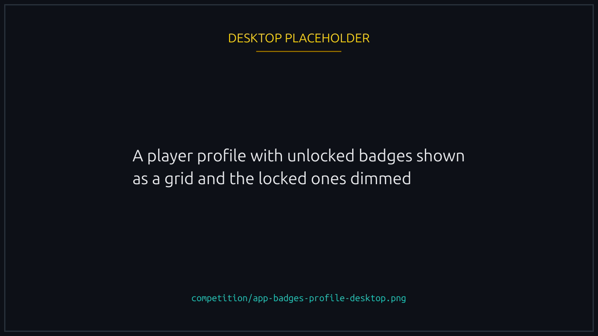
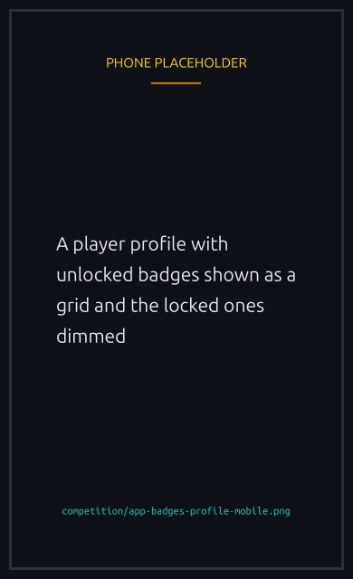

# Badges

Badges are earned automatically as you play and engage. They show on your profile and pop up in Telegram and on the site the moment you unlock one.


Badges are cosmetic recognition of your activity. They do not give any race advantage.



{% column width="70%" %}

<figure><figcaption>
Unlocked badges sit on your profile. Locked ones stay visible as targets.
</figcaption></figure>


{% column width="30%" %}

<figure><figcaption>
On a phone
</figcaption></figure>



Most badges are ladders: the same activity counted further. You keep every tier you pass, so a ladder shows how far along it you are rather than replacing the tier below.

## XP milestones ⭐

Earn XP by racing, winning, creating races, verifying, and raiding.

| Badge           | Emoji | XP     |
| --------------- | ----- | ------ |
| Getting Started | ⭐    | 10     |
| Rising Star     | ⭐    | 100    |
| Seasoned Racer  | ⭐    | 1,000  |
| XP Machine      | ⭐    | 5,000  |
| Legend          | ⭐    | 10,000 |
| Mythic          | ⭐    | 25,000 |
| Immortal        | ⭐    | 50,000 |

## Races completed 🏁

| Badge      | Emoji | How to earn          |
| ---------- | ----- | -------------------- |
| Regular    | 🏁    | Complete 10 races    |
| Dedicated  | 🏁    | Complete 50 races    |
| Centurion  | 🏁    | Complete 100 races   |
| Veteran    | 🏁    | Complete 500 races   |
| Iron Duck  | 🏁    | Complete 1,000 races |
| Relentless | 🏁    | Complete 5,000 races |

## Wins 🏆

| Badge        | Emoji | How to earn         |
| ------------ | ----- | ------------------- |
| Lucky Duck   | 🏆    | Win your first race |
| Consistent   | 🏆    | Win 10 races        |
| Ace          | 🏆    | Win 50 races        |
| Champion     | 🏆    | Win 100 races       |
| Unstoppable  | 🏆    | Win 500 races       |
| Duck Dynasty | 🏆    | Win 1,000 races     |
| Juggernaut   | 🏆    | Win 2,000 races     |
| Apex Duck    | 🏆    | Win 5,000 races     |

## Streaks 🔥

| Badge        | Emoji | How to earn           |
| ------------ | ----- | --------------------- |
| Hat Trick    | 🔥    | Win 3 races in a row  |
| On Fire      | 🔥    | Win 5 races in a row  |
| Unbeatable   | 🔥    | Win 10 races in a row |
| Unlucky Duck | 🦆    | Lose 5 races in a row |


Unlucky Duck is the one badge a losing run earns you. The randomness that took those five races is the same randomness that will take the next one, so the streak says nothing about what comes after it. See [Provable randomness](../trust/fairness.md).


## Podium finishes 🥇

| Badge          | Emoji | How to earn               |
| -------------- | ----- | ------------------------- |
| Podium Regular | 🥇    | Finish top 3 in 10 races  |
| Podium Master  | 🥇    | Finish top 3 in 50 races  |
| Podium Legend  | 🥇    | Finish top 3 in 100 races |

## Tournaments 🏅

| Badge           | Emoji | How to earn                   |
| --------------- | ----- | ----------------------------- |
| Contender       | 🏅    | Race in your first tournament |
| Circuit Regular | 🏅    | Race in 5 tournaments         |
| Circuit Veteran | 🏅    | Race in 10 tournaments        |
| Circuit Legend  | 🏅    | Race in 25 tournaments        |

Earned by racing during a tournament rather than by winning one. See [Tournaments](tournaments.md).

## Volume 💰

Your total wagered, in SOL.

| Badge            | Emoji | How to earn         |
| ---------------- | ----- | ------------------- |
| Skin in the Game | 💰    | Wager 1 SOL total   |
| High Roller      | 💰    | Wager 10 SOL total  |
| Big League       | 💰    | Wager 100 SOL total |
| Whale Territory  | 💰    | Wager 500 SOL total |

## Token races 🪙

Counted by how many different [supported tokens](../economy/spl-tokens.md) you have raced in.

| Badge           | Emoji | How to earn                      |
| --------------- | ----- | -------------------------------- |
| Token Racer     | 🪙    | Race using an SPL token          |
| Diversified     | 🪙    | Race with 2 different SPL tokens |
| Token Juggler   | 🪙    | Race with 3 different SPL tokens |
| Portfolio Racer | 🪙    | Race with 4 different SPL tokens |
| Token Tycoon    | 🪙    | Race with 5 different SPL tokens |

## NFTs 🎨

| Badge         | Emoji | How to earn                                   |
| ------------- | ----- | --------------------------------------------- |
| Collector     | 🎨    | Join a race with a boost NFT                  |
| Turbo         | 🎨    | Win a race while using a boost NFT            |
| Wardrobe      | 👕    | Race wearing 2 different cosmetic NFTs        |
| Stylist       | 👗    | Race wearing 5 different cosmetic NFTs        |
| Fashionista   | 💃    | Race wearing 10 different cosmetic NFTs       |
| Custom Course | 🛣️    | Create a race on a custom track NFT           |
| Track Curator | 🗺️    | Create races on 2 different custom track NFTs |

The cosmetic and track ladders count **different** NFTs, so racing the same duck ten times does not advance them. See [NFT collections](../nfts/README.md).

## Social and hosting 🤝

| Badge         | Emoji | How to earn                                   |
| ------------- | ----- | --------------------------------------------- |
| Revenge       | 🤝    | Win a rematch against someone who beat you    |
| Underdog      | 🤝    | Win without a boost against boosted opponents |
| Domination    | 🤝    | Win 1st place in a 5+ player race             |
| Party Starter | 🤝    | Create a race with 5+ players                 |
| Grand Host    | 🤝    | Create a race with 10+ players                |
| Sponsor       | 🤝    | Create a sponsored race                       |
| Whale         | 🤝    | Enter a race with 1+ SOL entry fee            |
| Grudge Match  | 🤝    | Complete a full 1v1 rematch chain             |

Grand Host and the larger lobbies need a Runner NFT to create, since anything past the default lobby size is a customization. See [Runner NFTs](../nfts/runners.md).

## Chat taps 🔉

Chat taps are the tap-to-chat messages you send during a race.

| Badge          | Emoji | How to earn               |
| -------------- | ----- | ------------------------- |
| Noisy Duck     | 🔉    | Use chat taps in a race   |
| Loud Duck      | 🔊    | Use chat taps in 5 races  |
| Deafening Duck | 📢    | Use chat taps in 10 races |

## Arcade 🕹

The lounge arcade is a mini-game on the platform. These are awarded on your **best** run rather than a total, so one good run is what moves them.

| Badge          | Emoji | How to earn                |
| -------------- | ----- | -------------------------- |
| Coin Op        | 🕹    | Score 1,000 in the arcade  |
| High Score     | 🕹    | Score 5,000 in the arcade  |
| Cabinet Legend | 🕹    | Score 15,000 in the arcade |

## Raids 📣

Earned from the raid leaderboard. Link and verify your X account so your engagement is credited (see [Player verification](../trust/verification.md) and [The Lucky Ducks Telegram bot](../help/telegram-bot.md#raids-boost-the-tweet-together)).

| Badge          | Emoji | How to earn              |
| -------------- | ----- | ------------------------ |
| First Raid     | 📣    | Score in your first raid |
| Raider         | 📣    | Score in 10 raids        |
| Raid Veteran   | 📣    | Score in 50 raids        |
| Signal Booster | 🎯    | Earn 100 raid points     |
| Raid Machine   | 🎯    | Earn 500 raid points     |

Raid points come from likes (2), retweets (3), and replies (4) on Lucky Ducks raid tweets, and also add to your XP.

## Rare 💎

One off achievements rather than ladders.

| Badge         | Emoji | How to earn                             |
| ------------- | ----- | --------------------------------------- |
| Early Adopter | 💎    | Race in one of the first 100 races      |
| Night Owl     | 💎    | Race between 00:00 and 05:00 local time |
| Marathon      | 💎    | Play 10+ races in a single day          |
| Iron Man      | 💎    | Play 25+ races in a single day          |
| Chain Hopper  | 🌉    | Join a race gated on a non-Solana chain |

Early Adopter is awarded for joining a race whose ID is 100 or below, so it belongs to the platform's first races. Chain Hopper needs a linked external wallet, which is covered in [NFT holders](../races/access-and-gating.md#nft-holders).

---

Keep racing and raiding to fill out your collection.
