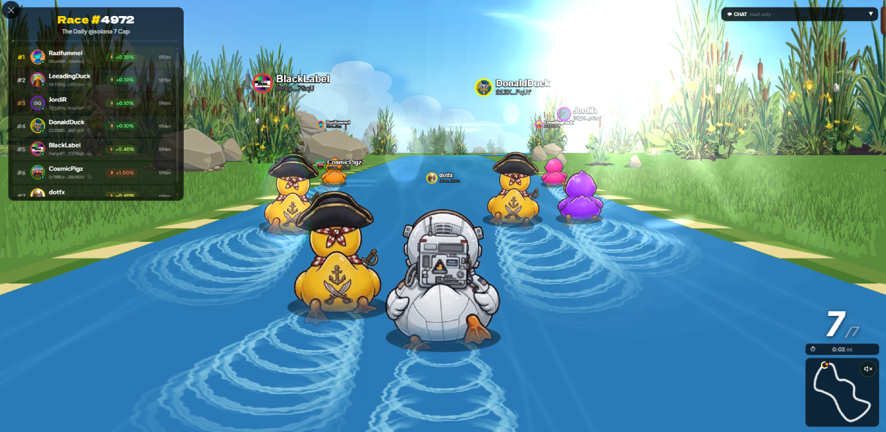

# Welcome

Lucky Ducks is duck racing, fully on chain. Every race is provably fair, every NFT is verifiable, and a smart contract pays every prize. No house edge. Just ducks!

<figure><figcaption>
A five player race, mid-run. The animation follows the seed the oracle published on chain.
</figcaption></figure>

## What you can do here

- **Race** up to 20 players, in WTA (Winner Takes All) or Podium Split mode.
- **Collect** four NFT collections: Runners unlock advanced features, Boosts add speed, Tracks change the scenery, Cosmetics dress up your duck.
- **Compete** in tournaments where teams race for one on-chain pot, split between the winning team.
- **Team up** with up to 20 players. Your races feed the standing automatically, with no sign-up and no entry fee.
- **Stake** in SOL or any supported SPL token, Legacy or Token-2022. The platform takes a small treasury fee, the rest goes to the winners.
- **Play fast** by pre-funding a vault and letting the platform sign for you, so joining takes one tap instead of a wallet approval.

## A provably fair draw for any community

A race is a random draw with an on-chain payout, so it works as one. Fund the prize yourself with a **sponsored race** and players join for nothing: the oracle picks the winner, the contract pays out, and nobody, the team included, can steer it.

- **Give away tokens.** Sponsor the pot in SOL or any supported token, open 20 seats, and let the draw run. Winner takes all, or Podium Split pays three.
- **Keep it to your people.** Gate entry on holding your NFT collection or a minimum balance of your token, on Solana or on a supported chain such as Ethereum, Base or Polygon.
- **Run a closed draw.** An invite list of up to 20 wallets, and only those wallets can enter.
- **Prove it afterwards.** Every seed, ranking and transfer is on chain, so a winner who asks can check the draw themselves.


Sponsoring a race needs a Runner NFT in your wallet, and the prize token has to be one the platform has approved. The organiser pays the prize plus the small race costs; the race account's rent comes back when it closes. See [Advanced options](races/advanced-options.md), [Race access and gating](races/access-and-gating.md) and [Fees and prizes](economy/fees-and-prizes.md).


## Where to find things

Read top to bottom on a first visit, or jump straight in.

<table data-view="cards"><thead><tr><th></th><th></th><th data-hidden data-card-target data-type="content-ref"></th><th data-hidden data-card-cover data-type="files"></th></tr></thead><tbody><tr><td><strong>Getting Started</strong></td><td>What the platform is, how one race goes, and the shortest path to your first one.</td><td><a href="introduction/what-is-lucky-ducks.md">what-is-lucky-ducks.md</a></td><td><a href="../.gitbook/assets/brand/docs-card-getting-started.png">docs-card-getting-started.png</a></td></tr><tr><td><strong>Races</strong></td><td>Creating, joining, gating and cancelling a race, and every option on the form.</td><td><a href="races/creating-a-race.md">creating-a-race.md</a></td><td><a href="../.gitbook/assets/brand/docs-card-races.png">docs-card-races.png</a></td></tr><tr><td><strong>NFTs</strong></td><td>The four collections, what each one changes, and where to acquire or rent one.</td><td><a href="nfts/README.md">README.md</a></td><td><a href="../.gitbook/assets/brand/docs-card-nfts.png">docs-card-nfts.png</a></td></tr><tr><td><strong>Competition</strong></td><td>Tournaments, teams, rematches, badges and the community lottery.</td><td><a href="competition/tournaments.md">tournaments.md</a></td><td><a href="../.gitbook/assets/brand/docs-card-competition.png">docs-card-competition.png</a></td></tr><tr><td><strong>Economy</strong></td><td>What a race costs, where the money goes, and what comes back to you.</td><td><a href="economy/fees-and-prizes.md">fees-and-prizes.md</a></td><td><a href="../.gitbook/assets/brand/docs-card-economy.png">docs-card-economy.png</a></td></tr><tr><td><strong>Trust and Fairness</strong></td><td>Where the randomness comes from, and how to check a race result yourself.</td><td><a href="trust/fairness.md">fairness.md</a></td><td><a href="../.gitbook/assets/brand/docs-card-trust.png">docs-card-trust.png</a></td></tr><tr><td><strong>Help</strong></td><td>Common questions, a glossary, the Telegram bot, and where to reach the team.</td><td><a href="help/faq.md">faq.md</a></td><td><a href="../.gitbook/assets/brand/docs-card-help.png">docs-card-help.png</a></td></tr></tbody></table>


Anything here wrong or out of date? Ping us on Telegram or X. See [Social networks](help/social-networks.md) for every channel. The platform moves fast and the docs follow.

