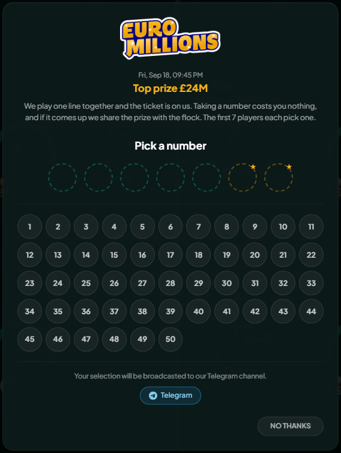
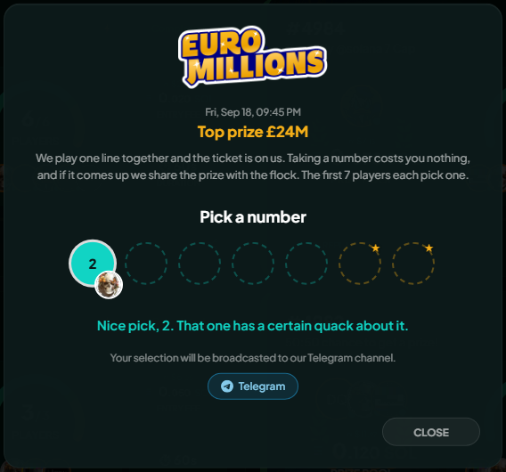

# The community lottery

On UK draw days a box asks you for one number. Everyone who picks adds one to a single shared line, and The Lucky Ducks sets out to play that line in the real draw.

You pick one number. The flock picks the rest.

<figure><figcaption>
An empty line, every number still free. The first seven players fill it.
</figcaption></figure>

## How it works

You have to be signed in, by wallet or social login. Guests never see the box.

A round opens in a set window on a day the UK actually draws, and the first players to tap fill the line, one number each, in order.

| Game         | Draw days           | What the line needs                               |
| ------------ | ------------------- | ------------------------------------------------- |
| Set For Life | Monday, Thursday    | 5 numbers from 1 to 47, then 1 Life Ball (1-10)   |
| EuroMillions | Tuesday, Friday     | 5 numbers from 1 to 50, then 2 Lucky Stars (1-12) |
| Lotto        | Wednesday, Saturday | 6 numbers from 1 to 59                            |

Sunday has no round, because nothing is drawn on a Sunday.

Every pick appears in the row for everyone watching, and the box closes itself when the last slot goes.

## Picking a number

Taken numbers are crossed out and cannot be chosen.


**Tapping a free number takes it straight away.** No confirm step, and no changing it afterwards, so tap the one you want.


<figure><figcaption>
One tap, and your number is in the line.
</figcaption></figure>

**What you can pick depends on where you land in the line.** Once the main numbers are gone the next players are choosing Lucky Stars or the Life Ball, from a much smaller range, and the box says which and shows only the valid numbers.

One number per round. Once yours is in, the box will not ask again on any device.

## If your pick does not go through

Rounds fill fast, so a tap can land a moment late. The box tells you which happened:

- **Someone just took that number.** Pick another.
- **The line filled.** Every slot went before your tap landed.
- **Picking has closed.** The window ended.
- **You have already picked.** You hold a slot in this round.


Nothing is charged and nothing is lost in any of those. Taking part costs nothing at all.


## If you would rather not

Choose **No thanks** and the box leaves you alone for that round. It will offer again on the next draw day.

## Following along in Telegram

Channels can opt into lottery announcements: the window opening, each number as it goes, and the finished line. Ask a channel admin to switch it on, or see [The Lucky Ducks Telegram bot](../help/telegram-bot.md).

## Things worth knowing

The top prize in the box is whatever the National Lottery is advertising for that draw. It moves between draws, and for Set For Life it is not a cash sum at all.

Picking a number is not a bet and buys you no ticket. It is one shared line the community chooses together. The ticket is on The Lucky Ducks, and if the line comes up, the prize is shared with the flock, as the box itself says.


**The ticket is a best effort, not a promise.** The team does its best to buy the line before each draw, but it is not obliged to, and a round's ticket can go unbought for any reason. A line that was never played cannot win, so a round is a bit of fun, never something to count on.

