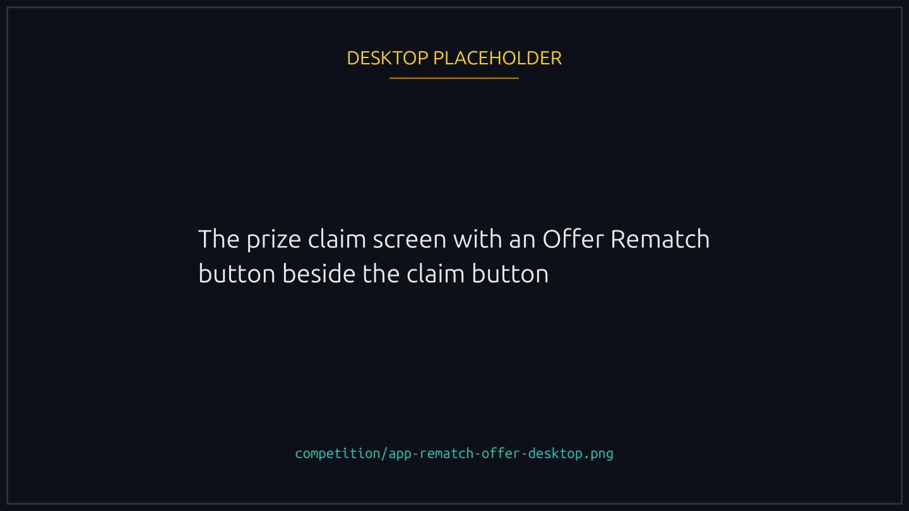
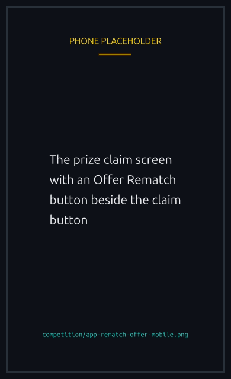
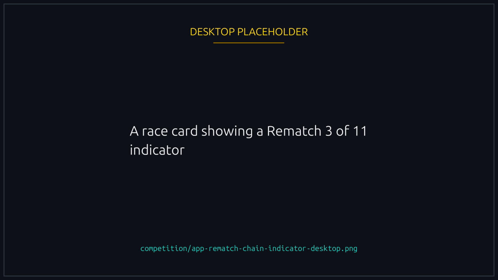
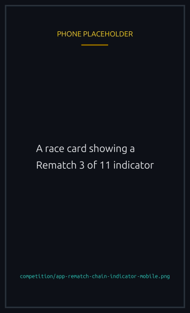

# Rematches

When a 1v1 ends, either player can offer a rematch. It rolls your stake forward instead of paying everything out and asking you to buy back in, and the offer sits on the prize claim screen so you do not go looking for it.


{% column width="70%" %}

<figure><figcaption>
Claiming and rematching are the same stop.
</figcaption></figure>



{% column width="30%" %}

<figure><figcaption>
On a phone
</figcaption></figure>




## What can be rematched

A finished 1v1 you played in. Sponsored races cannot be rematched, and neither can a race whose prize has already been claimed. Token races rematch exactly like SOL ones.


**Claim the prize and the rematch goes with it.** The winner's stake in the next race comes out of the winnings still sitting in the old race, so once those are paid out there is nothing to roll forward and the program refuses the offer. Rematch first, or claim and start a fresh race.


Two windows also apply, both short and both platform settings, so the app is where to read them: you have a window from the finish to make the offer, and your opponent then has their own window to answer it.

## Offering a rematch

Click Offer Rematch on the claim screen. That creates the next race and puts your stake in it:

- **Winner.** Your stake is one entry fee, taken from the winnings you have not claimed. The rest of that payout, minus the platform fee, reaches you when your opponent accepts, with no separate claim.
- **Loser.** You deposit one entry fee up front. Your opponent's stake joins it when they accept.

Either way the new pot is exactly 2 entry fees, matching the race it followed. Offering uses one of your [daily races](../races/daily-races.md).

## What the proposer picks

The new race inherits the entry fee, duration, join setting, [no-boost mode](../nfts/boosts.md#no-boost-races) and every customization the old one had. Four things are yours to change:

| At propose time     | What it does                                                                                                                                              |
| ------------------- | --------------------------------------------------------------------------------------------------------------------------------------------------------- |
| **AI commentary**   | On or off regardless of what the finished race had, 1v1 included. You deposit the [audio cost](../economy/fees-and-prizes.md#other-costs-at-creation) now |
| **X announcement**  | Posts the rematch publicly. Flat 0.0005 SOL, non-refundable, paid now. See [X announcement](../races/advanced-options.md#x-announcement)                  |
| **Your Track NFT**  | Pass one and the rematch uses it. Skip it and the rematch keeps whatever Track the last race had                                                          |
| **Your Runner NFT** | Optional, and it lifts your daily ceiling from 50 races to 500. AI commentary needs a Runner anyway, so enabling audio means attaching one                |

The name carries over with a `#N` suffix, so "Duel" becomes "Duel #2", then "Duel #3".

## Accepting

Accepting inside the window starts the new race and pays the finished one out immediately, so the winner never claims it separately. It uses one of the accepter's daily races.

## Cancelling versus declining

These look alike and are not.

**You cancel your own offer.** It clears, but rematches on that race stay open, so you can offer again while the window lasts.

**Your opponent declines.** That closes rematches on that race for good. Neither of you can offer again.


Cancelling while your opponent can still accept costs the same fixed **0.01 SOL** penalty as leaving a lobby. Once their window has passed it is free, so waiting a moment is worth it if you are not in a hurry.


## Nobody is ever stuck

- The proposer can cancel at any moment.
- The opponent can decline at any moment.
- Once the acceptance window passes, anyone at all can clear the offer, and the proposer is refunded in full.

## Rematch chains

A rematch can be rematched, up to the platform's maximum chain depth. Each card shows its place as "Rematch X of Y", so the room left is always visible, and a chain keeps the windows the first race was created with.


{% column width="70%" %}

<figure><figcaption>
How far down the chain this race is, and how much room is left.
</figcaption></figure>



{% column width="30%" %}

<figure><figcaption>
On a phone
</figcaption></figure>




No-boost mode is inherited all the way down, so a rematch cannot sneak boosts back into a level match.

Each proposal and each acceptance spends a daily race, per player. Worth knowing if you rematch a lot: a long chain eats your day faster than fresh races do.

## Stat tracking

Rematches count as normal races for XP, wins and everything else. Three in a row is three wins for one player and three losses for the other. The chain itself pays no bonus, though some tournament rules treat rematch chains specially.
