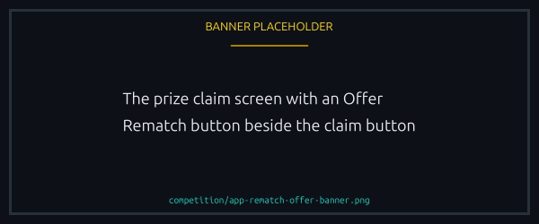
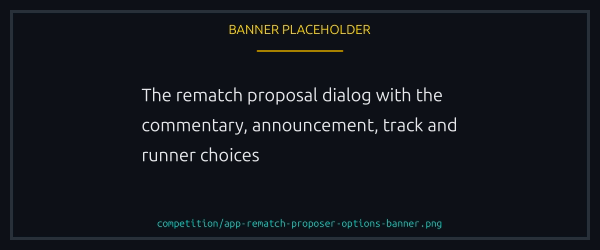
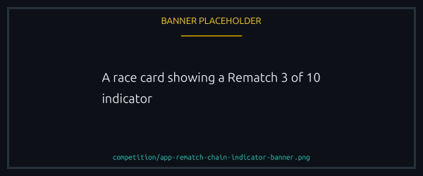

# Rematches

When a 1v1 ends, either player can offer a rematch, and a rematch is double or nothing. The whole pot of the race you just finished rolls into the next one, the loser matches it, and whoever wins the rematch takes both. The offer sits on the prize claim screen so you do not go looking for it.

<figure><figcaption>
Claiming and rematching are the same stop.
</figcaption></figure>

## What can be rematched

A finished 1v1 you played in. Sponsored races cannot be rematched, and neither can a race whose prize has already been claimed. Token races rematch exactly like SOL ones.


**Claim the prize and the rematch goes with it.** The winner's stake in the next race is the prize still sitting in the old race, so once it is paid out there is nothing to roll forward and the program refuses the offer. Rematch first, or claim and start a fresh race.


Two windows also apply, both short and both platform settings, so the app is where to read them: you have a window from the finish to make the offer, and your opponent then has their own window to answer it.

## Offering a rematch

Click Offer Rematch on the claim screen. That creates the next race and puts your stake in it:

- **Winner.** Your stake is the whole prize you have not claimed. It stays where it is and nothing is paid out. Your opponent matches it when they accept.
- **Loser.** You deposit an amount equal to that prize up front. The winner's prize joins it when they accept.

Either way the new pot is twice the old one: a race of 2 entry fees is rematched for 4, and that rematch for 8. The amount on the button is what you are putting in, and the note beside it says what the winner takes. No fee is taken when a rematch is accepted. The pot pays its fees once, when the last race of the chain is claimed. Offering uses one of your [daily races](../races/daily-races.md).

## What the proposer picks

The new race's entry fee is the pot of the race before it. It inherits the duration, join setting, [no-boost mode](../nfts/boosts.md#no-boost-races) and every customization the old one had. Four things are yours to change:

| At propose time     | What it does                                                                                                                                                     |
| ------------------- | ---------------------------------------------------------------------------------------------------------------------------------------------------------------- |
| **AI commentary**   | On or off regardless of what the finished race had, 1v1 included. You deposit the [audio cost](../economy/fees-and-prizes.md#other-costs-at-creation) now        |
| **X announcement**  | Posts the rematch publicly, for a flat non-refundable cost paid now. See [X announcement](../races/advanced-options.md#x-announcement)                           |
| **Your Track NFT**  | Pick one and the rematch uses it. Pick none and the rematch keeps whatever Track the last race had                                                               |
| **Your Runner NFT** | Nothing to pick. The app uses the Runner in your wallet on its own, and it lifts your [daily allowance](../races/daily-races.md). AI commentary needs one anyway |

The name carries over with a `#N` suffix, so "Duel" becomes "Duel #2", then "Duel #3".

<figure><figcaption>
Four choices are yours. The rest is inherited from the race you just played.
</figcaption></figure>

## Accepting

Accepting inside the window starts the new race. If the winner made the offer, the loser deposits the match as they accept. Nothing is paid out: the finished race's prize is the winner's stake in the new one, so there is no separate claim to make. It uses one of the accepter's daily races.

## Cancelling versus declining

These look alike and are not.

**You cancel your own offer.** It clears, but rematches on that race stay open, so you can offer again while the window lasts.

**Your opponent declines.** That closes rematches on that race for good. Neither of you can offer again.


Cancelling while your opponent can still accept costs the same fixed penalty as [leaving a lobby](../economy/refunds-and-rent.md#withdrawal-during-the-lobby). Once their window has passed it is free, so waiting a moment is worth it if you are not in a hurry.


## Nobody is ever stuck

- The proposer can cancel at any moment.
- The opponent can decline at any moment.
- Once the acceptance window passes, anyone at all can clear the offer, and the proposer is refunded in full.
- Until one of those happens, the offered race is closed to everything else: nobody can join it, and it cannot be cancelled or refunded like an ordinary race.

## Rematch chains

A rematch can be rematched, up to the platform's maximum chain depth. The pot doubles at every step, so the stakes of a chain climb fast: read the amount on the button before you offer or accept. Each card carries a Rematch #N badge saying how far down the chain it is, and a chain keeps the windows the first race was created with.

<figure><figcaption>
How far down the chain this race is.
</figcaption></figure>

No-boost mode is inherited all the way down, so a rematch cannot sneak boosts back into a level match.

Each proposal and each acceptance spends a daily race, per player. Worth knowing if you rematch a lot: a long chain eats your day faster than fresh races do.

Each offer also takes the next race number, and one that is declined or expires does not give it back. That is why race numbers sometimes skip.

## Stat tracking

Rematches count as normal races for XP, wins and everything else. Three in a row is three wins for one player and three losses for the other. The chain itself pays no bonus, though some tournament rules treat rematch chains specially.
