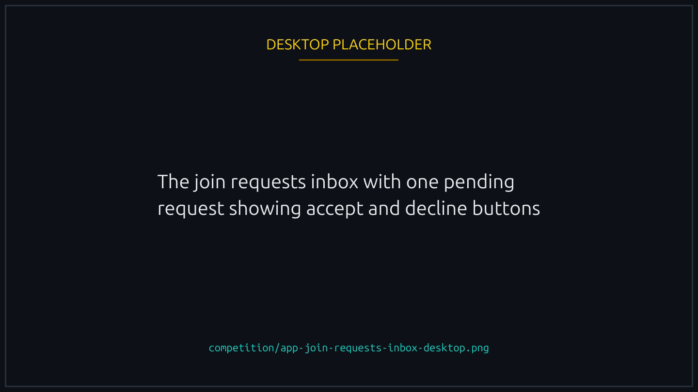
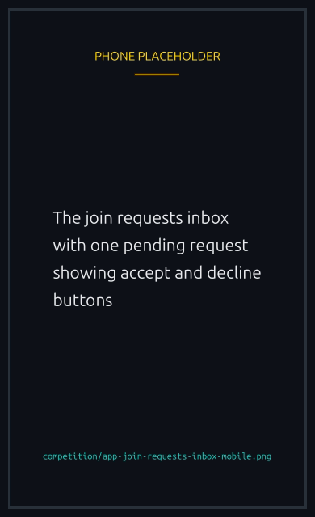

# Teams

A team is a wallet group that competes together in **tournaments**. Members join races independently and their results aggregate into one standing.

There are no team events outside tournaments, so that is what teams are for.

## Creating a team

From the Teams page, click Create Team, pick a **name** and an **avatar**, and sign. You become the founder and first member.

A team holds up to **20 members**, founder included, and can carry **20** pending join requests at a time. Its page shows the cap and the seats left.


{% column width="70%" %}

<figure><figcaption>
Roster, cap and seats left, all on the team page.
</figcaption></figure>



{% column width="30%" %}

<figure><figcaption>
On a phone
</figcaption></figure>




## Inviting members

Two ways in:

1. **Direct invite.** The founder invites a wallet address, and it lands in that player's inbox to accept or decline.
2. **Open team.** The team marks itself open, players request to join from its page, and the founder approves or declines each one from the admin panel.

## Joining requests inbox

Every player has a Join Requests inbox in the platform notifications, where a new request arrives with Accept and Decline on it. It is anchored on the left, away from the race toasts on the right, so the two cannot collide at the end of a race.


{% column width="70%" %}

<figure><figcaption>
Requests wait in the inbox until the founder answers.
</figcaption></figure>



{% column width="30%" %}

<figure><figcaption>
On a phone
</figcaption></figure>




## Team standings in tournaments

Standings are computed off chain on one rule, chosen when the tournament is created. Every rule is a **per-player average**, whether it counts wins, races, XP, volume, podiums, duels, last places or races using a particular NFT, so a big team cannot out-score a small one on headcount. [Tournaments](tournaments.md#scoring) has the full set and the bonus for racing outsiders.

Computing off chain is what lets a new rule appear without upgrading the program. The winners are written on chain before anything is paid.

## Teams are frozen while a tournament runs


While one is under way nothing about any team can change: no creating, no join requests, no adding or kicking, no leaving, no deleting. A roster reshuffled mid-event could earn points under one lineup and collect under another.


Sort your team out beforehand. While one is running those buttons stay disabled.

## Disbanding

The founder can disband at any time. Members are notified and the history stays attributable to the team, but nobody new can join and no standings accumulate.

## Why teams over solo

A tournament pot goes to one team and splits between its members, so a team is the only way to win one. The rest is the social side: agreeing which races to enter, comparing results, sharing what works.
