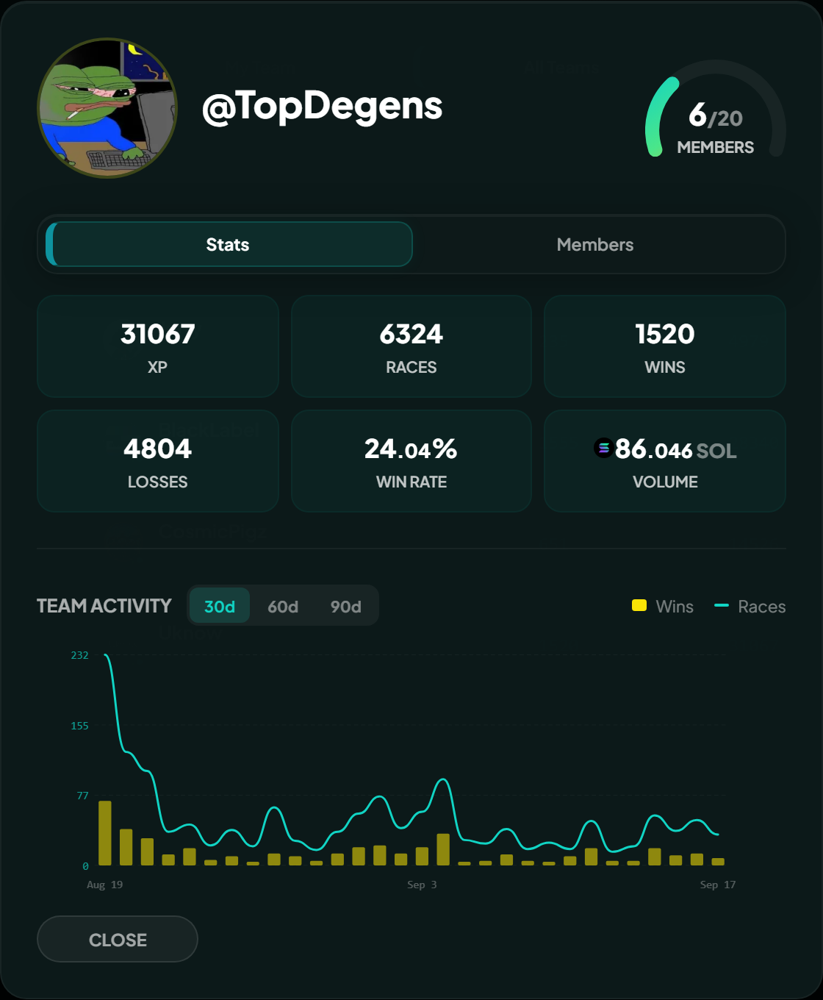
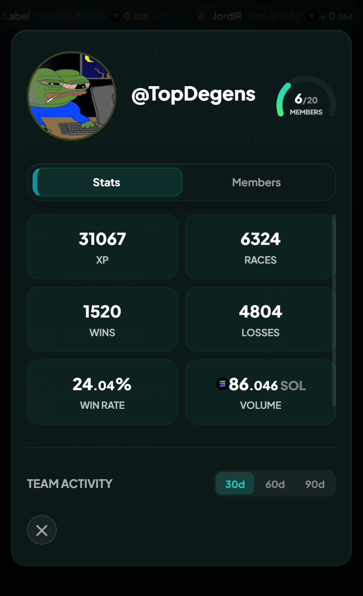
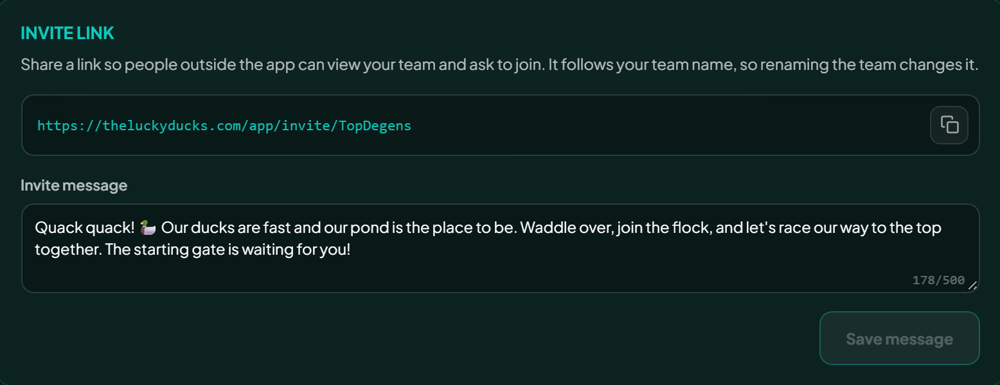
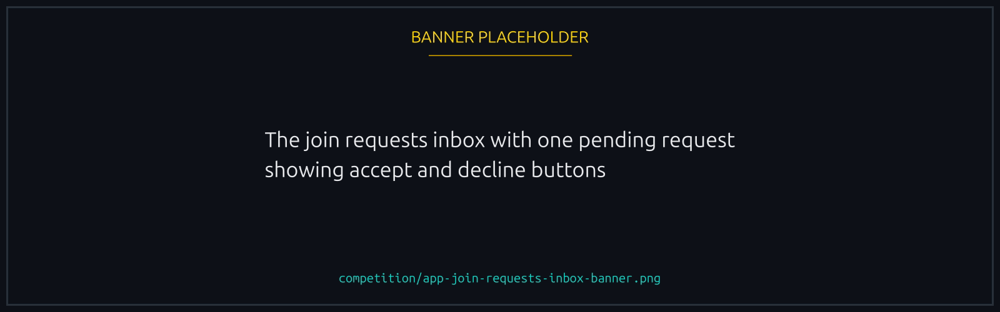

# Teams

A team is a wallet group that competes together in **tournaments**. Members join races independently and their results aggregate into one standing.

There are no team events outside tournaments, so that is what teams are for.

## Creating a team

From the Teams page, click Create Team, pick a **name** and an **avatar**, and sign. You become the founder and first member.

A team holds up to **20 members**, founder included, and can carry **20** pending join requests at a time. Its page shows the cap and the seats left.


{% column width="70%" %}

<figure><figcaption>
Roster, cap and seats left, all on the team page.
</figcaption></figure>



{% column width="30%" %}

<figure><figcaption>
On a phone
</figcaption></figure>




## Bringing people in

There is one way into a team, and the player takes the first step: they open the team's page and ask to join. The founder answers. Nobody is added without asking, and nobody joins without the founder agreeing.

What the founder shares is the team's **invite link**. It follows the team name, so renaming the team changes the link, and the old one stops working. Anyone who opens it lands on the team page and can ask to join from there. Beside the link, the founder can save a short **invite message** for whoever arrives that way.

<figure><figcaption>
Share the link, and whoever opens it can ask to join.
</figcaption></figure>

## Answering join requests

A dot appears on **Teams** in the menu when someone asks. It clears the moment the founder opens the team's **Members** tab, which is where the requests wait, under the roster and with the same tick boxes. Tick one, several or all of them, then accept or reject the lot in one go: a batch is a single transaction, however many players are in it.

A team holds **20** pending requests at a time. A player waiting on an answer can withdraw the request from the team page, and a rejected player is free to ask again.

<figure><figcaption>
Requests wait under the roster until the founder answers.
</figcaption></figure>

## Team standings in tournaments

Standings are computed off chain on one rule, chosen when the tournament is created. Every rule is a **per-player average**, whether it counts wins, races, XP, volume, podiums, duels, last places or races using a particular NFT, so a big team cannot out-score a small one on headcount. [Tournaments](tournaments.md#scoring) has the full set and the bonus for racing outsiders.

Computing off chain is what lets a new rule appear without upgrading the program. The winners are written on chain before anything is paid.

## Teams are frozen while a tournament runs


While one is under way nothing about any team can change: no creating, no join requests, no adding or kicking, no leaving, no deleting. A roster reshuffled mid-event could earn points under one lineup and collect under another.


Sort your team out beforehand. While one is running those buttons stay disabled.

## Disbanding

The founder can disband at any time. Members are notified and the history stays attributable to the team, but nobody new can join and no standings accumulate.

## Why teams over solo

A tournament pot goes to one team and splits between its members, so a team is the only way to win one. The rest is the social side: agreeing which races to enter, comparing results, sharing what works.
