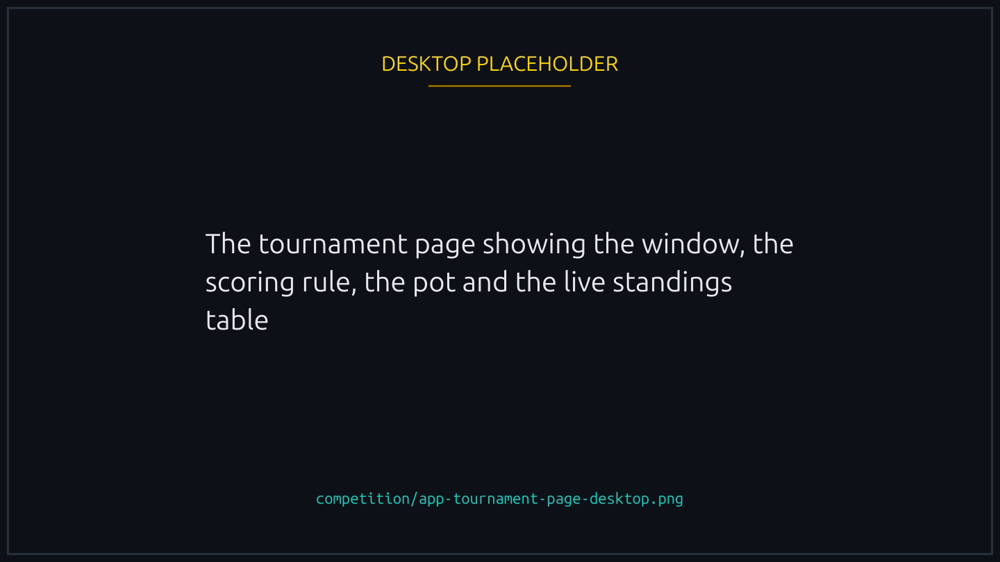
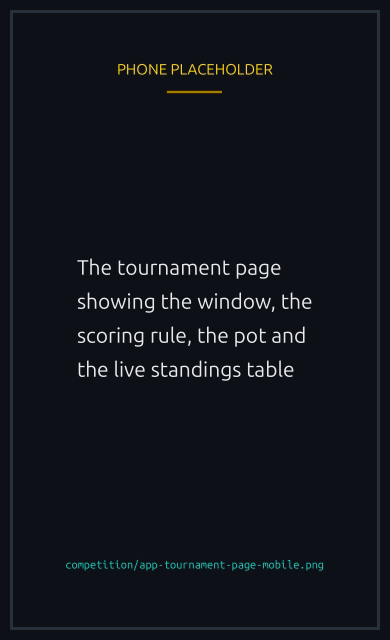
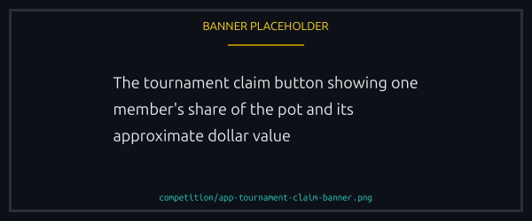

# Tournaments

A scheduled event where **teams** compete over a fixed window for a single pot. No sign-up, no entry fee: you race as usual, and the races your [team](teams.md) runs inside the window count toward its standing.

One runs at a time, and its page shows the window, the rule it is scored on, the pot and the live standings.


{% column width="70%" %}

<figure><figcaption>
The window, the rule and the pot, all on one page.
</figcaption></figure>



{% column width="30%" %}

<figure><figcaption>
On a phone
</figcaption></figure>




## What counts

A race counts when it finishes inside the window and meets that tournament's conditions, which its page lists:

- The race has to start after the tournament does. One created earlier does not count even if it settles during the window.
- If the pot is in a token, only races using that token count.
- A team may need a minimum number of members to qualify at all.
- Sponsored races are either included or excluded.


Only races finalized on chain count. One still in its lobby, waiting on randomness or mid-run counts for nothing until it settles.


## Scoring

Every rule is a **per-player average**, so size alone wins nothing: 10 members racing once each score exactly what 1 member racing 10 times scores.

| Family                                                     | Scored on                                                                                                           |
| ---------------------------------------------------------- | ------------------------------------------------------------------------------------------------------------------- |
| Wins, races, XP, SOL volume, token volume, podium finishes | The average per member, one rule per metric                                                                         |
| Weighted                                                   | Average wins at 60 percent plus average races at 40 percent                                                         |
| Duels                                                      | Points from 1v1 rematches, doubled against another team or a solo racer                                             |
| Worst results                                              | Most last places per member. The more you lose, the better                                                          |
| Creators                                                   | Most completed races created per member                                                                             |
| Biggest races                                              | Bigger lobbies score more, with a bonus for a mixed lobby                                                           |
| NFT and token rules                                        | Races per member, where races using a Boost, a Cosmetic, or the tournament's paired collection or token count twice |

The first family carries a **diversity bonus**: 10 percent per outside team or solo racer you meet, averaged across your races, so racing only your own members scores least. The other rules already account for outside play and take no bonus.

A tie is broken by which team was created first, then by a fixed seed. No shared places.

## The pot and who gets it

The platform funds the pot when it creates the tournament, in SOL or a [supported token](../economy/spl-tokens.md), and nothing is added later.

The **winning team takes all of it**, split equally between its members. No second or third place. A pot that will not divide exactly leaves a tiny remainder, and the first winner in the list gets it.

A platform fee comes off the pot before the split, set per tournament and never above 10 percent.


Standings are computed off chain, which is what lets a rule change between tournaments without touching the program. The winners are then written on chain, and from that point the payout is the program's to make and nobody can alter the list.


## Claiming

One transaction pays every winner at once, so the first of you to press Claim settles it for the whole team. With [playing without signing every action](../races/delegated-play.md) on, the platform can send it for you.

Whoever sends it, the money goes to the winners' own wallets. Paying the fee entitles the sender to nothing.

The button shows your share and what it is worth. While the tournament runs that dollar figure follows the market; once it ends the figure is fixed at the rate when it ended, so what you won does not appear to drift afterwards. A tournament that ended with no usable price shows the amount alone.

<figure><figcaption>
One transaction pays the whole team, whoever sends it.
</figcaption></figure>

## Your team is frozen while a tournament runs


From the start to the end of a tournament, no team can change: no creating, no join requests, no adding, kicking or leaving, no deleting. A roster reshuffled mid-event could collect points under one lineup and claim under another.


So build or join your team beforehand. While one is running those buttons stay disabled.


[teams.md](teams.md)

