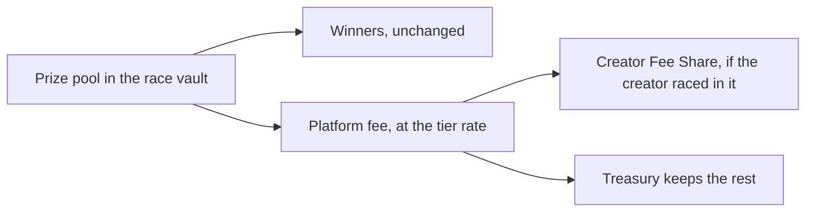
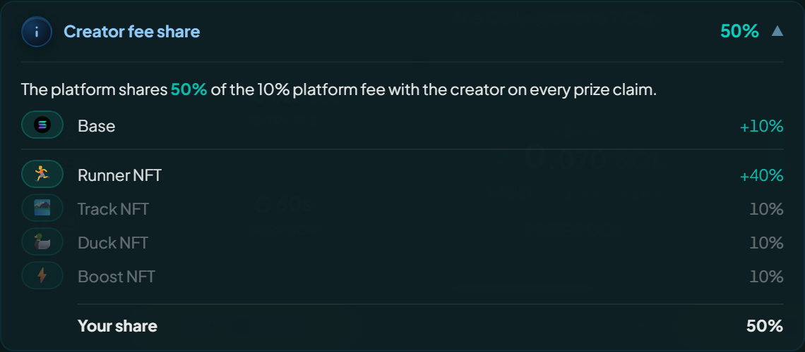

# Creator Fee Share

Creator Fee Share hands a race creator part of the platform fee at race end. Winners are untouched. The only thing that moves is where the platform's cut goes.

## What this changes (and what it doesn't)

- **Entry fees:** unchanged.
- **Winner payout:** unchanged, still the pool minus the platform fee, split by race mode.
- **Platform fee total:** unchanged, still taken from the pool at the tier rate.
- **Where that fee goes:** the one thing that moves. Part of it can go to the creator instead of the treasury.

## Race in your own race, and the share is yours

Every creator earns a share, no NFT required. The one condition is that you **join the race you created**, because the share gives back part of the fee your own race generated and is meant for a creator who is racing.

On top of that base, each NFT you bring adds its own share. They stack.

| What you bring                       | Adds |
| ------------------------------------ | ---- |
| Nothing, you just join your own race | 10%  |
| Runner NFT                           | 40%  |
| Track NFT                            | 10%  |
| Cosmetic NFT on your duck            | 10%  |
| Boost NFT on your duck               | 10%  |

All four brings 80% of the fee on that race, none brings 10%, and each counts on its own: a Track earns its 10% whether or not a Runner is there too.


These are percentages **of the platform fee**, not of the prize pool, and the create form shows what your race will earn before you sign.


| Race created by...                         | Creator share |
| ------------------------------------------ | ------------- |
| A creator who joins, holding no NFT        | 10%           |
| A creator who joins, with a Runner         | 50%           |
| A creator who joins, with a Runner + Track | 60%           |
| A creator who joins, with all four         | 80%           |
| A creator who hosts without playing        | 0%            |
| A 1-v-1 race (2 players)                   | 0%            |

The percentages are platform settings, added together and never exceeding 100% of the fee. A new rate applies only to **new** races, since an existing race keeps the share it snapshotted.

<figure><figcaption>
What the race will earn you is shown before you sign it.
</figcaption></figure>

### What this is for

A race costs its creator the oracle and archival fees whether it fills or not, and the base share gives that back: run a race, play in it, and the fee it generates returns to you instead of being a cost. How much depends on the pool, so a bigger race covers the cost sooner and the NFT shares turn break-even into profit.

## Which races qualify

Only regular Winner Takes All and Podium races. Creator Fee Share does **not** apply to:

- **1-v-1 races (2 players).** Excluded by design.
- **Sponsored races.** A creator funding the prize does not also take a cut of the fee, so the treasury keeps all of it.
- **Hosted races (creator did not join as a player).** A creator who [hosts without playing](../races/hosting-and-cancelling.md#host-a-race-without-playing) gives up the Creator Fee Share, the base included. Hosting and earning a share are separate paths, and the decision is locked in when the race is created: joining later does not bring the share back.
- **Refunded or cancelled races.** No prize claimed means no fee paid, so there is no share.

Two more things worth knowing about the NFT shares:

- **The Cosmetic and Boost shares follow your own entry.** They are earned by the duck you put in the race, so they go with the cosmetic and the boost you picked when you created it, not with what you happen to own.
- **A race with boosts turned off earns no Boost share.** No boost is applied in that race, so there is nothing for the share to reward.

A rematch earns no share at all: it is a 1v1, and the program writes its creator share as zero whatever the race it followed earned.

## The snapshot rule

Each race captures its share **at creation**, already totalled: the base plus whichever NFT shares applied. Later changes to the percentages leave it alone, which keeps an in-flight race predictable and protects creators from a surprise drop mid-race.

## A worked example

Say a Winner Takes All race has a 1 SOL prize pool. The fee tier at that pool size is 3% (see [Fees and prizes](fees-and-prizes.md#platform-fee-tiers)).

- Platform fee: `1 SOL × 3% = 0.03 SOL`
- Winner payout: `1 SOL - 0.03 SOL = 0.97 SOL` (always, regardless of creator share)

Depending on what the creator brought, the 0.03 SOL fee splits like this:

| Race created by...                  | Creator share | Treasury keeps | Creator receives |
| ----------------------------------- | ------------- | -------------- | ---------------- |
| A creator who joins, holding no NFT | 10%           | 0.027 SOL      | 0.003 SOL        |
| Runner                              | 50%           | 0.015 SOL      | 0.015 SOL        |
| Runner + Track                      | 60%           | 0.012 SOL      | 0.018 SOL        |
| All four                            | 80%           | 0.006 SOL      | 0.024 SOL        |
| A creator who hosts without playing | 0%            | 0.03 SOL       | 0                |

The winner gets 0.97 SOL in every case.


**Your share is a slice of the fee, not of the pool.** This is the easiest number to misread. On the race above, a 10% share is 10% of the 0.03 SOL fee, which is 0.003 SOL, not 10% of the 1 SOL pool. The bigger the pool, the bigger the fee, and so the bigger your share.


That also decides whether a race pays for itself: on the base share alone a small race falls just short of the oracle and archival fees, a larger one clears them, and the NFT shares clear them comfortably either way. The create form shows where your race lands before you sign.

## Where the creator share lands

- **SOL races.** The share rides along with the rent return at race close, with no separate claim, landing in the creator's wallet or [player vault](player-vault.md) by their payout setting.
- **SPL token races.** It goes to the creator's token account for that token, created for them in the claim transaction if they have none. Legacy SPL Token and Token-2022 both work, as in the rest of the [SPL flow](spl-tokens.md).

## Tracking it

Two places show it:

- **On the race.** The total is fixed on the race at creation, and the app reads it to show what cut that race earns its creator.
- **At payout.** The amount, the wallet it went to and the transaction are all published at claim time, so the creator sees it at once in their feed.

A share of 0, from a 1-v-1, a sponsored race or a host who did not play, publishes nothing, because there is nothing to pay.

## For administrators

The five configuration values, and the rule that binds them

The five shares live in the platform configuration as separate values, all in basis points (10000 = 100%):

- `creatorFeeShareBaseBps`: earned by any creator who joins their own race, with no NFT required.
- `creatorFeeShareRunnerBps`: added when the creator holds a Runner.
- `creatorFeeShareTrackBps`: added when the creator uses a Track.
- `creatorFeeShareCosmeticBps`: added when the creator's entry wears a cosmetic.
- `creatorFeeShareBoosterBps`: added when the creator's entry carries a boost.

Each must be between 0 and 10000, and **their total must not exceed 10000 either**. They are added together and paid out of one platform fee, so a configuration that sums above 100% would promise more than the race collects, and the program refuses it. That check is on the total, which means raising one share can be rejected because of the values the other four already hold.

Only the configuration owner can change them, and new values only take effect for new races. Setting the base to 0 restores the older behaviour, where only NFT holders earned anything.

## Why this exists

It makes running a race something a creator is paid for rather than something they pay for. Every race costs its creator the oracle and archival fees up front, and the base share is what gives that back, so anyone who fills a race and plays in it is contributing to the platform rather than subsidising it.

The four NFT shares sit on top of that and reward the creators who actually put their NFTs to work rather than only holding them. A creator who brings a Runner, a Track, a cosmetic and a boost to their own race earns the most, which is the point: the fee comes back to the people running the races and using what they own to do it.
