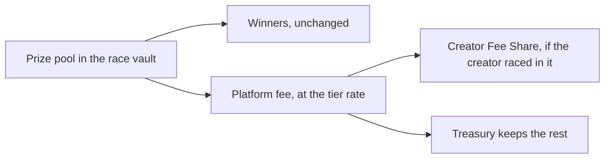
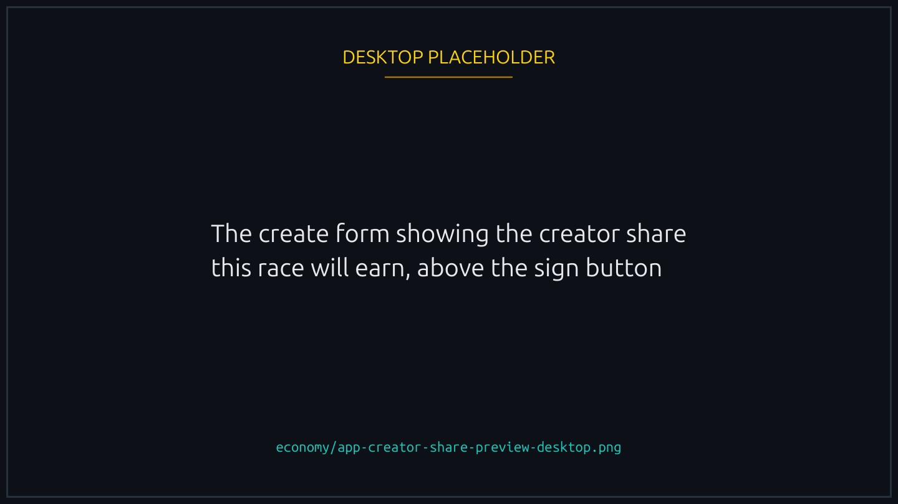
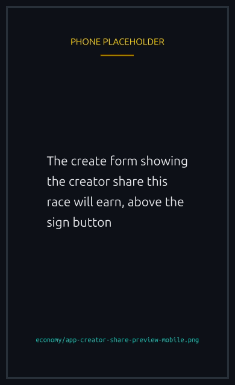

# Creator Fee Share

Creator Fee Share lets a race creator keep part of the platform fee at race end. It does not change what winners receive. It only changes where the platform's cut goes.

## What this changes (and what it doesn't)

- **Entry fees:** unchanged. Players still pay the same amount to join.
- **Winner payout:** unchanged. Winners still take home the prize pool minus the platform fee, split according to the race mode.
- **Platform fee total:** unchanged. Still pulled from the prize pool at the fee tier rate.
- **Where the platform fee goes:** this is the only thing that moves. Part of the fee can be redirected from the treasury to the race creator.

## Race in your own race, and the share is yours

Every creator earns a share. No NFT is required. The one condition is that you **join the race you created**: the share gives back part of the fee your own race generated, so it goes to a creator who is racing, not to one who only set the race up.

On top of that base, each NFT you bring adds its own share. They stack.

| What you bring                       | Adds |
| ------------------------------------ | ---- |
| Nothing, you just join your own race | 10%  |
| Runner NFT                           | 40%  |
| Track NFT                            | 10%  |
| Cosmetic NFT on your duck            | 10%  |
| Booster NFT on your duck             | 10%  |

A creator with all four earns 80% of the platform fee on their race. A creator with none of them earns 10%. Each one counts on its own: a Track earns its 10% whether or not you also hold a Runner.


These are percentages **of the platform fee**, not of the prize pool, and the create form shows what your race will earn before you sign.


| Race created by...                         | Creator share |
| ------------------------------------------ | ------------- |
| A creator who joins, holding no NFT        | 10%           |
| A creator who joins, with a Runner         | 50%           |
| A creator who joins, with a Runner + Track | 60%           |
| A creator who joins, with all four         | 80%           |
| A creator who hosts without playing        | 0%            |
| A 1-v-1 race (2 players)                   | 0%            |

The percentages are platform settings managed by the team and can be tuned over time. They are added together and never exceed 100% of the fee. New rates only apply to **new** races; races already created keep the share they snapshotted at creation.


{% column width="70%" %}

<figure><figcaption>
What the race will earn you is shown before you sign it.
</figcaption></figure>


{% column width="30%" %}

<figure><figcaption>
On a phone
</figcaption></figure>



### What this is for

A race costs its creator the VRF fee and the archive fee whether it fills or not. The base share is meant to give that back: run a race, race in it, and the fee it generates comes back to you instead of being a cost. How much comes back depends on the size of the race, so a bigger pool covers the cost sooner, and the NFT shares are what make it comfortably profitable rather than merely break-even.

## Which races qualify

Only regular Winner Takes All and Podium races. Creator Fee Share does **not** apply to:

- **1-v-1 races (2 players).** Excluded by design.
- **Sponsored races.** When the creator funds the prize themselves, they don't earn a cut of the platform fee on top of that. The treasury keeps the full fee.
- **Hosted races (creator did not join as a player).** A creator who [hosts without playing](../races/hosting-and-cancelling.md#host-a-race-without-playing) gives up the Creator Fee Share, the base included. Hosting and earning a share are separate paths, and the decision is locked in when the race is created: joining later does not bring the share back.
- **Refunded or cancelled races.** No prize is claimed, so no fee is paid, so there's no share to pay out.

Two more things worth knowing about the NFT shares:

- **The Cosmetic and Booster shares follow your own entry.** They are earned by the duck you put in the race, so they go with the cosmetic and the boost you picked when you created it, not with what you happen to own.
- **A race with boosts turned off earns no Booster share.** No boost is applied in that race, so there is nothing for the share to reward.

Rematches inherit whatever share was snapshotted on the original race, even if platform defaults have since changed.

## The snapshot rule

Each race captures the share it will use **at the moment of creation**. The captured value is already the total: the base plus whichever of the four NFT shares applied. If the platform later changes any of the percentages, races already created stay on the old value.

This protects creators from surprise drops mid-race and keeps the math on any in-flight race fully predictable.

## A worked example

Say a Winner Takes All race has a 1 SOL prize pool. The fee tier at that pool size is 3% (see [Fees and prizes](fees-and-prizes.md#platform-fee-tiers)).

- Platform fee: `1 SOL × 3% = 0.03 SOL`
- Winner payout: `1 SOL - 0.03 SOL = 0.97 SOL` (always, regardless of creator share)

Depending on what the creator brought, the 0.03 SOL fee splits like this:

| Race created by...                  | Creator share | Treasury keeps | Creator receives |
| ----------------------------------- | ------------- | -------------- | ---------------- |
| A creator who joins, holding no NFT | 10%           | 0.027 SOL      | 0.003 SOL        |
| Runner                              | 50%           | 0.015 SOL      | 0.015 SOL        |
| Runner + Track                      | 60%           | 0.012 SOL      | 0.018 SOL        |
| All four                            | 80%           | 0.006 SOL      | 0.024 SOL        |
| A creator who hosts without playing | 0%            | 0.03 SOL       | 0                |

The winner gets 0.97 SOL in every case.


**Your share is a slice of the fee, not of the pool.** This is the easiest number to misread. On the race above, a 10% share is 10% of the 0.03 SOL fee, which is 0.003 SOL, not 10% of the 1 SOL pool. The bigger the pool, the bigger the fee, and so the bigger your share.


That also decides whether a race pays for itself. Creating one costs you the VRF fee and the archive fee, so a small race on the base share alone will not quite cover them, while a larger race will, and the NFT shares clear it comfortably either way. The create form shows the figure before you sign, so you can see where any particular race lands.

## Where the creator share lands

- **SOL races.** The creator's share rides along with the existing rent return at race close. There is no separate claim step. It arrives the moment the race settles, in the creator's wallet or their [player vault](player-vault.md) according to their payout setting.
- **SPL token races.** The creator's share is sent to the creator's Associated Token Account for that token. If they don't have one for the mint yet, it's created automatically as part of the claim transaction. Both legacy SPL Token and Token-2022 mints are supported, the same way as the rest of the [SPL flow](spl-tokens.md).

## Tracking it

Two places surface the creator share:

- **On the race itself.** A race exposes `creatorFeeShareBps`, which is the combined total snapshotted at creation. The dApp uses this to show players what cut the creator earns for that specific race.
- **At payout.** A real-time event fires when the share is paid out at claim time, with the amount, the creator's wallet, and the transaction signature. The creator sees the payout immediately in their personal feed.

If the share is 0 (because the race is 1-v-1, or sponsored, or the creator hosted without playing), no payout event is emitted, since there's nothing to pay.

## For administrators

The five configuration values, and the rule that binds them

The five shares live in the platform configuration as separate values, all in basis points (10000 = 100%):

- `creatorFeeShareBaseBps`: earned by any creator who joins their own race, with no NFT required.
- `creatorFeeShareRunnerBps`: added when the creator holds a Runner.
- `creatorFeeShareTrackBps`: added when the creator uses a Track.
- `creatorFeeShareCosmeticBps`: added when the creator's entry wears a cosmetic.
- `creatorFeeShareBoosterBps`: added when the creator's entry carries a boost.

Each must be between 0 and 10000, and **their total must not exceed 10000 either**. They are added together and paid out of one platform fee, so a configuration that sums above 100% would promise more than the race collects, and the program refuses it. That check is on the total, which means raising one share can be rejected because of the values the other four already hold.

Only the configuration owner can change them, and new values only take effect for new races. Setting the base to 0 restores the older behaviour, where only NFT holders earned anything.

## Why this exists

It makes running a race something a creator is paid for rather than something they pay for. Every race costs its creator the VRF and archive fees up front, and the base share is what gives that back, so anyone who fills a race and plays in it is contributing to the platform rather than subsidising it.

The four NFT shares sit on top of that and reward the creators who actually put their NFTs to work rather than only holding them. A creator who brings a Runner, a Track, a cosmetic and a boost to their own race earns the most, which is the point: the fee comes back to the people running the races and using what they own to do it.
