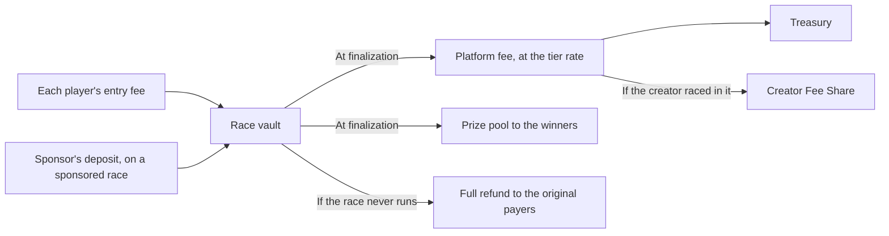
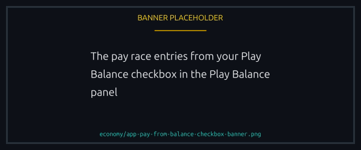
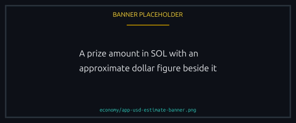

# Fees and prizes

What you pay, where it goes, and how the pool is split.

## What you pay

Your entry fee moves entirely into the race vault. At race end the vault pays the platform fee out of the pool and the rest to the winners.

The transaction you sign also covers:

- **Network fee.** Roughly 0.000005 SOL per signed transaction, Solana's standard.
- **No platform-side ATA rent** on a SOL race. A token race may need a one-time Associated Token Account if you have none for that mint.

## Paying from your wallet or your vault

Every cost here can come from your wallet or from a balance you pre-fund once. The confirmation shows both with your balance beside them, and falls back to the wallet when the balance is short. See [Your player vault](player-vault.md).

The totals match either way. What changes is how often you approve something.

<figure><figcaption>
The setting decides it once, rather than asking you every race.
</figcaption></figure>

## Where the entry fee goes

| Path                        | Recipient       | When              |
| --------------------------- | --------------- | ----------------- |
| Prize pool                  | Winner(s)       | Race finalization |
| Platform fee                | Treasury        | Race finalization |
| Stays in vault if cancelled | Original payers | Race cancellation |

The split happens inside the finalization transaction, so nobody has to do anything for the fee to be taken.

## Platform fee tiers

The rate is picked at creation from a tier schedule, against the **entry fee**, or against the sponsor's deposit on a sponsored race. It then applies to the whole pool at claim time. Small entry fees pay a higher rate, large ones less.

| Entry fee (per player) | Platform fee |
| ---------------------- | ------------ |
| Up to 0.05 SOL         | 10%          |
| Up to 0.1 SOL          | 7.5%         |
| Up to 0.5 SOL          | 5%           |
| Up to 1 SOL            | 3%           |
| Above 1 SOL            | 2%           |


Worked example: a race with a 0.1 SOL entry fee and 10 players. Entry fee falls in the second tier, so the fee is 7.5%. The pool at fill is 1 SOL. At claim the platform takes 1 × 7.5% = 0.075 SOL, and winners share the remaining 0.925 SOL.

For a sponsored race, the sponsor's deposit is what the tier is picked against (there is no per player entry fee). A 1 SOL sponsored prize sits in the 3% tier, so the platform takes 0.03 SOL at claim and winners share 0.97 SOL.


Token pools use the same percentages with thresholds adjusted to that token's denomination. The full schedule is in `/config` under `race.feeTiers`, and per token under `splTokens[].feeTiers`.

## Prize pool calculation

- **Regular race.** Pool = entry fee × paid joiners.
- **Sponsored race.** Pool = whatever the creator deposited. Joiners pay nothing, and the fee comes out of that deposit at finalization.

## The dollar figures beside an amount

Every amount is stated in the currency it is actually paid in, with an approximate dollar value beside it. The token figure is the exact one, because it is what the transaction moves; the dollar figure is that amount at a market price, which is why it always carries a `≈`.

Which price depends on whether the thing is still running:

- **A live race or tournament** is priced at the current rate, so its dollar value moves while you watch. An open race is an offer, and an offer is worth what it is worth now.
- **One that has ended** keeps the rate from the moment it ended. Win 2 SOL with SOL at 150 dollars and the page still says so tomorrow. A finished result that quietly repriced overnight would be telling you that you won something other than what you were paid.


With no price available you see the amount and no dollar figure. A blank means the price is missing, not that the amount is worthless.


<figure><figcaption>
The token amount is the exact one. The figure beside it is an estimate.
</figcaption></figure>

## Other costs at creation

The creator pays a few small costs at creation, separate from the pool:

- **Oracle fee** (~0.00275 SOL), to ORAO for the VRF request.
- **Archival fee** (~0.0001 SOL), to the IPFS archival worker.
- **Audio cost**, with AI commentary on: about 0.00005 SOL per race second, so roughly 0.0015 SOL for 30 seconds and 0.009 SOL for 3 minutes.
- **X announcement**, if enabled: flat 0.0005 SOL straight to the backend wallet, non-refundable.
- **Start-when-underfilled cost**, if opted in: paid to the backend authority on auto start, refunded if the race never auto starts.
- **Race account rent.** Around 0.012 SOL for a 5 seat lobby, scaling with the seats: roughly 0.0084 SOL for a 1v1 and 0.03 SOL at 20. Refunded in full when the race closes.

All of them are itemised in the cost box before you sign.

<figure><figcaption>
The same breakdown appears on the create form, before you sign.
</figcaption></figure>

## A note for creators

On a regular race, part of the platform fee goes back to the creator, provided they raced in it. No NFT is needed to earn it, and each NFT the creator brings adds more. See [Creator Fee Share](creator-fee-share.md), which also covers how it offsets the costs above.


[creator-fee-share.md](creator-fee-share.md)

