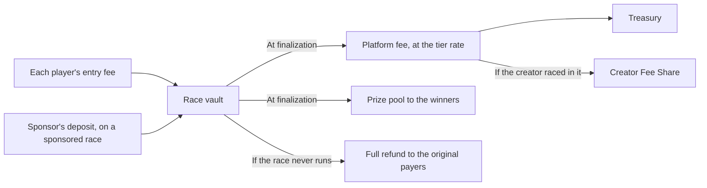
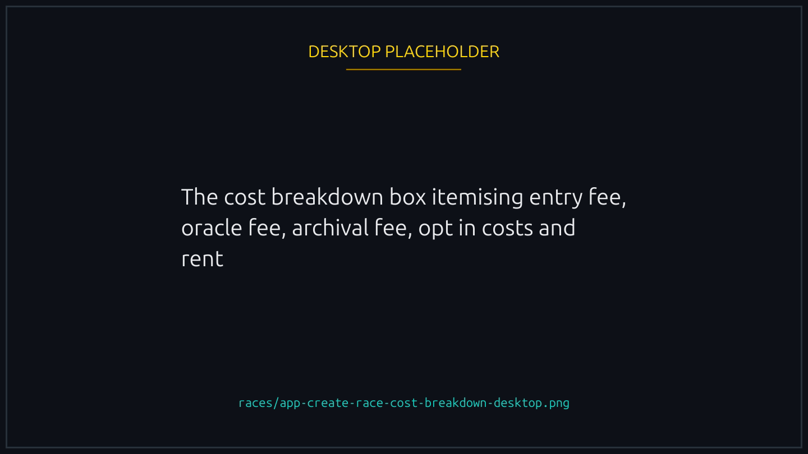
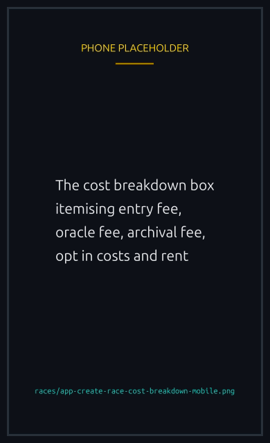

# Fees and prizes

What you pay to play, where the money goes, and how the prize pool is split.

## What you pay

When you join a race, your entry fee moves entirely into the race vault. The race vault then pays the platform fee out of the prize pool at race end, and pays the rest to the winners.

The transaction you sign also covers:

- **Network fee**. Roughly 0.000005 SOL per signed transaction. Solana's standard.
- **No platform-side ATA rent** for SOL races. SPL token races may require a small one-time Associated Token Account creation if you do not yet have one for that mint.

## Paying from your wallet or your vault

Every cost on this page can come from your wallet, as it always has, or from a balance you pre-fund once. The confirmation screen shows both options with your current balance beside them, and falls back to your wallet when the balance is short. See [Your player vault](player-vault.md).

The totals are the same either way. What changes is how many times you approve something.

## Where the entry fee goes

| Path                        | Recipient       | When              |
| --------------------------- | --------------- | ----------------- |
| Prize pool                  | Winner(s)       | Race finalization |
| Platform fee                | Treasury        | Race finalization |
| Stays in vault if cancelled | Original payers | Race cancellation |

The split happens automatically as part of the race finalization transaction. You do not need to do anything for the platform fee to take its cut.

## Platform fee tiers

The platform fee percentage is picked from a tier schedule at race creation, based on the **entry fee** (or, for a sponsored race, the sponsor's deposit). It is then applied to the full prize pool at claim time. Smaller entry fees pay a higher percentage; larger ones pay less.

| Entry fee (per player) | Platform fee |
| ---------------------- | ------------ |
| Up to 0.05 SOL         | 10%          |
| Up to 0.1 SOL          | 7.5%         |
| Up to 0.5 SOL          | 5%           |
| Up to 1 SOL            | 3%           |
| Above 1 SOL            | 2%           |


Worked example: a race with a 0.1 SOL entry fee and 10 players. Entry fee falls in the second tier, so the fee is 7.5%. The pool at fill is 1 SOL. At claim the platform takes 1 × 7.5% = 0.075 SOL, and winners share the remaining 0.925 SOL.

For a sponsored race, the sponsor's deposit is what the tier is picked against (there is no per player entry fee). A 1 SOL sponsored prize sits in the 3% tier, so the platform takes 0.03 SOL at claim and winners share 0.97 SOL.


SPL token pools use the same percentage schedule but with thresholds adjusted for that token's typical denomination. The full schedule is in `/config` under `race.feeTiers` and per-token under `splTokens[].feeTiers`.

## Prize pool calculation

- **Regular race**. Pool = entry fee × number of paid joiners.
- **Sponsored race**. Pool = whatever the creator deposited. Joiners pay nothing; the platform fee comes out of the sponsor's deposit at finalization.

## The dollar figures beside an amount

Every amount on the platform is stated in the currency it is actually paid in, SOL or a token, with an approximate dollar value under or beside it. The token figure is the exact one: it is what the transaction moves and what the program agreed to. The dollar figure is that amount at a market price, which is why it is always written with a `≈`.

Which price gets used depends on whether the thing is still running:

- **A live race or tournament** is priced at the current market rate, so its dollar value moves while you are looking at it. An open race is an offer, and an offer is worth what it is worth now.
- **One that has ended** keeps the rate from the moment it ended. If you won 2 SOL when SOL was at 150 dollars, the page still says so tomorrow. A finished result that quietly repriced itself overnight would be telling you that you won something different from what you were paid.


When no price is available for a currency, you see the amount and no dollar figure at all. A blank there means the price is missing, not that the amount is worth nothing.


## Other costs at creation

A few small costs are paid by the creator at race creation, separate from the pool:

- **Oracle fee** (~0.0035 SOL). Paid to ORAO for the VRF request.
- **Archival fee** (~0.0001 SOL). Goes to the IPFS archival worker.
- **Audio cost** (if AI commentary is enabled). About 0.00005 SOL per race second, so a 30 second race costs roughly 0.0015 SOL and a 5 minute race about 0.015 SOL.
- **X announcement cost** (if X announcement is enabled). Flat 0.005 SOL, paid straight to the backend wallet, non-refundable.
- **Start-when-underfilled cost** (if opted in). Paid to the backend authority on auto start, refunded if the race never auto starts.
- **Race PDA rent**. Around 0.003 SOL. Fully refunded to the creator when the race closes.

These costs are all listed in the cost breakdown box at the bottom of the Create Race modal before you sign.


{% column width="70%" %}

<figure><figcaption>
The same breakdown appears on the create form, itemised, before you sign.
</figcaption></figure>


{% column width="30%" %}

<figure><figcaption>
On a phone
</figcaption></figure>



## A note for creators

On regular (non-sponsored) races, part of the platform fee goes back to the race creator, provided they join the race themselves. No NFT is needed to earn it, and each NFT the creator brings adds more. See [Creator Fee Share](creator-fee-share.md) for details, including how it offsets the creation costs listed above.


[creator-fee-share.md](creator-fee-share.md)

