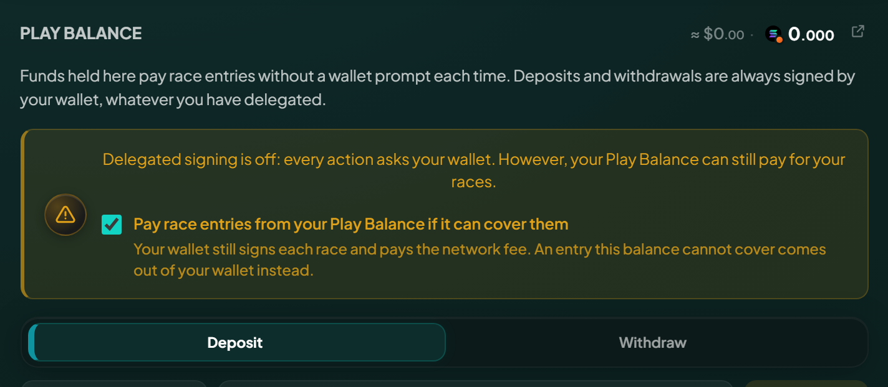
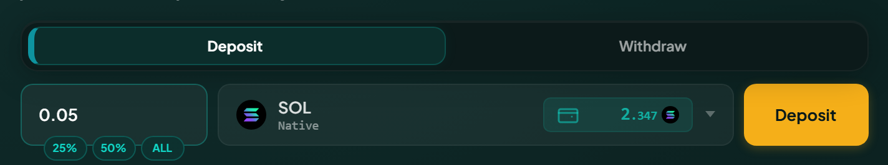
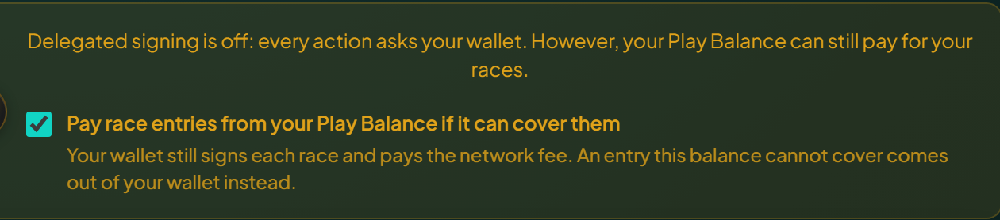
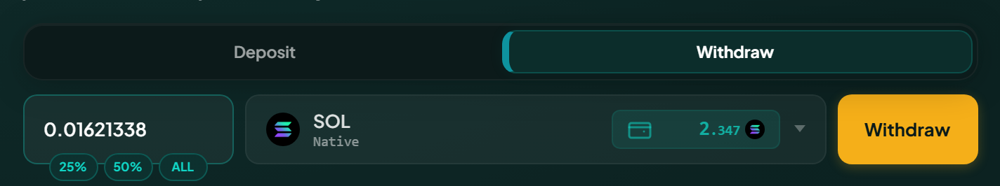
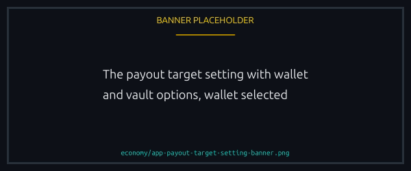

# Your player vault

A balance you top up once and spend across many races, instead of approving a wallet transfer every time you join.


Not to be confused with a race vault, which holds one race's entry fees and closes with that race. Your player vault is yours, it persists, and only you can take money out.


<figure><figcaption>
Top up, withdraw, and set what pays for a race, all in one panel.
</figcaption></figure>

## Where it lives

Inside your player account, the same on chain account holding your race history and profile, so if you have raced you already have one. Depositing creates nothing new and costs no extra rent.

The balance is not a number recorded somewhere: it is the actual SOL in your account, above the small deposit Solana requires to keep any account open. That deposit sits apart and never counts as balance, which is why you can withdraw everything and never meet a minimum you cannot spend.

## Topping up

From the Player page choose Deposit, pick SOL or a supported token, enter an amount and sign. The **25%**, **50%** and **All** chips under the amount fill it in for you, from what your wallet can move. You can hold SOL and several tokens at once, each tracked separately.


**A deposit always needs your wallet's signature.** Not a policy: money leaving your wallet requires your wallet to sign, so no setting and no permission can move it for you.


<figure><figcaption>
A deposit always asks your wallet, whatever else is switched on.
</figcaption></figure>

## Spending from it

What pays for a race entry is a setting, not a question per race.

With [delegated signing](../races/delegated-play.md) on, the vault pays, because nothing is asking your wallet and there is no other account to draw on.

Signing for yourself, your wallet pays. To spend the balance instead, tick **Pay race entries from your Play Balance if it can cover them** in the Play Balance panel. It is remembered for your wallet, and it only appears while delegated signing is off, since a live permission already spends the balance.

If the balance falls short, your wallet pays and the app says so. Nothing fails and nothing is half-paid.


**A token race spends from two balances at once.** The entry fee comes from your token balance, the network fee and race costs from your SOL. A vault full of a token but empty of SOL cannot fund a token race, and the app says so before you sign.



**The vault cannot pay rent.** Opening an account on Solana needs a deposit from a wallet that signs for it, so creating a race, or your very first player account, always comes from your wallet. Everything else can come from the vault. On an action signed for you, the fee payer fronts the rent and your vault repays it.


<figure><figcaption>
Remembered for your wallet, and only shown while you sign for yourself.
</figcaption></figure>

## Taking money out

Withdraw any amount, any time, from the Player page, whether or not you have granted [delegated signing](../races/delegated-play.md). The **25%**, **50%** and **All** chips under the amount fill in that share of the balance. Only your wallet can authorise it, and no permission you grant or setting you flip can move money out of your vault or your account.

A token withdrawal first checks that your vault really holds that token on chain. If the figure on screen is out of date and there is nothing there to take out, the app says so before your wallet is asked, and nothing is signed.

Closing the account returns everything in one transaction, your SOL, every token balance and the rent deposit. Your race history resets, and the account comes back the next time you race. See [Refunds and rent](refunds-and-rent.md#your-player-account-rent).

<figure><figcaption>
Any amount, any time, and only your wallet can authorise it.
</figcaption></figure>

## Where your winnings land

Separately from how you pay, you choose where returning money goes:



Prizes, refunds and returned rent arrive in your wallet, as they always have.



The same money joins your vault balance instead, ready to fund the next race with no top up.



The choice is yours alone and covers every race you are in, which matters on refunds, because anyone may trigger a refund on a lobby that never filled. It covers returned rent as well as prizes.

It covers tournament prizes too. Each member of a winning team is paid where they chose, whoever starts the claim, so one teammate can take their share in their wallet while another pools theirs.

It also stands on its own. Winnings and refunds go where this setting says whether or not delegated signing is granted, so letting a grant expire does not send them back to your wallet.

The one exception is closing your account: that returns the rent of the account holding the vault, so there is nothing left to credit and it always goes to your wallet.

<figure><figcaption>
One setting, per player, covering prizes, refunds and returned rent.
</figcaption></figure>

Pooling is worth it if you race often, and you can set it back to Wallet whenever you like.

The switch always shows what is stored for your account, whether or not delegated signing is on, so enabling it never moves your winnings somewhere you did not pick.

## The balance in the top bar

The button at the top right shows your wallet's SOL. Open it to see both balances side by side: your wallet, then your vault's SOL and every token it holds.

Press any row to put that balance on the button instead. A vault balance carries a small orange dot on its token icon, the same orange as an action the app signs for you, because that is the money those actions spend. Press the wallet row to go back.

The choice is saved with [your preferences](../help/preferences.md), so it holds on every device. It returns to your wallet by itself when the vault no longer holds what you picked, and when you close your account.


Signed in with a social account on a device with no wallet app? There is no wallet balance to read, so the button shows your vault.


## Next

Funding your vault is also what makes [playing without signing every action](../races/delegated-play.md) possible.


[delegated-play.md](../races/delegated-play.md)

