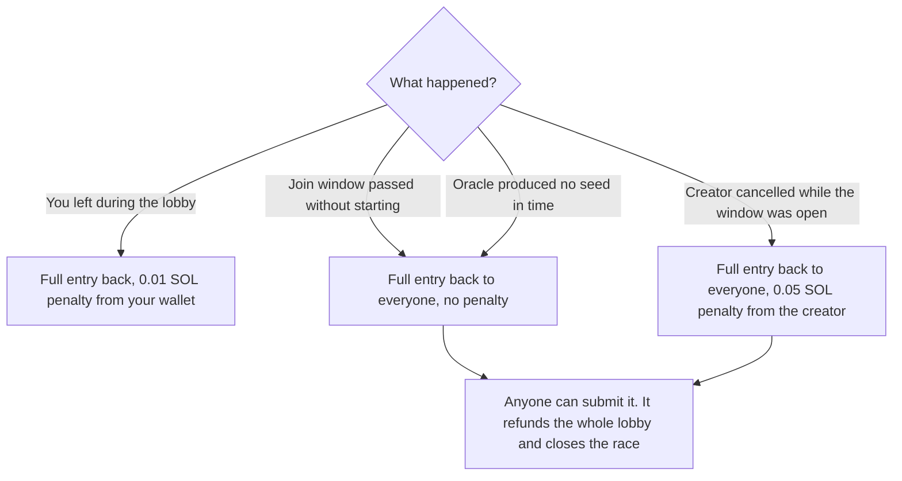
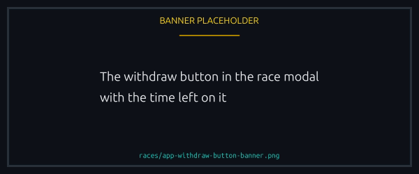
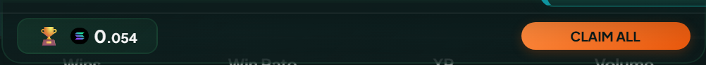
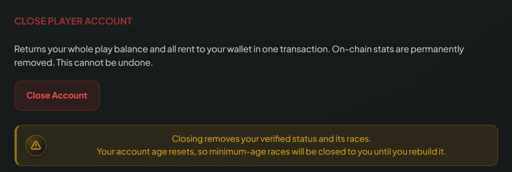

# Refunds and rent

How money comes back when a race does not finish as expected.

## Withdrawal during the lobby

Leaving a lobby has two time constraints:

- **Within 2 minutes of your own join.** Longer than that and the withdraw button is disabled.
- **Never in the last 60 seconds** of the join window, which is locked for everyone whenever they joined.


The vault then refunds your **full entry fee** and charges a fixed **0.01 SOL** penalty from your wallet to the platform fee wallet. It does not scale with the pot or the token, and it is always in SOL, even on a token race.


Details worth knowing:

- The penalty is a separate transfer, not a deduction from the refund. Same net effect, but on chain you see two movements: a credit and a small SOL debit.
- It comes from whatever signed. Sign yourself and it leaves your wallet; leave during a [delegated session](../races/delegated-play.md) and it leaves your vault, so even a sponsored race you are leaving needs a funded vault.
- On a sponsored race joiners paid nothing, so withdrawing just frees the seat: no refund, no penalty, and the sponsor's deposit untouched.
- In a **1v1** the creator cannot withdraw, since that would strand the other player. They cancel instead.

Withdrawn players stay in the participants list with a strikethrough, and stop counting toward the fill counter or the underfilled threshold.

<figure><figcaption>
The button disables itself once either window closes.
</figcaption></figure>

## Full refund on race cancellation or expiration

A race that never finalizes refunds every paid participant in **full**. Two cases.

### Creator cancellation during the join window

The creator can cancel while the window is open, even with nobody in yet:

- Every player who joined, the creator included if they joined, gets their **full** entry back.
- The creator pays a fixed **0.05 SOL** penalty to the platform, the same for SOL and token races, in SOL either way, and flat regardless of the pot.

A race past its start point cannot be cancelled. See [Hosting, cancelling, and refunds](../races/hosting-and-cancelling.md#cancelling-a-race).

### Expiration (join window passed without starting)

A race that never reached its start condition expires and becomes refundable. Anyone can trigger that, not only the creator, players get their full entry back, and there is **no** penalty. The penalty belongs to a manual cancel inside the window.

### Other refund paths

The race records why it was cancelled, and the app shows that reason on it. Beyond a manual cancel, two lead here:

- **The join window passed** without the race becoming startable, which is the expiry path above.
- **No seed arrived** inside the oracle's window, about 3 minutes. Rare; the oracle is reliable.


Either way anyone at all can trigger the refund, and **it refunds the whole lobby in one transaction and closes the race**. There is no refunding yourself alone and no leaving the others behind, and the money reaches each original payer whoever paid for the transaction.


### Who triggers it, and who pays for it

Nothing happens on chain when a deadline passes. The race simply becomes refundable, and somebody has to submit it.

- **Races the platform created** are swept automatically, and the platform pays the fee.
- **A race a player created is left alone on purpose.** It is theirs to close, because the platform does not close a race somebody else paid for, so it waits for the creator or any participant.

You are never left guessing: a race past its window joins the Unclaimed Items banner as soon as it is refundable. The banner sits in the top bar, on every page, and it carries anything owed to you: refunds like this one, and prizes you have won but not taken. One button clears the lot.

<figure><figcaption>
Everything owed to you collects in one banner, with the button that clears it.
</figcaption></figure>

Triggering it yourself costs the network fee, and during a [delegated session](../races/delegated-play.md) that comes from your vault. See [Provable randomness](../trust/fairness.md#what-if-the-seed-never-arrives) for the deadline itself.

## Race account rent

Creating a race allocates a Solana account, and the creator pays its rent up front. The account is sized for a full lobby, so the rent tracks the seats: roughly 0.0084 SOL for a 1v1, 0.012 SOL at 5 seats and 0.03 SOL at 20. When the race finalizes or is cancelled, the contract closes the account and returns all of it to the creator.

Net cost of creating a race, then: oracle fee, archival fee and any opt in costs. The rent is a deposit, not a charge.

## Your player account rent

Your first create or join allocates a small per-wallet account holding your race history, profile and [player vault](player-vault.md) balance. Rent is around 0.0023 SOL.

That rent is what Solana requires to keep an account open. It sits apart from your vault balance and is never spendable, which is why your balance is always withdrawable in full.

It is refundable too. The close button on the Player page returns everything in one transaction: your SOL, every token balance and the rent. Your race history resets, and the account comes back on your next race, so the rent is only held while you are using the platform.

<figure><figcaption>
One transaction returns your SOL, your tokens and the rent.
</figcaption></figure>

## Start-when-underfilled surcharge

Opting into start-when-underfilled deposits a small surcharge into the race vault at creation. Two outcomes:

- **The race auto starts underfilled.** The surcharge goes to the platform for starting the race for you.
- **It fills naturally, cancels or refunds.** The surcharge stays in the vault and returns to the creator with everything else.

## Where the money lands

Refunds, prizes and returned rent follow your payout setting: your wallet by default, or your [player vault](player-vault.md) if you pool them. The setting is yours alone and covers every race you are in, which matters here because anyone may trigger a refund on a lobby that never filled.

The exception is closing your player account. That returns the rent of the account holding the vault, so there is nothing left to credit and it always goes to your wallet.

## Where to claim

Most refunds and claims run through the Unclaimed banner on the Player page, where any race with something pending shows up with a single Claim button. The race detail modal carries per-race claim buttons too.
