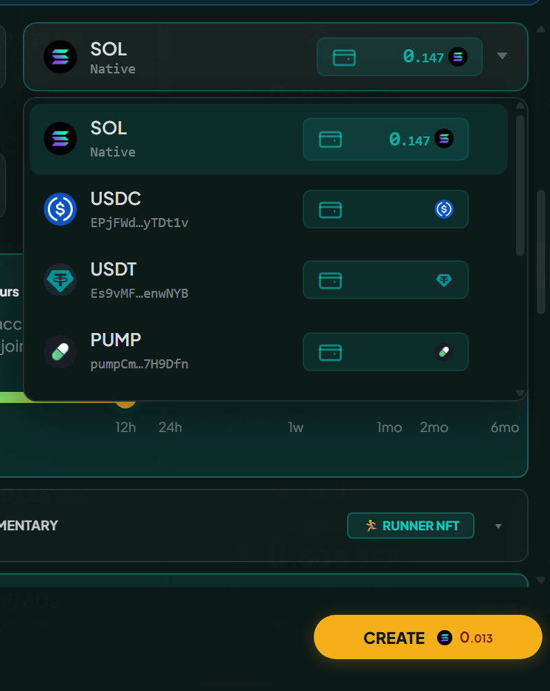

# SPL token races

Races and tournaments can run in supported SPL tokens instead of SOL. USDC and USDT are supported and more arrive over time; the currency picker on the create form is the live list.

<figure><figcaption>
The picker is the live list. A token that is not in it is not supported yet.
</figcaption></figure>

## Supported token programs

Both Solana token standards work:



The original program (`TokenkegQfeZyiNwAJbNbGKPFXCWuBvf9Ss623VQ5DA`). Most major tokens run here, USDC and USDT included.



The newer program (`TokenzQdBNbLqP5VEhdkAS6EPFLC1PHnBqCXEpPxuEb`), with extensions like transfer fees, interest-bearing balances and confidential transfers. Tokens such as AMPS use it.



Which of the two a token uses is worked out for you, so there is nothing to set: pick the token and everything else follows from it.

Where a token charges a transfer fee of its own, the platform reads that fee and accounts for it both when you join and when you are paid, so the amount you see is the amount that actually moves.

## How a token race works

Mechanically identical to a SOL race, with three differences:

- The entry fee is set and shown in the token itself, so a 1 USDC race costs 1 USDC.
- Each player needs a token account for that SPL token, which is a small account Solana uses to hold one token for one wallet. Without one, joining creates it for you and you pay a one-time deposit of about 0.002 SOL, which comes back when you close it.
- The race vault holds the token itself, and payouts move it from there to each winner's token account.


Costs paid in SOL stay in SOL. Network fees, rent, and the withdrawal or cancellation penalties are all charged in SOL even when the pot is a token.


## Selecting a token

The entry fee field carries a currency picker listing SOL and every supported token with its icon, symbol and your balance. Which tokens appear, and in what order, is set by the platform.

## Fee tier differences

Each token has its own tier schedule. The percentages match SOL's (10%, 7.5%, 5%, 3%, 2%) while the thresholds suit what that token is worth, which is why AMPS and AISI sit at much higher absolute numbers.

## Joining without the token

Hold none of the chosen token and the join button is disabled with an "Insufficient balance" tooltip. The app checks before anything is signed, so finding out costs nothing.

## Tournaments in SPL tokens

A tournament pot can be in a supported token, and when it is, only races in that token count toward the standings, so the event and its prize share one currency.

Claiming works as it does for SOL: one transaction pays every member of the winning team, creating a token account for anyone who lacks one, so there is nothing to set up first. See [Tournaments](../competition/tournaments.md#claiming).

## Why use SPL tokens

- **Stablecoins** keep an entry fee fixed in USD terms, with no exposure to SOL moving between joining and finalization.
- **Community tokens** drive activity in their own ecosystems, turning race pools into liquidity events for those projects.
