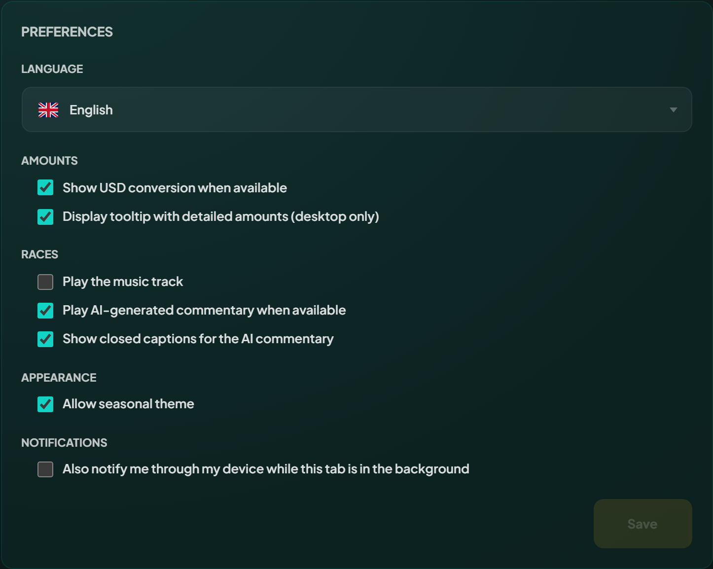

# Your preferences

Preferences are on the Player page, in the Settings tab, grouped as Language, Amounts, Races, Appearance and Notifications. They are saved against your wallet, so signing in on another device brings them with you.

Change what you like, then press **Save**. Nothing applies until you do, and Save stays disabled until something differs from what is stored. Every option but one starts switched on, so a wallet that never opens the panel sees the app as designed. Device notifications start off, because turning them on makes your browser ask for permission.

<figure><figcaption>
Set them once, and they follow your wallet to any device.
</figcaption></figure>

| Preference                                                               | What turning it off does                                                    |
| ------------------------------------------------------------------------ | --------------------------------------------------------------------------- |
| **Language**                                                             | A picker, not a switch. It appears when more than one language is on offer. |
| **Show USD conversion when available**                                   | Hides every approximate dollar figure. Token amounts are unaffected.        |
| **Display tooltip with detailed amounts (desktop only)**                 | Stops the breakdown that opens when you hover an action button.             |
| **Play the music track**                                                 | Mutes the soundtrack during a race.                                         |
| **Play AI-generated commentary when available**                          | Mutes the commentary on races created with it.                              |
| **Show closed captions for the AI commentary**                           | Hides the captions written under the commentary.                            |
| **Allow seasonal theme**                                                 | Removes the seasonal decorations and colours while a theme is live.         |
| **Also notify me through my device while this tab is in the background** | Off by default. See [Device notifications](#device-notifications).          |

## The dollar figures

The app shows an approximate dollar value beside most amounts. It is an estimate from a market price, and the token amount beside it is the exact one. Turning the conversion off removes the estimate everywhere, including the balance panel in the top bar. See [Fees and prizes](../economy/fees-and-prizes.md) for how the figure is priced.

## The race sound

The three race options are the same switches as the mute and caption buttons on the race screen. Muting the music during a race unticks it here, and unticking it here mutes the next race. They are also remembered on the device itself, so they hold before you sign in.


Commentary only plays on races created with AI commentary. The option decides whether you hear it, not whether a race has it.


## Device notifications

With this option on, a notification that would appear at the side of the page is also sent through your device while the tab is in the background: you are in another tab, another window, or the browser is minimised. While you are looking at the page, nothing changes.

Pressing **Save** with the box ticked makes your browser ask whether the site may send notifications. If you refuse, the box goes back to off and the rest of your changes still save. To turn it on later, allow notifications for the site in your browser settings, then tick the box again.

The setting covers the marketplace as well. There is no separate switch there: it follows what you saved here, for the wallet you are signed in with.


The browser permission belongs to the device, not to your wallet. On a new device the option arrives ticked but that browser has not been asked yet. The app offers to turn notifications on there, once, and the Notifications group shows an **Enable on this device** button until the browser has an answer. Refusing on one device does not switch the option off for the others.


## The balance in the top bar

One more choice is saved the same way, and it is made where it shows: which balance the button at the top right displays. See [Your player vault](../economy/player-vault.md#the-balance-in-the-top-bar).
