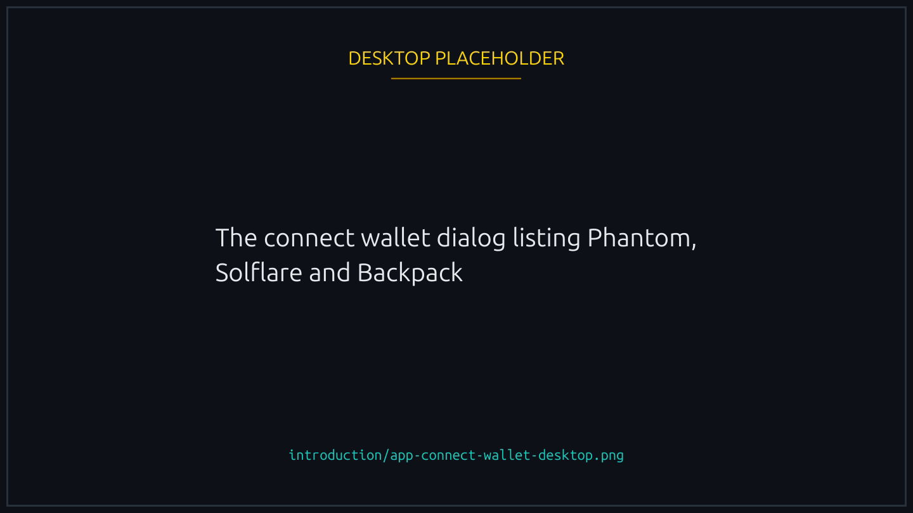
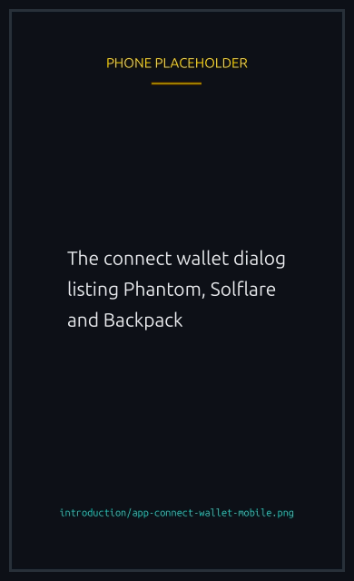

# Your first race

Six steps from a fresh browser tab to a finished race.




### Get a Solana wallet

Phantom, Solflare, Backpack, and most major Solana wallets work. The wallet adapter handles the connection automatically. If you do not have one yet, Phantom is the easiest to start with: it is a browser extension and a mobile app, both free.





### Top up with a small SOL balance

You need SOL to pay transaction fees (roughly 0.000005 SOL per signed transaction) plus whatever the race entry fee is. A safe starting balance is 0.05 SOL: enough for a stats account, a few dozen tx fees, and a couple of typical races.





### Connect

Go to `theluckyducks.com/app/` and click Connect Wallet. Approve the connection in your wallet. The first connection is a signed message, not a transaction, so it costs nothing.


{% column width="70%" %}

<figure><figcaption>
The first connection is a signature, not a transaction, so it costs nothing.
</figcaption></figure>


{% column width="30%" %}

<figure><figcaption>
On a phone
</figcaption></figure>



Your first sign-in is always the wallet, because nothing else can prove the wallet is yours. Later ones do not have to be: once you have linked a social account, the login screen offers it as a second way in.





### Create the on chain player account

On your very first action (create or join a race), the smart contract needs a player account to hold your race history, your profile, and your vault balance. A modal will explain this once and ask you to approve a one time transaction. The rent is around 0.0017 SOL and is fully refundable if you ever close the account.





### Join a race or make one

The lobby list shows all open races. Pick one that matches your appetite (entry fee, max players, duration) and click Join. Or open the Create Race modal and set the parameters yourself. Either way, signing the transaction is the commitment: your entry fee moves into the race vault as soon as it confirms.


{% column width="70%" %}

<figure><figcaption>
Open races, newest first. The card carries everything the race will cost you.
</figcaption></figure>


{% column width="30%" %}

<figure><figcaption>
On a phone
</figcaption></figure>







### Watch your duck race

Once the race starts, the canvas takes over. Ducks paddle, splash, occasionally somersault. The visual race plays at a fixed pace driven by the on chain seed. Once it ends, winners can claim with a single click.


{% column width="70%" %}

<figure><figcaption>
The finishing order, and the claim button with your payout on it.
</figcaption></figure>


{% column width="30%" %}

<figure><figcaption>
On a phone
</figcaption></figure>






## Optional: skip the wallet popups

Once you are racing regularly, you can pre-fund a balance and let Lucky Ducks sign your in-game actions for you, so joining takes one tap. See [Your player vault](../economy/player-vault.md) and [Playing without signing every action](../races/delegated-play.md).

## Optional: verify

Once you have joined a race, the platform offers verification: link an account with X, Telegram, Facebook or another supported provider. Verified players get a checkmark badge and can enter races their creator has reserved for verified wallets.

It is worth doing early for two reasons beyond the badge. A linked account lets you sign in without opening your wallet app on later visits, and it is required before you can turn on [playing without signing every action](../races/delegated-play.md). See [Player verification](../trust/verification.md).


[joining-and-playing.md](../races/joining-and-playing.md)

