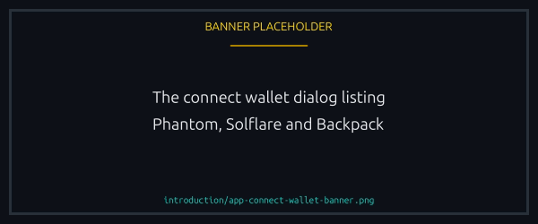
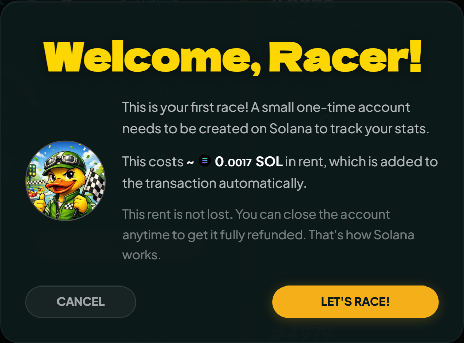
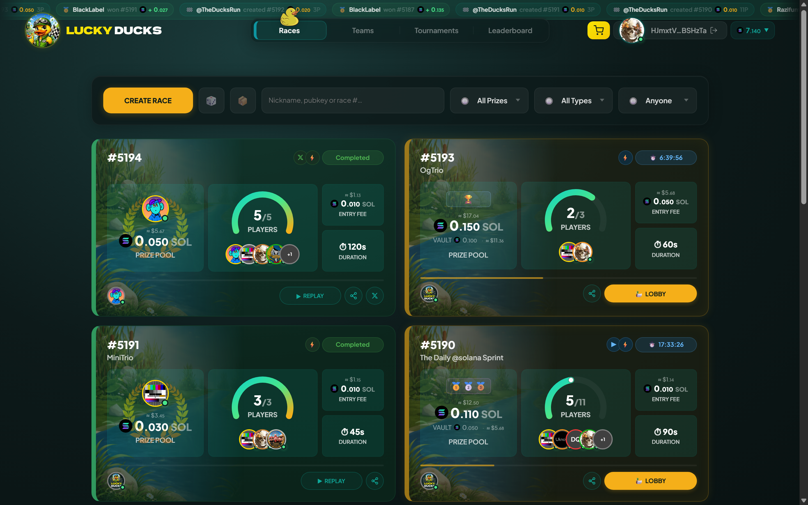
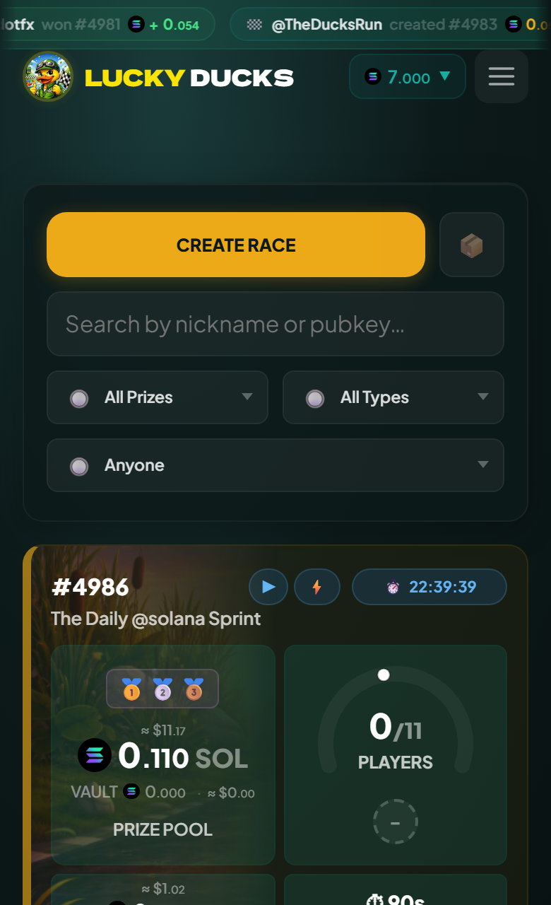
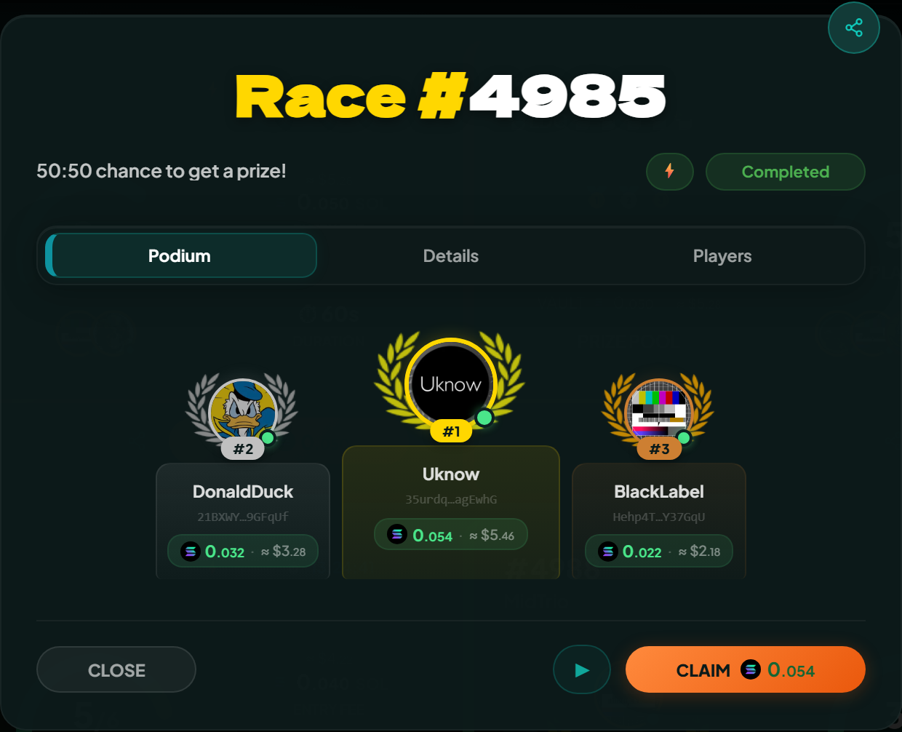
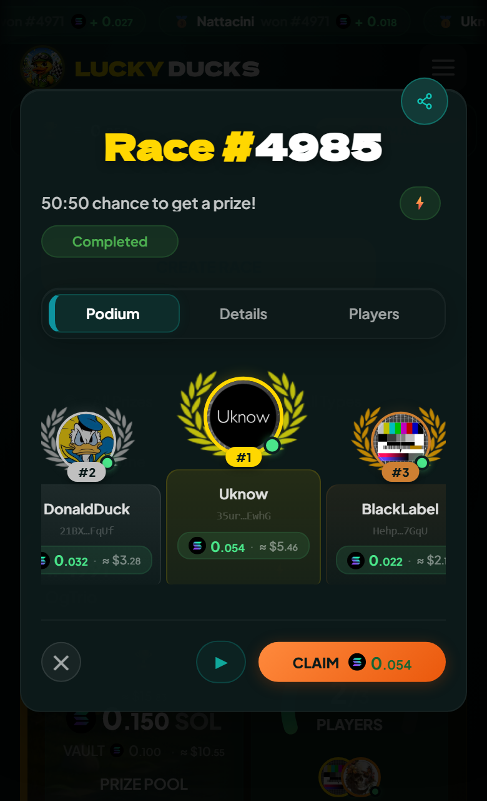

# Your first race

Six steps from a fresh browser tab to a finished race.

## 1. Get a Solana wallet

Phantom, Solflare, Backpack and most major Solana wallets work, and the app handles the connection for you. Starting from nothing, Phantom is the easiest: browser extension and mobile app, both free.

## 2. Top up with a little SOL

You need SOL for transaction fees, roughly 0.000005 SOL each, plus the entry fee itself. 0.05 SOL is a comfortable start: a player account, a few dozen fees and a couple of typical races.

## 3. Connect

Go to `theluckyducks.com/app/`, click Connect Wallet and approve. The first connection is a signed message rather than a transaction, so it costs nothing.

<figure><figcaption>
A signature, not a transaction, so it costs nothing.
</figcaption></figure>

Your first sign-in is always the wallet, because nothing else can prove the wallet is yours. Later ones need not be: link a social account and the login screen offers it as a second way in.

## 4. Create your player account

Your first create or join needs an on chain account to hold your race history, profile and vault balance. A modal explains it once, the first time you open the create form or join a race. There is no separate transaction to sign: the account is created inside your first create or join, and its rent, about 0.0017 SOL, is added to that transaction. The modal shows the exact figure, and the rent comes back in full if you ever close the account.

<figure><figcaption>
It appears once. The rent rides along with your first race, and comes back if you close the account.
</figcaption></figure>

## 5. Join a race, or make one

The lobby list shows every open race. Pick one that suits your appetite for entry fee, lobby size and duration, and click Join. Or open Create Race and set it yourself. Signing is the commitment: your entry fee moves into the race vault as soon as it confirms.


{% column width="70%" %}

<figure><figcaption>
Open races, newest first, each card carrying what the race costs.
</figcaption></figure>



{% column width="30%" %}

<figure><figcaption>
On a phone
</figcaption></figure>




## 6. Watch your duck race

The canvas takes over: ducks paddle, splash and occasionally somersault, at a pace set by the on chain seed. When it ends, winners claim in one click.


{% column width="70%" %}

<figure><figcaption>
The finishing order, and the claim button with your payout on it.
</figcaption></figure>



{% column width="30%" %}

<figure><figcaption>
On a phone
</figcaption></figure>




## Optional: skip the wallet popups

Once you are racing regularly, pre-fund a balance and let Lucky Ducks sign your in-game actions, so joining takes one tap. See [Your player vault](../economy/player-vault.md) and [Playing without signing every action](../races/delegated-play.md).

## Optional: verify

After your first race you can link an account with X, Telegram, Facebook or another supported provider. Verified players get a green dot on their avatar and can enter races reserved for verified wallets.

Two reasons to do it early, beyond the badge: a linked account signs you in without opening your wallet app, and it is required before you can turn on [playing without signing every action](../races/delegated-play.md). See [Player verification](../trust/verification.md).


[joining-and-playing.md](../races/joining-and-playing.md)

