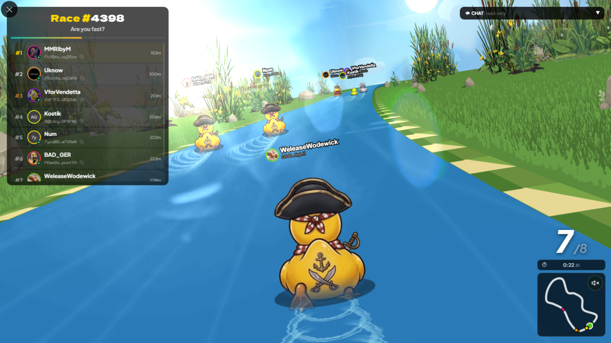
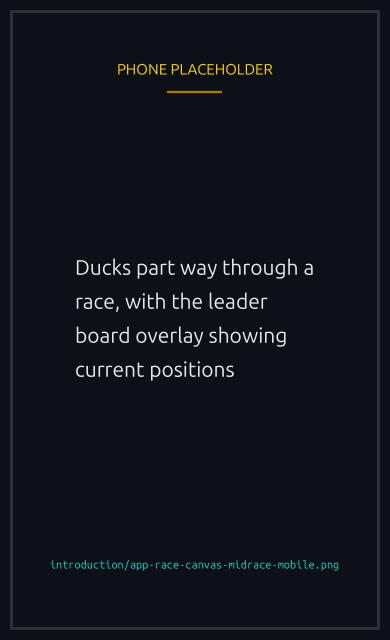

# What is The Lucky Ducks

A stylized pond, a flock of ducks at the line, and a 30-second sprint to the finish. Every race is a real Solana transaction, every prize is paid by a verified smart contract, and every random number that decides the outcome comes from an oracle rather than from the website.


{% column width="70%" %}

<figure><figcaption>
Positions come from the on-chain seed, not from the server.
</figcaption></figure>



{% column width="30%" %}

<figure><figcaption>
On a phone
</figcaption></figure>




## The pitch

Most online racing games hide the math: the server picks a winner, plays the animation, and trusts you not to ask. Here the math is the product. The contract takes your entry fee, locks it in a per race vault, asks an on chain oracle for randomness, and pays the winners on a table it enforces itself.

Three things follow:

- **Anyone can verify a race.** Once the randomness is published the outcome is fixed. Re-run the math on the same seed and the finishing order comes out the same, every time.
- **The platform cannot pick a winner.** The team writes the contract and deploys it, and from then on has no special power over outcomes.
- **Refunds are automatic.** If a race never starts, whether from too few players, a failed oracle or a stuck transaction, every player can claim their fee back, and anyone at all can trigger the refund. No support ticket.

## The catch

It runs on Solana, so you need a wallet, a little SOL for fees, and the willingness to sign transactions.


Your first race also creates a small on chain player account. It costs \~0.0017 SOL in rent, refundable in full if you close it later.


Past that, an entry fee is whatever the creator set, in SOL or a supported SPL token.

## Who runs it

The Lucky Ducks team writes the contract, the backend, the frontend and the art. The platform takes a small treasury fee from every prize pool, which covers hosting, oracle costs and development. The rest of your money goes to other players.


[how-it-works.md](how-it-works.md)

