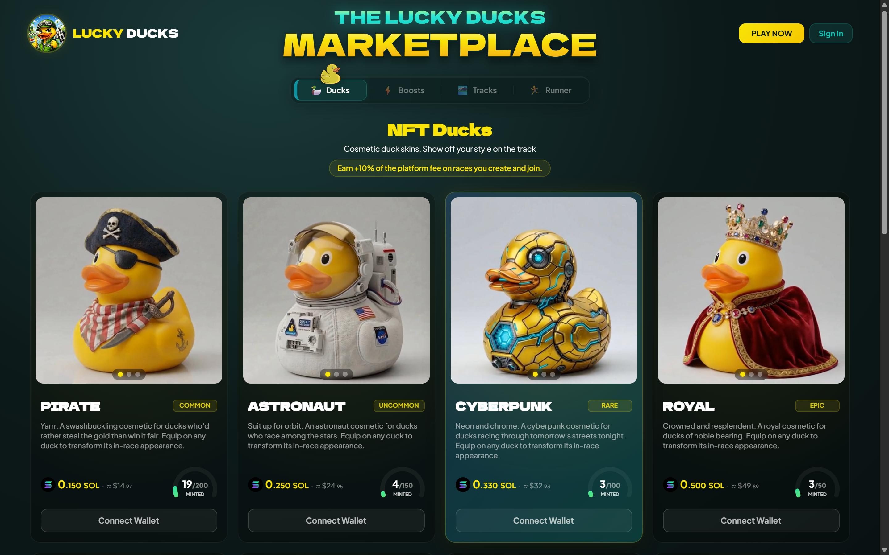
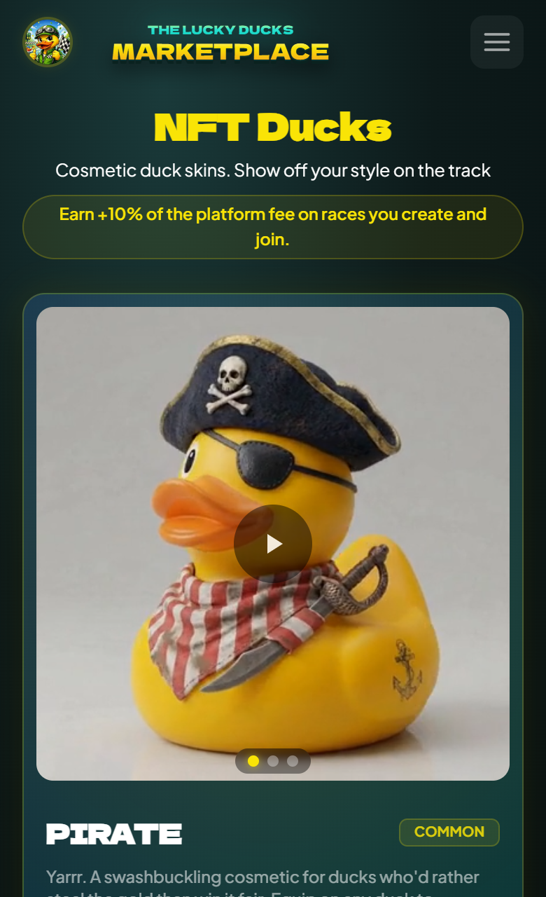

# NFT collections

Lucky Ducks ships four NFT collections, each with a different purpose. All four use the Metaplex Core standard on Solana, are tradable on the Lucky Ducks marketplace and on third party marketplaces (Tensor, MagicEden), and are verifiable through the platform: race actions check whether the connected wallet holds an asset from the appropriate collection.

## The four collections

| Collection            | Purpose                           | Affects race outcome? |
| --------------------- | --------------------------------- | --------------------- |
| **Runners**           | Unlock advanced race features     | No                    |
| **Boosts**            | Add a small speed advantage       | Yes                   |
| **Tracks**            | Custom race backgrounds           | No                    |
| **Cosmetics / Ducks** | Visual customization of your duck | No                    |


Only the Boosts collection mechanically affects who wins. The rest are about access (Runners), customization (Tracks, Cosmetics), or both.


## How NFT detection works

When you create or join a race, the page scans the connected wallet for assets matching the relevant collection's verified creator pubkey. If at least one valid asset is found, the relevant features unlock in the UI. Scans are cached for a few minutes; if you just transferred an NFT in and the page hasn't picked it up, refresh the wallet adapter to retrigger.


The smart contract independently verifies the NFT is in the wallet at the moment of the transaction. The frontend cannot fake this check.


## Where to acquire

- **Mints**. New collections drop periodically. Mint links appear on the homepage and in the Telegram announcement channel.
- **Marketplace**. The in-app marketplace lists every Lucky Ducks NFT currently for sale. Filter by collection.
- **Third party**. Tensor and MagicEden list the same NFTs. Buying from a third party works identically to buying in-app, the NFT lands in the same wallet.
- **Mystery Boxes**. Sealed boxes you mint and open for a random reward NFT from the matching collection (Cosmetics, Tracks, or Boost). See [Mystery Boxes](mystery-boxes.md).
- **Renting**. Some tiers can be rented by the day instead of bought. The NFT sits in your wallet and works normally for the term, then returns to the platform. See [Renting an NFT](renting.md).


{% column width="70%" %}

<figure><figcaption>
The in-app marketplace, filtered by collection.
</figcaption></figure>


{% column width="30%" %}

<figure><figcaption>
On a phone
</figcaption></figure>



## What about royalties

Boosts, Runners, and Tracks ship without enforced royalties at the moment. The Cosmetics collection has royalty enforcement enabled via the Metaplex Core Royalties plugin. Creator royalties feed back into platform development.

## Next

Read the per collection pages for what each NFT actually does:

<table data-view="cards"><thead><tr><th></th><th></th><th data-hidden data-card-target data-type="content-ref"></th><th data-hidden data-card-cover data-type="files"></th></tr></thead><tbody><tr><td><strong>Runner NFTs</strong></td><td>The access pass. Unlocks advanced race creation and lifts your daily allowance.</td><td><a href="runners.md">runners.md</a></td><td><a href="../../.gitbook/assets/nfts/nft-card-runners.png">nft-card-runners.png</a></td></tr><tr><td><strong>Boost NFTs</strong></td><td>The only collection that affects outcomes, capped at 1% on chain.</td><td><a href="boosts.md">boosts.md</a></td><td><a href="../../.gitbook/assets/nfts/nft-card-boosts.png">nft-card-boosts.png</a></td></tr><tr><td><strong>Track NFTs</strong></td><td>Custom scenery for a race you create. Visual only.</td><td><a href="tracks.md">tracks.md</a></td><td><a href="../../.gitbook/assets/nfts/nft-card-tracks.png">nft-card-tracks.png</a></td></tr><tr><td><strong>Cosmetic NFTs</strong></td><td>Wearable duck skins, and your platform avatar.</td><td><a href="cosmetics.md">cosmetics.md</a></td><td><a href="../../.gitbook/assets/nfts/nft-card-cosmetics.png">nft-card-cosmetics.png</a></td></tr><tr><td><strong>Mystery Boxes</strong></td><td>Sealed boxes that open into a random reward from a themed pool.</td><td><a href="mystery-boxes.md">mystery-boxes.md</a></td><td><a href="../../.gitbook/assets/nfts/nft-card-mystery-boxes.png">nft-card-mystery-boxes.png</a></td></tr><tr><td><strong>Renting an NFT</strong></td><td>Pay by the day, race with it, and it returns on its own.</td><td><a href="renting.md">renting.md</a></td><td><a href="../../.gitbook/assets/nfts/nft-card-renting.png">nft-card-renting.png</a></td></tr></tbody></table>
