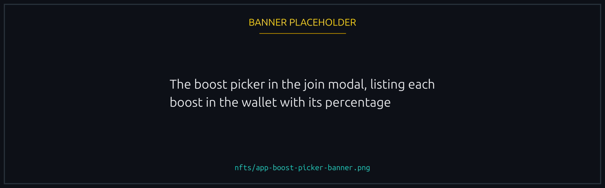
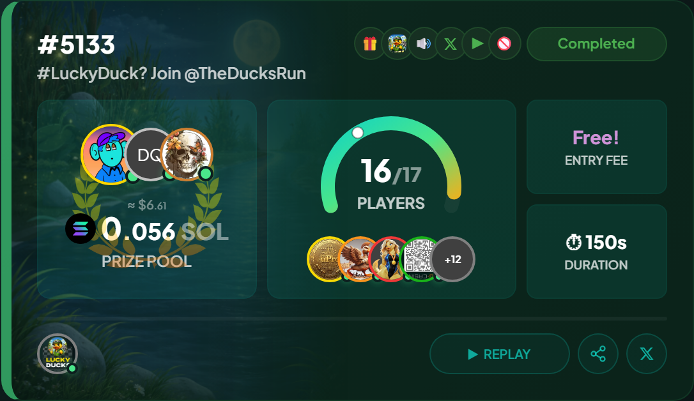
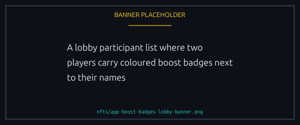

# Boost NFTs

The one collection that touches race outcomes. Equip a Boost when you join and your duck carries a small speed advantage for that race.

## How the boost works

Every Boost carries a fixed size in its on chain details, written in basis points. 100 basis points is 1%, so an 80 point boost adds 0.8% to your duck's speed.


The cap is on chain at **100 bps, or 1%**. A boost claiming more off chain is cut back to 1% by the contract, which keeps a boost an edge rather than a guarantee.


## Stacking and selection

One boost per race. Hold several and the join modal shows them all for you to pick from; pick none and the race runs unboosted.

<figure><figcaption>
One boost per race, chosen at join time.
</figcaption></figure>


Boosts are **never consumed**. The same one works in every race you ever join.


## Are boosters fair?

The worry is reasonable: a paid speed boost sounds like pay to win. It is not, and the numbers below come from simulating the on chain velocity model directly.

### Why the boost stays small

The engine draws a duck's speed separately on each of several segments, and two numbers set the scene:

1. **Speed range per segment.** Each segment's base speed is drawn uniformly between roughly 600 and 1400 units, so an unlucky duck can be more than **2.3 times slower** than a lucky one. That gap dwarfs any boost.
2. **Boost size.** A boost multiplies a segment by at most 1.01. It cannot rescue a bad draw, only nudge a good one.

Segments per race depend on duration:

| Race duration    | Segments per duck |
| ---------------- | ----------------- |
| Up to 40 seconds | 3 to 5            |
| 41 to 90 seconds | 5 to 9            |
| Over 90 seconds  | 7 to 13           |

Each duck draws its own segment count, per segment weights (1-3) and per segment speeds, so nobody cruises at one speed. It looks more like duck A on 900, 620, 1350, 780, 1100 against duck B on 700, 1250, 940, 1180, 830. A 1% boost multiplies each of B's numbers by 1.01, which against that spread is tiny.

The simulated win rates in full (Monte Carlo, 200,000 simulations)

**Real win probabilities.** Base odds in a 5 player race are 20% per duck, and a boost shifts them barely:

| Boost     | 5 player, 30s race | 5 player, 60s race | 5 player, 3 minute race |
| --------- | ------------------ | ------------------ | ----------------------- |
| None      | 19.9%              | 20.1%              | 20.0%                   |
| +0.1%     | 20.1%              | 20.3%              | 20.2%                   |
| +0.5%     | 20.8%              | 21.2%              | 21.4%                   |
| +1% (max) | 21.7%              | 22.4%              | 22.7%                   |

A longer race gives the boost slightly more room, because more segments average out the draws and let a fixed multiplier show. Even at the cap and the longest duration it is about 2.7 percentage points above base.

**Bigger and smaller lobbies.** The effect shrinks as the lobby grows:

| Lobby     | Base odds | +1% boost win rate |
| --------- | --------- | ------------------ |
| 1v1       | 50%       | 52.0%              |
| 5 player  | 20%       | 21.7%              |
| 10 player | 10%       | 11.1%              |
| 20 player | 5%        | 5.8%               |

In every case the boost adds roughly 1 to 2 percentage points, never more.

**Where a boosted duck actually finishes.** A max +1% duck in a 5 player, 30 second race:

| Finish position | Frequency |
| --------------- | --------- |
| 1st (win)       | 21.8%     |
| 2nd             | 20.7%     |
| 3rd             | 20.0%     |
| 4th             | 19.3%     |
| 5th (last)      | 18.2%     |


**A +1% duck finishes last almost as often as an unboosted one.** The speed draw dominates. Every finished race is public, so check for yourself: see [How to verify a race on-chain](../trust/verifying-a-race.md).


### If you'd rather race without boosters

- **Sponsored races.** Boosts are disabled outright. If the creator funds the prize, nobody brings one.
- **No-boost races.** A creator can switch them off on any race, sponsored or not. See [No-boost races](#no-boost-races) below.
- **Allowlist races.** You control who joins, so you can invite players who agree to go without. The caveat: an allowlisted player who owns a boost **can** still equip it, because the list governs who enters, not what they bring. See [Allowed players (private invites)](../races/access-and-gating.md#allowed-players-private-invites).

There is no counter NFT, and a boost cannot be neutralised or stolen. In a regular race the only answer to someone's boost is your own.

### Why the 1% cap

It is on chain and deliberate. Unbounded boosts would let a wealthy player dominate; 1% holds the maximum edge to the 1 to 2 percentage points above, and that is the ceiling rather than a starting point.

## No-boost races

A race can be created with boosts switched off for everyone, its creator included, so the result comes down to the draw alone.

Those races carry a crossed-out circle on the card, in the race view and on the share image, and the Telegram and X announcements say so too, so you always know before joining.

<figure><figcaption>
The marker rides on the card, the race view and the share image.
</figcaption></figure>

### Why you might create one

Boosts are small but real, and in a race where everyone else has one, going without is a small disadvantage. No-boost mode removes the question, which suits community events where not everyone owns boosts.

### Creating one

It needs a Runner NFT. The option sits on the create form, and in recipe settings if you run automated races.

### If you already own boost NFTs

Nothing is lost. They work normally in every race that has not disabled them. In a no-boost race nothing you bring is applied, and you are not charged for a boost that never took effect.


Rematches inherit the setting all the way down the chain, so a rematch cannot sneak boosts back into a level match.


## Verifying the badge

A participant who equipped a boost carries a small badge beside their name in the lobby, coloured by boost size: cooler for smaller, hotter for bigger. One glance tells you who is running with what.

<figure><figcaption>
Badge colour tracks boost size, so the lobby shows who brought what.
</figcaption></figure>

## Acquiring

The usual channels: scheduled mints, the in-app marketplace, third party secondary. Boost floors follow how busy the game is.
