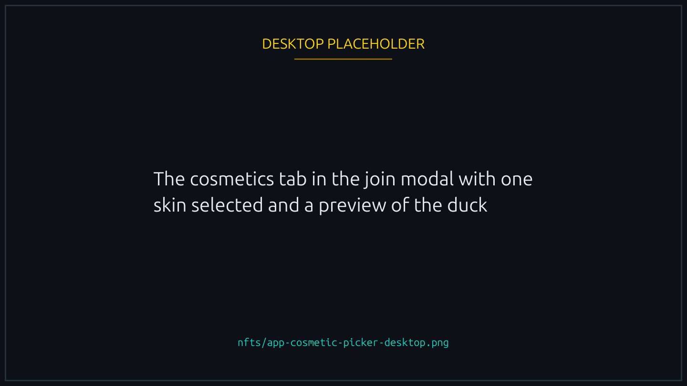
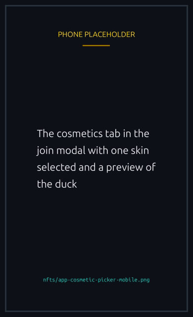

# Cosmetic NFTs

Wearable duck skins. A Cosmetic NFT (sometimes referred to as a "Duck" by the team) changes how your duck looks in the race canvas, on the lobby card, and in your player profile.

<figure><figcaption>
Cosmetics are visual only, in the race and on your profile.
</figcaption></figure>

## What changes

- Color palette of the duck's body, beak, and accessories
- Optional themed outfits (astronaut, pirate, royal, more)
- Optional pattern overlays (camo, gradient, animated)
- Avatar on the lobby and player pages, when you set the cosmetic as your default

## How they apply

In the Join Race modal, the Cosmetics tab shows every cosmetic in your wallet. Pick one and your duck wears it for that race. The choice persists between races until you change it. If you do not pick a cosmetic, your duck races in default plumage.


Cosmetics are visual only. They do not affect speed, finishing order, or any other race mechanic.


## Themed releases

Recent and upcoming drops follow a movie-inspired naming pattern: "inspired by" but never named after specific IP, to keep the team out of trademark territory. Examples shipped include retro arcade style, neon synthwave style, and seasonal sets.

## Royalties

The Cosmetics collection has no enforced royalties.

## Acquiring

- Scheduled themed drops (every few weeks)
- In app marketplace listings
- Third party marketplaces (Tensor, MagicEden) carry the same NFTs

## Setting an avatar

Cosmetics can also be picked as your platform avatar from the Player page. The cosmetic's image then appears next to your nickname everywhere: race lobbies, chat, leaderboard, team rosters. This is separate from selecting one for a specific race.


{% column width="70%" %}

<figure><figcaption>
Picking one for a race, and picking one as your avatar, are two separate choices.
</figcaption></figure>


{% column width="30%" %}

<figure><figcaption>
On a phone
</figcaption></figure>


