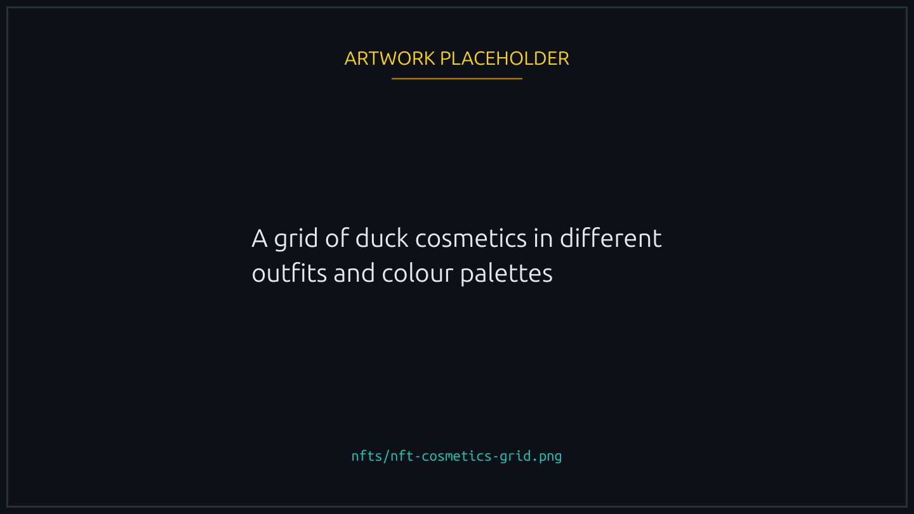
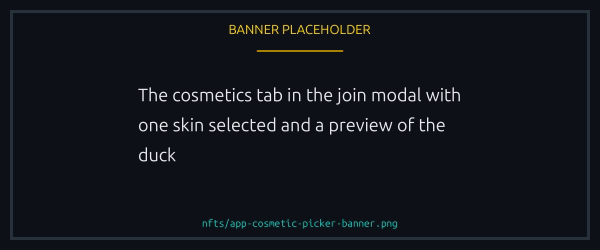
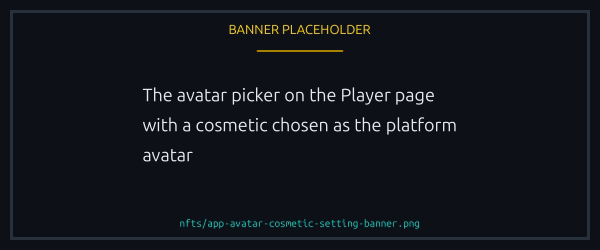

# Cosmetic NFTs

Wearable duck skins. A Cosmetic, sometimes called a Duck by the team, changes how your duck looks on the canvas, on the lobby card and on your profile.

<figure><figcaption>
Looks only, in the race and on your profile.
</figcaption></figure>

## What changes

- The palette of the body, beak and accessories
- Themed outfits: astronaut, pirate, royal and more
- Pattern overlays: camo, gradient, animated
- Your avatar on the lobby and player pages, if you set the cosmetic as your default

## How they apply

The Cosmetics tab in the join modal shows every cosmetic in your wallet. Pick one and your duck wears it, and the choice sticks until you change it. Own none and your duck races in default plumage.


Cosmetics are visual only. No effect on speed, finishing order or anything else a race decides.


<figure><figcaption>
Every cosmetic in your wallet, and the choice sticks until you change it.
</figcaption></figure>

## Themed releases

Drops follow a movie-inspired naming pattern: "inspired by" and never named after a specific title, which keeps the team out of trademark trouble. Shipped sets include retro arcade, neon synthwave and seasonal runs.

## Royalties

The collection carries the Royalties plugin at a rate of zero, so selling a cosmetic costs you no royalty. See [NFT collections](README.md#what-about-royalties).

## Acquiring

- Themed drops every few weeks
- In-app marketplace listings
- Tensor and MagicEden, carrying the same NFTs

## Setting an avatar

You can also pick a cosmetic as your platform avatar from the Player page, and its image then appears next to your nickname everywhere: lobbies, chat, leaderboard, team rosters. That is a separate choice from the one you make for a race.

<figure><figcaption>
Your race skin and your platform avatar are two separate choices.
</figcaption></figure>
