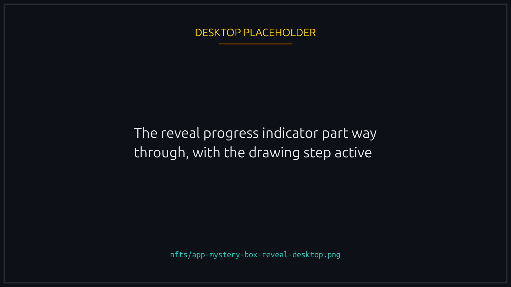
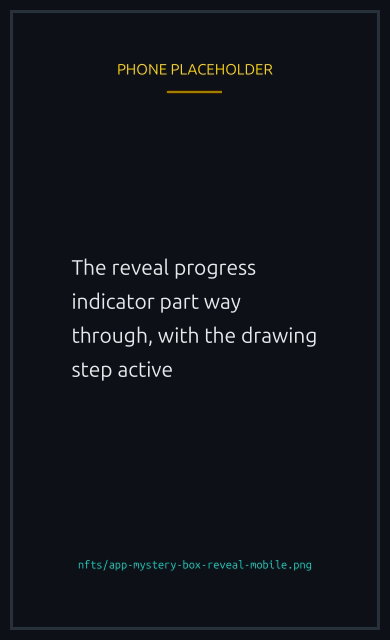

# Mystery Boxes

Mystery Boxes are sealed NFT boxes that open into a random reward from a themed pool. You mint a box without knowing what is inside; the box is then opened on chain and a reward NFT is minted straight to your wallet.

The reward NFT belongs to the matching regular collection ([Cosmetics](cosmetics.md), [Tracks](tracks.md), or [Boosts](boosts.md)), so what you pull is interchangeable with anything else from that collection: tradable on the marketplace, recognized by the platform, no special "from a box" tag attached to it.


{% column width="70%" %}

<figure><figcaption>
You choose the box type. The reward inside it is drawn at random.
</figcaption></figure>


{% column width="30%" %}

<figure><figcaption>
On a phone
</figcaption></figure>



## The three box types

Each box belongs to one of three groups, and reveals a reward drawn only from that group:

| Box           | Opens into                                                                       |
| ------------- | -------------------------------------------------------------------------------- |
| **Cosmetics** | A random Duck cosmetic (Pirate, Astronaut, Cyberpunk, Royal, Golden, and so on). |
| **Tracks**    | A random race Track (Night, Sunset, Rainy, Snowy, Stormy, Foggy, and so on).     |
| **Boost**     | A random Boost.                                                                  |

The exact reward you get is chosen at open time, weighted by the pool the team has configured. Rarer rewards have a smaller share of the pool.

## How opening works




### Mint a box

Pick a box type in the marketplace and mint it like any other NFT. You pay the box price and a sealed box lands in your wallet.





### The box opens automatically

No second transaction is needed from you. The moment your box mint is seen, the reveal begins.





### A random reward is drawn

The outcome is decided by a verifiable random number (see [Provably fair](#provably-fair) below) and the configured reward weights.





### Your reward is minted to you

The reward NFT is sent directly to the wallet that opened the box, and the box is consumed.




A progress indicator walks through each step (opening, drawing your prize, selecting your reward, minting it) and finishes by showing the reward you received.


{% column width="70%" %}

<figure><figcaption>
The reveal runs on its own. There is no second signature.
</figcaption></figure>


{% column width="30%" %}

<figure><figcaption>
On a phone
</figcaption></figure>




You never sign a separate "reveal" transaction. Once the box is minted, opening is handled for you and the reward arrives on its own.


## Provably fair

The reward is selected using **ORAO VRF**, an on chain verifiable random function. The randomness is requested and fulfilled on chain, so the draw cannot be predicted or tampered with ahead of time. The reveal only finalizes after the random value is published on chain.

This is the same randomness source that decides race winners. For background on what that guarantees and how you can verify it yourself, see [Provable randomness](../trust/fairness.md).

## Reveal states

While a box is opening you may see one of these states:

- **Opening, Drawing, Selecting, Minting.** The reveal is in progress. This usually takes only a few seconds.
- **Revealed.** Done. Your reward NFT is in your wallet.
- **Temporarily unavailable.** The matching reward group is momentarily empty or paused. Your box is safe; try again a little later.
- **Failed.** The open could not complete this time (for example, the randomness was not produced in time). The system retries for up to about two minutes before showing this; your box is not lost.

## FAQ

Do I choose my reward?

No. The reward is drawn at random from the box's reward pool. You choose the box type (Cosmetics, Tracks, or Boost), not the specific reward.

How long does opening take?

Typically a few seconds. In rare cases the on chain randomness takes longer; the system keeps trying for up to about two minutes.

What happens to the box after it opens?

The box is consumed as part of opening. It is a one time key that turns into your reward.

Is there a limit on how many boxes I can buy?

Yes. Each box type has a total supply and a per-wallet cap, both set by the team. When you hit either one the store tells you which, and refuses the purchase before you sign anything.

The store said it could not check availability. Is it sold out?

No, and the wording is deliberate. "Sold out" and "could not check right now" are two different answers. The store refuses to sell a box it cannot confirm is available, so a temporary read failure looks like a refusal rather than risking a purchase against an empty box. Sold out is final; could not check is worth retrying in a moment.

Can I see recent reveals?

Yes. The marketplace shows a feed of the most recently revealed mints so you can see what others have pulled.

Are the rewards different from collection mints?

No. A reward NFT pulled from a Mystery Box is identical to one minted any other way: same collection, same metadata, same marketplace listing options.

