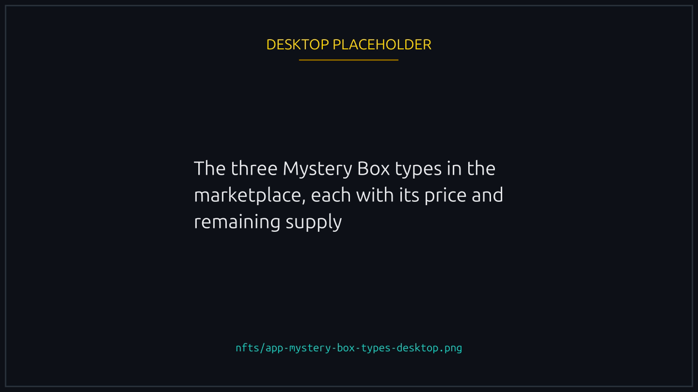
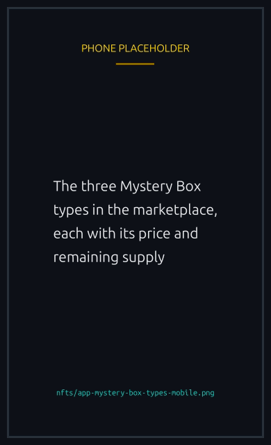
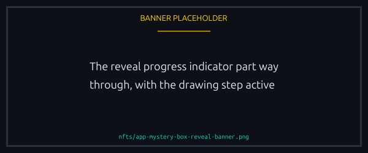

# Mystery Boxes

A sealed box you mint without knowing what is inside. It opens on chain and mints a reward NFT straight to your wallet.

The reward belongs to the matching regular collection, [Cosmetics](cosmetics.md), [Tracks](tracks.md) or [Boosts](boosts.md), so it is interchangeable with anything else from there: tradable, recognised by the platform, and carrying no "from a box" tag.


{% column width="70%" %}

<figure><figcaption>
You choose the box type. What is inside is drawn at random.
</figcaption></figure>



{% column width="30%" %}

<figure><figcaption>
On a phone
</figcaption></figure>




## The three box types

Each box draws only from its own group:

| Box           | Opens into                                                                       |
| ------------- | -------------------------------------------------------------------------------- |
| **Cosmetics** | A random Duck cosmetic (Pirate, Astronaut, Cyberpunk, Royal, Golden, and so on). |
| **Tracks**    | A random race Track (Night, Sunset, Rainy, Snowy, Stormy, Foggy, and so on).     |
| **Boost**     | A random Boost.                                                                  |

The reward is picked at open time against weights the team configures, so rarer rewards hold a smaller share of the pool.

## How opening works




### Mint a box

Open the marketplace section you want, Ducks, Boosts or Tracks, and mint the box it leads with, like any other NFT. You pay the price and a sealed box lands in your wallet.





### The box opens itself

No second transaction. The reveal begins the moment your mint is seen.





### A random reward is drawn

Decided by a verifiable random number, see [Provably fair](#provably-fair) below, and the configured weights.





### Your reward is minted to you

Straight to the wallet that opened the box, and the box is consumed.




A progress indicator walks through opening, drawing, selecting and minting, then shows you what you got.

<figure><figcaption>
The reveal runs on its own. There is no second signature.
</figcaption></figure>


You never sign a "reveal". Once the box is minted the opening is handled for you and the reward arrives by itself.


## Provably fair

The draw uses **ORAO VRF**, the same on chain randomness that decides race winners: requested and fulfilled on chain, so nobody can predict or tamper with it, and the reveal only finalises once the random value is published. See [Provable randomness](../trust/fairness.md) for what that guarantees and how to check it.

## Reveal states

- **Opening, Drawing, Selecting, Minting.** In progress, usually a few seconds.
- **Revealed.** Done, and the reward is in your wallet.
- **Temporarily unavailable.** That reward group is momentarily empty or paused. Your box is safe, so try again shortly.
- **Failed.** The open could not finish this time, for instance because the randomness did not arrive. The system retries for up to about 2 minutes first, and your box is not lost.

## FAQ

Do I choose my reward?

No. You choose the box type, Cosmetics, Tracks or Boost, and the reward is drawn at random from that pool.

How long does opening take?

Usually a few seconds. When the on chain randomness is slow the system keeps trying for up to about 2 minutes.

What happens to the box after it opens?

It is consumed. A box is a one time key that turns into your reward.

Is there a limit on how many boxes I can buy?

Yes. Each type has a total supply and a per-wallet cap, both set by the team, and the store tells you which one you hit and refuses before you sign.

The store said it could not check availability. Is it sold out?

No, and the wording is deliberate. The store refuses to sell a box it cannot confirm exists, so a temporary read failure looks like a refusal rather than risking a purchase against an empty pool. Sold out is final; could not check is worth retrying in a moment.

Can I see recent reveals?

Yes. The marketplace shows a feed of the latest reveals, so you can see what other people have pulled.

Are box rewards different from collection mints?

No. A reward is identical to one minted any other way: same collection, same metadata, same listing options.

