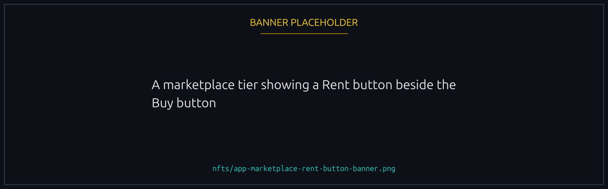
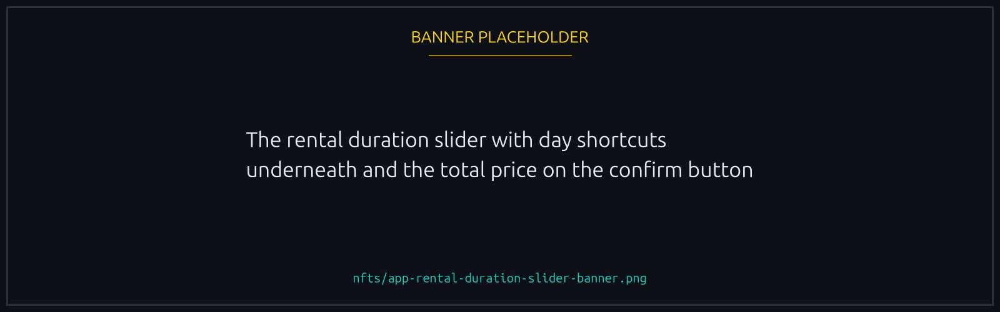
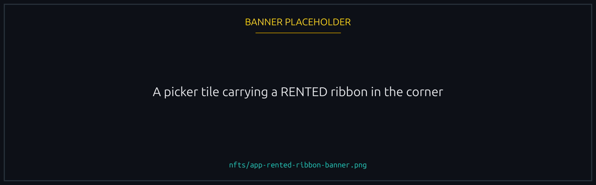

# Renting an NFT

Pay for a number of days and the NFT lands in your wallet, working exactly like one you own for as long as you hold it. When the time is up it goes back on its own.

It suits a Boost for a weekend tournament, or trying a Track before you buy one.

## What can be rented

Only the tiers the platform offers. In the marketplace a rentable tier has a **Rent** button beside **Buy**; anything else has only Buy, so there is no disabled button to hunt for.

<figure><figcaption>
No Rent button means that tier is not rentable at all.
</figcaption></figure>

Mystery Boxes never rent. A box exists only until you open it, so there would be nothing to give back.

The pool is deliberately small. Rentable items are minted for the purpose, carry a **Rental** label where an edition number would be, and run to a handful of each. If a tier is all out, the Rent button says so and you can try again when one returns.

## Choosing how long

From **1 day to 30 days**, in whole days. The slider moves a day at a time and the marks beneath it (1, 3, 7, 14, 21, 30) are shortcuts rather than the only options, so 5 days or 17 are both fine.

Each tier has its own daily price, set by the platform and unrelated to what buying one costs. The total is the daily price times the days, the button shows it, and there is no proration or partial day.

<figure><figcaption>
The total on the button is the whole cost. Nothing is charged later.
</figcaption></figure>

## Paying

**One transaction moves the money and the NFT together**, so there is no moment where you have paid and not received. Rentals are SOL only, once, up front: nothing renews and nothing is charged later.


If your wallet reports a failure after you approved, do not pay again. Check your rentals first: the platform records the transaction before sending it, so a rental that actually landed will be there.


## While you hold it

The NFT is genuinely yours for the term and the platform treats it that way. A rented Boost gives the same edge, a rented Runner unlocks the same features, a rented Track or Duck looks the same in a race. Nobody you race against can tell.

Two things differ, both from the same freeze:

- **You cannot sell, transfer or give it away**, here or on Tensor, MagicEden or anywhere else. A listing could never settle, so the transfer is blocked rather than failing after somebody has paid you.
- **You cannot burn it.** There are only a few of each, and a pool cannot survive its renters destroying them.

Everything else is normal: no page to keep open, and no tie to a browser or device.

**Your own screens mark it, and only yours.** A rented item carries a **RENTED** ribbon in the create and join pickers, on every tab, so you can see which of your picks has a clock on it. Nobody else sees it, in a race or anywhere else.

<figure><figcaption>
On your screens only. Other players never see it.
</figcaption></figure>

## The one rule: do not alter it


**Do not attach anything of your own to a rented NFT.** Playing cannot trigger this: racing with it and equipping it leave the item untouched. It means going to the NFT in a wallet or explorer and adding something, such as your own delegate or freeze.

Do that and the rental ends on the spot. The item is taken back, the rest of the term with it, and there is no refund. You are told when it happens, and the ended rental says what was found on it.


The item goes back into the pool for the next person, and it has to go back the way it left.

## When the term ends

The NFT leaves your wallet on expiry, with no signature and nothing to do. That is the deal, and it is what frees the item for the next renter.

Your rentals sit on the marketplace with the days left on each and the last day marked. Nothing is deducted at the end, since you paid in full at the start.

A race you have already joined is unaffected if the term ends mid-run: the NFT's effect was recorded when you joined.


**A saved default is skipped, not broken.** If the item was your saved Boost, Track or Duck, your next race leaves that slot empty rather than refusing to start. Pick something you still hold, or rent again. A saved race template behaves the same way.


## If you want to keep it

A rental cannot be extended in place. Rent again when the term is up, or buy one outright from [the marketplace](README.md#where-to-acquire). A bought NFT carries none of the restrictions above: yours, transferable, sellable, and it never expires.
