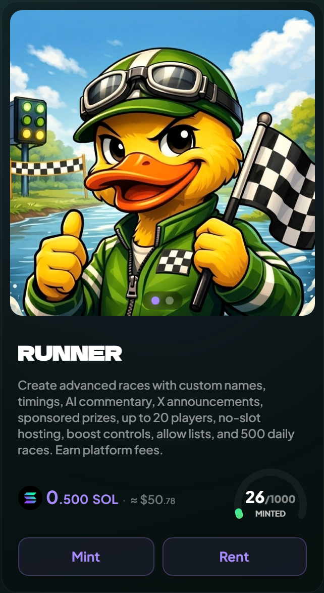
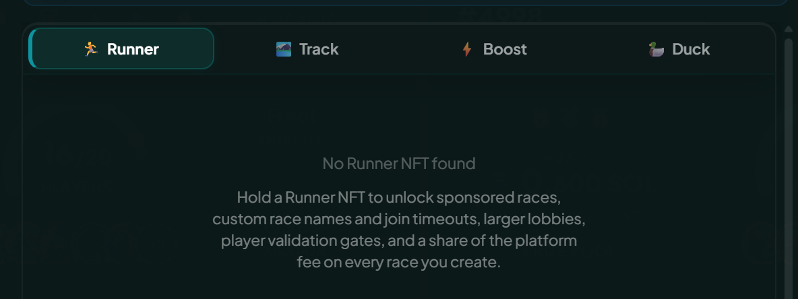

# Runner NFTs

The access pass. A Runner in your wallet unlocks the advanced race creation features, and nothing else about how you race.

<figure><figcaption>
It only has to be in the creating wallet at the moment the race is created.
</figcaption></figure>

## What it unlocks

- **More than 5 seats.** Anyone can create up to 5; a Runner takes you to 20.
- **AI commentary.** The per second narration track.
- **Custom race duration.** 30 seconds is open to everyone; anything else, up to the platform maximum of 3 minutes, needs a Runner.
- **Custom join timeout.** The 1 minute to 1 week slider.
- **Custom name** on the race card.
- **Start when underfilled.**
- **A higher daily allowance.** 50 races a day becomes 500, and this is the only thing that lifts it.
- **Host without playing.** A race that opens empty and fills as others join. See [Hosting, cancelling, and refunds](../races/hosting-and-cancelling.md).
- **Sponsored race.** You fund the pool instead of the joiners.
- **X announcement** when the race goes live.
- **No-boost race**, for everyone in it.
- **Allowed Players**, an invite list of up to 20 wallets, which counts as a customization.
- **NFT Holders**, the collection gate, on every chain.
- **Minimum account age** on joiners.

## What Runner is not required for

Two of the four gates host fine without one, as long as the race stays on default settings otherwise. Each has its own creator side check, covered in [Race access and gating](../races/access-and-gating.md):

- Verified Only asks the creator to be verified, if they take a seat.
- Token Holders asks for an approved token, and for the creator to meet the same balance at auto join.

The other two always need a Runner: **NFT Holders**, on every chain, and **Allowed Players**.


A Runner is also the largest single addition to the [Creator Fee Share](../economy/creator-fee-share.md), though it does not unlock it. Every creator who races in their own race earns a base share with no NFT at all, and the Runner adds to that.


## What it does not do


Runners are not boosts. No extra speed, no head start, no effect on any race you join. They decide what you can build when you create.


## Acquiring

- Runner mints drop occasionally, announced on the homepage banner and in Telegram.
- Secondary market on Tensor, MagicEden or the in-app marketplace.
- The collection is deliberately small, so the floor moves with demand.

## Verifying you have one

Connect a wallet holding a Runner and the create form shows everything. There is nothing to switch on or select: the app reads your connected wallet on its own, when you create and when you join, and uses what it finds. Without one the gated options are dimmed and each carries a "🏃 Runner NFT" chip. The form still opens and standard races still work; the unlocked features simply stay out of reach.

<figure><figcaption>
Gated options are dimmed rather than hidden, so you can see what a Runner would add.
</figcaption></figure>

## Renting or borrowing one

Runners are among the tiers the platform rents by the day, so you can take one for a weekend of hosting instead of buying. See [Renting an NFT](renting.md).

They are also ordinary transferable assets, so an over-the-counter loan between holders works too: the program only asks whether the NFT sits in the wallet creating the race, and it can move freely between races.
