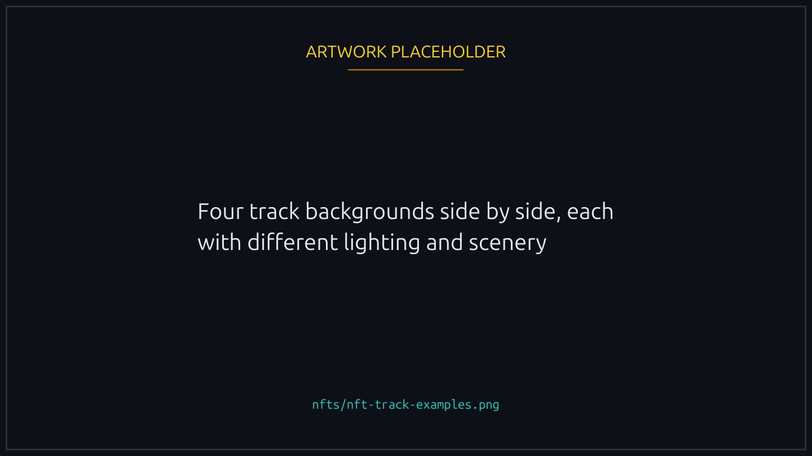
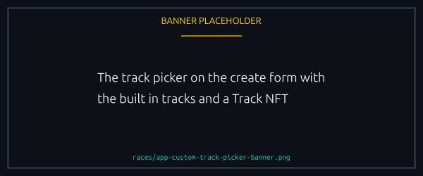

# Track NFTs

A themed environment for your races: a different pond, different light, different props along the lane. The race plays out the same. Only the scenery moves.

<figure><figcaption>
A track changes what surrounds the lane, never the outcome.
</figcaption></figure>

## What you get

- A high resolution background and matching pond reflection
- A track name on the race card and detail modal
- A deep link to the NFT page from any race using it
- A marketplace shortcut on the race detail's Track Info row

## Built in tracks

Four ship with the platform, free and always available: **day, night, sunset, sunrise**. One is assigned at random when a race picks no custom track.

## Custom tracks

The Custom Track picker on the create form offers any Track NFT you hold. The card and detail modal then carry its name and image, and everyone in the lobby and the race sees it.


Once the race exists, the Track need not stay in your wallet. The race stores the mint at creation and renders from that, wherever the asset lives later, so you can sell a Track you have already raced on and that race still looks right.


<figure><figcaption>
A Track you own appears in the picker beside the four built in ones.
</figcaption></figure>

## Acquiring

Tracks arrive in small themed drops, often seasonal or sponsored. Floors follow demand and how rare the drop was.

## Track creation

The team designs and mints all of them, and there is no community minting tool, so proposing one means reaching the team. See [Social networks](../help/social-networks.md).
