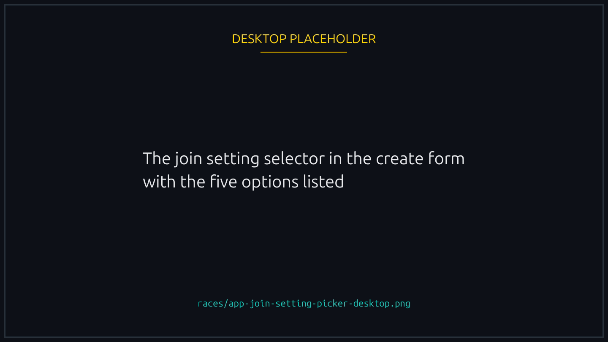
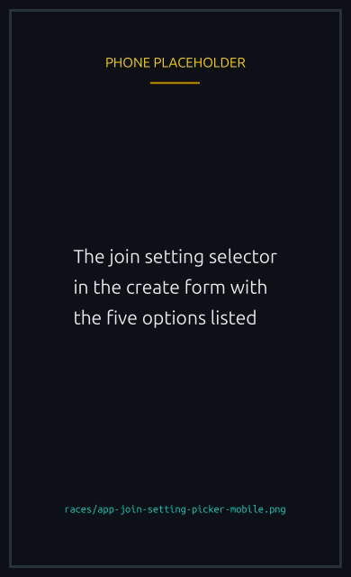
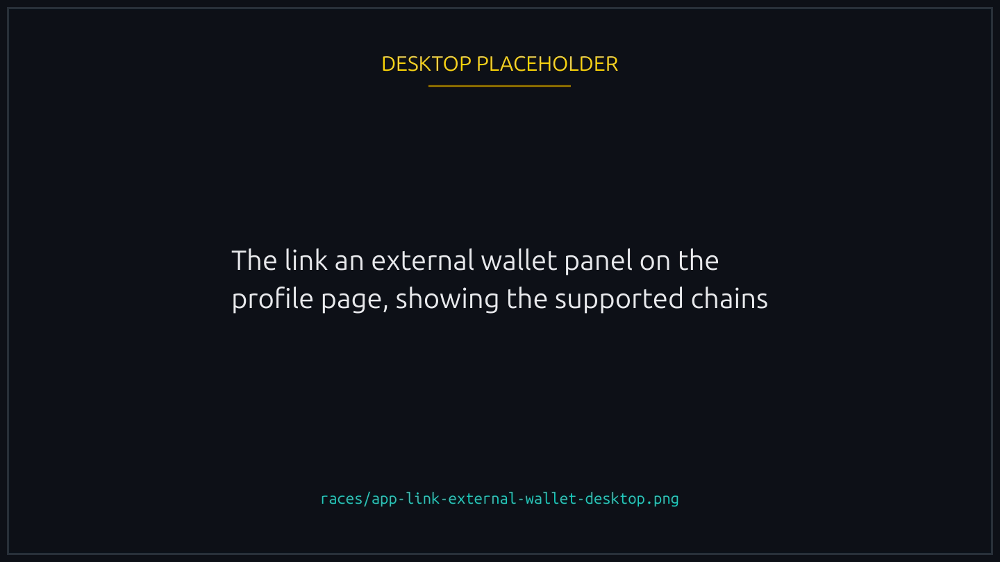
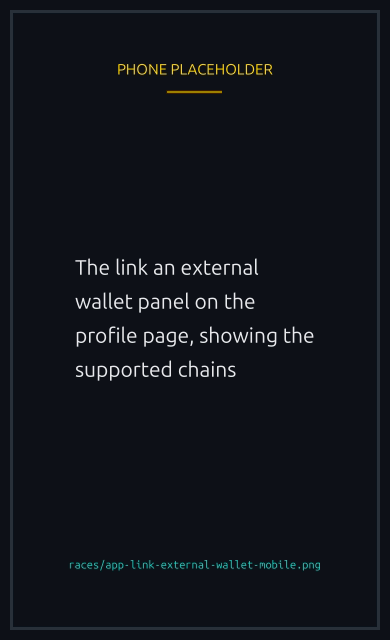
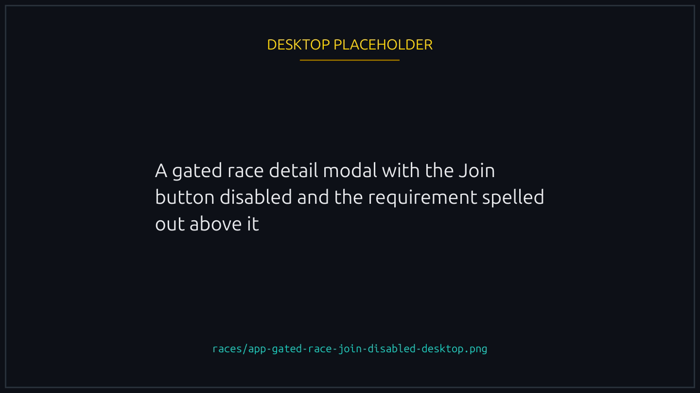
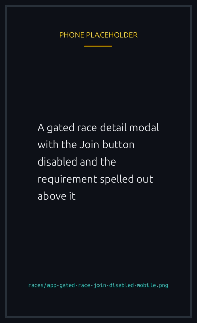

# Race access and gating

Every race carries a **join setting** that decides who may enter. Open by default, or locked to verified players, an invite list, NFT holders or token holders.

This page covers each one, when hosting needs a Runner NFT, and how the gates stack with [minimum account age](advanced-options.md#minimum-account-age).

## The five join settings

| Setting                   | Who can join                                                                      |
| ------------------------- | --------------------------------------------------------------------------------- |
| **Open**                  | Anyone with a wallet. Default.                                                    |
| **Verified players only** | Players who have linked and verified a social account (X, Telegram, or Facebook). |
| **Allowed players**       | Only the wallets on the creator's invite list.                                    |
| **NFT holders**           | Players who hold a minimum number of NFTs from a chosen collection.               |
| **Token holders**         | Players who hold a minimum balance of a chosen token.                             |


{% column width="70%" %}

<figure><figcaption>
Picked once, at creation, and fixed from then on.
</figcaption></figure>



{% column width="30%" %}

<figure><figcaption>
On a phone
</figcaption></figure>





Everyone sees every race whatever the setting. A player who does not qualify finds Join disabled, with the reason on the race.


## When you need a Runner NFT to host

Verified Only, NFT Holders and Token Holders need **no** Runner, each with its own creator side check below. Allowed Players is the exception among the gates.

What does need a Runner is customizing the race past the basics:

- a custom name,
- a sponsored prize,
- a duration other than the default 30 seconds,
- more than 5 seats,
- a custom join window, or start when underfilled,
- AI commentary,
- an X announcement,
- a minimum account age,
- hosting without joining, or
- the **Allowed Players** join setting.

So a plain race on default settings with one of the three Runner free gates needs nothing. Customize it, or switch to Allowed Players, and the Runner is required.


The Runner only has to be in the host's wallet at create time. Joiners never need one: their eligibility is whatever the join setting asks for.


## Verified players only

Limits the race to players who have proved who they are by linking a social account. Anyone who has not [verified](../trust/verification.md) sees the race but cannot join, which cuts out throwaway wallets without you managing a list.

The creator must be verified too. No Runner needed.

## NFT holders

Requires each player to hold NFTs from a collection you choose, along with the **minimum number** they must hold, at least one, and the **chain** the collection lives on.

### Solana or another chain

Solana is the default. The chain selector also offers supported non-Solana chains, such as Ethereum, Base and Polygon, where you paste that chain's collection address instead. Only chains the platform supports appear, so anything you can pick works; anything missing is not enabled yet.

Nothing else about the race changes. It still runs on Solana, with SOL or the usual tokens, and the ducks race the same. Only the source of the required NFT is new.

Players see the chain wherever the race is announced: a race gated on a Base collection announces itself as needing NFT holders on BASE.

### The collection has to be approved


Whatever the chain, the collection must be one the platform has approved for gating. The team maintains that list, and the create transaction refuses a collection that is not on it, so nobody can gate on something arbitrary or spammy.


### Joining a cross-chain race: linked wallets

A Solana-gated race checks your connected wallet at join time, as ever.

A race gated on another chain checks the external wallet linked to your profile, which is a one time step per wallet:

- On your profile, choose "Link an external wallet".
- Connect the wallet holding those NFTs and sign a short message to prove you control it.
- The signature moves no funds and approves nothing. It only proves ownership.
- Linking a new wallet replaces the old link.


{% column width="70%" %}

<figure><figcaption>
One signature per wallet, once. It proves ownership and moves nothing.
</figcaption></figure>



{% column width="30%" %}

<figure><figcaption>
On a phone
</figcaption></figure>




That wallet is then remembered for every future cross-chain race on that chain, so you never link per race. It stays private to your account, is read only to check ownership, and nothing is ever spent from it.

### At join time

The platform confirms your linked wallet holds an NFT from the required collection and lets you in; if it does not, you are not eligible, as with any holder gate. Not linked yet? The join flow sends you to that step first.

For an eligible player the app prepares a one time eligibility pass, so the race confirms you qualify at the moment you enter. On Solana that covers Metaplex Core and compressed NFTs, so most approved collections work. For other chains the backend checks the linked wallet's holdings off chain.

### Creator side eligibility

No Runner is needed, provided the collection is approved, and your own auto join faces the same threshold as any joiner: the backend will not sign your eligibility pass unless you hold the minimum yourself, on whichever chain the collection lives on. Host without playing and only the approval gate applies at create time.

### A few things worth knowing

- Eligibility counts **what you hold right now**, not how long you have held it.
- Each NFT secures **one seat per race**. The same NFT cannot take two.
- The eligibility pass is short lived, so finish your join promptly. If it expires, join again.
- Solana-gated races are untouched by any of this. Race only in those and you never link an external wallet.

## Token holders

Requires a minimum balance of a token you choose, and the **minimum amount** has to be greater than zero. The check runs on chain as a player joins, so there is nothing to prepare beyond signing.

The token must be on the platform's approved list, the same list used for SPL prize tokens, visible in the token picker at creation. Anything else and the create transaction refuses.

The gating token need not be the prize token: a SOL race can require USDC, a USDC race can require AMPS. Legacy SPL Token and Token-2022 mints both work, as for [token races](../economy/spl-tokens.md).

Creator side: no Runner needed on an approved token. Auto join your own race and the contract checks your balance at create time; in host mode it checks whenever you later join.

## Allowed players (private invites)

Invites specific wallets to a private race, up to **20 wallets**, which is also the most players a race can hold.

- Add the wallets, one per line, as you create the race.
- Your own wallet depends on how you create it:
  - In a **normal** race you are auto joined as the first player, and the allowlist check is skipped for that one join, so you need not list yourself.
  - In **host mode** you are not auto joined, so joining later means being on the list like anyone else. Host mode needs a Runner regardless.
  - In a **sponsored** race you do not play, so the list does not concern you.
- On the list, the race shows an active Join button and you enter like any other race.
- The list is held for about an hour while you build it and sign. Take longer and the hold expires: re-enter it and create again. No funds are involved, so that costs nothing.

Only a short fingerprint of the list goes on chain with the race, not the wallets. The list itself lives on the backend and is exposed through the race endpoints, so the dApp and anyone reading the API can see who is invited. It is not secret; the fingerprint exists to prove the list was not tampered with between creation and join.

Need more than 20 wallets? Use a public race with another gate, such as NFT Holders, Token Holders or Verified Only.


Hosting an Allowed Players race needs a Runner NFT, unlike the other gates, because the allowlist is itself a customization: the contract stores the list root and verifies each joiner's proof against it.


## Stacking with minimum account age

[Minimum account age](advanced-options.md#minimum-account-age) stacks on any join setting. An NFT Holders race can also require an account of a certain age, and both checks must pass: the right NFTs **and** old enough.

## Gating and creator rewards

Rewards do not care which gate you chose. They care whether you **join your own race**: every creator who takes a seat earns the base [Creator Fee Share](../economy/creator-fee-share.md) with no NFT at all, and each NFT adds more.

A gated race therefore earns exactly what an open one does, and creating without a Runner still earns the base share. Creating without playing, which is [host mode](hosting-and-cancelling.md#host-a-race-without-playing), earns nothing, decided at creation rather than later. Races the platform auto hosts earn no share either, since there is no creator wallet to pay.

## Good to know

- In a normal race the host is auto joined at creation, so you never enter your own race separately.
- Verified Only, NFT Holders and Token Holders need no Runner on their own. Allowed Players does, and so does any customization past the defaults.
- For NFT and Token gates the minimum must exceed zero. Zero would admit everyone, which is just Open.
- For NFT and Token gates the collection or token must be approved, or the create transaction refuses.
- Gated races always stay visible. Players simply cannot join without meeting the requirement, and the Join button says so.


{% column width="70%" %}

<figure><figcaption>
A gate you do not pass is explained on the race, not hidden from the list.
</figcaption></figure>



{% column width="30%" %}

<figure><figcaption>
On a phone
</figcaption></figure>



