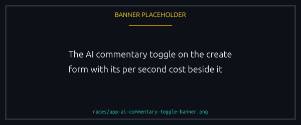
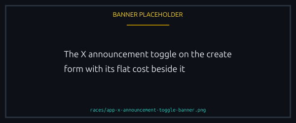
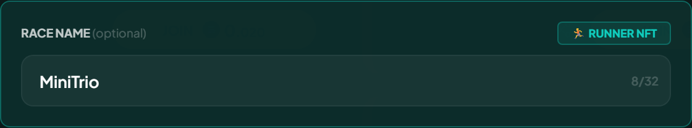
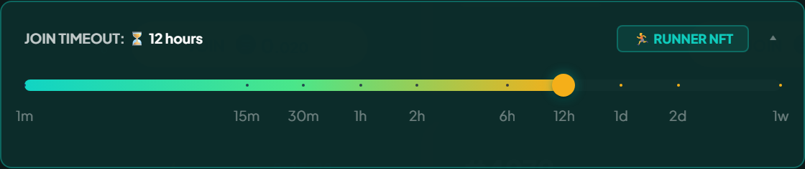
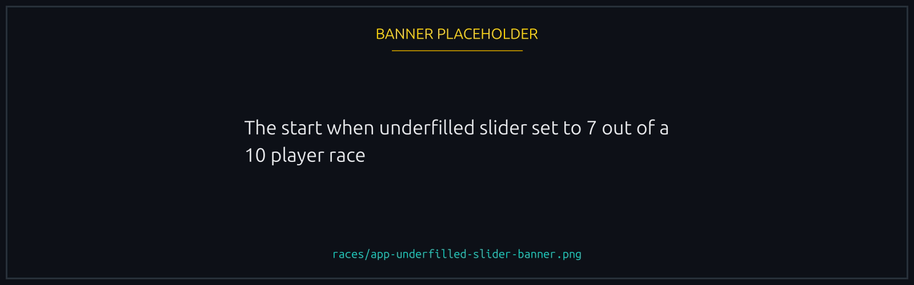
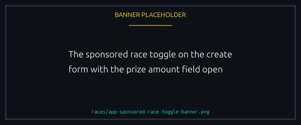
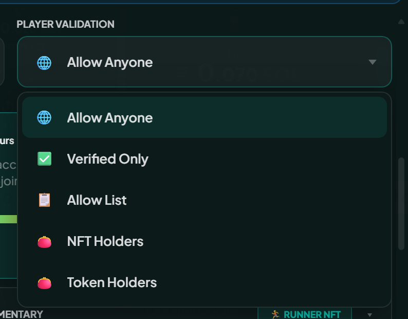
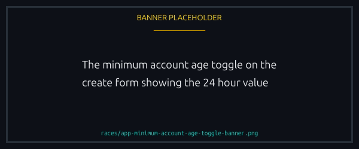

# Advanced options

The opt ins on the Create Race form. All need a Runner NFT in your wallet except where noted.

## AI commentary

A per second play by play in an AI voice, generated as the race starts. It costs the platform's audio rate times the race duration.

The narration names the ducks, the boosts in play and the standings. It never predicts the winner. Generating it can add up to 60 seconds after the lobby closes.


**The race never waits indefinitely.** If the track is not ready, the race starts silently instead of holding the lobby, and the audio is added to the race when it finishes, which can be part way through or after the finish. Either way it is archived with the race, so a silent race is not a race whose audio is lost.


Any race size can have it, 1v1 and rematches included. On a rematch the proposer decides, whatever the finished race had.

<figure><figcaption>
The cost shown is the race duration times the platform's audio rate.
</figcaption></figure>

## X announcement

Posts the race to the Lucky Ducks X account when it goes live, which is useful for community events or for reaching players who are not watching the app.


Flat cost at creation, around **0.0005 SOL**, itemised in the cost breakdown before you sign. It goes straight to the backend wallet like the archival fee, and it is **non-refundable** once the race exists, even if the race never fills.


The backend reads the on-chain flag and posts for you, so you sign nothing on X. The post carries the race link and the basics: entry fee, mode, when it starts. No-boost races are marked as such.

On a rematch the proposer picks this independently, whatever the finished race had.

<figure><figcaption>
A flat cost, itemised before you sign and gone for good once the race exists.
</figcaption></figure>

## Custom name

A title on the race card, so players can pick your race out of the lobby list. Handy for a themed event or a community match.

<figure><figcaption>
Up to 32 characters, and it is what players read on the card.
</figcaption></figure>

## Custom race duration

30 seconds is the default and open to everyone. Changing it, up to the platform maximum of 3 minutes, needs a Runner NFT. Short stays punchy; long gives the AI commentary room to build a story.

<figure><figcaption>
The form states the ceiling the platform currently allows.
</figcaption></figure>

## Custom join timeout

The lobby window is 1 hour by default, and a custom timeout overrides it: minimum 1 minute, maximum 1 week. Long windows suit scheduled events, short ones suit a rapid queue.

<figure><figcaption>
Anything from 1 minute to 1 week, in place of the 1 hour default.
</figcaption></figure>

## Custom track

Use a Track NFT you own as the background. It changes the pond, the lighting and the props, and nothing about the outcome. See [Track NFTs](../nfts/tracks.md).

The four built in tracks, day, night, sunset and sunrise, are always free. Anything else needs the Track NFT in your wallet.

<figure><figcaption>
The four built in tracks are free. Anything else has to be in your wallet.
</figcaption></figure>

## Start when underfilled

Lets the race launch short of max players once the join timeout passes. Without it, an unfilled race expires and can only be refunded.

Enabling it adds a slider for the minimum players to start with. It runs from the platform's default race size up to one below your maximum, so you cannot set a threshold the race could never reach. A 10 player race with the slider at 7 starts with 7, 8 or 9 once the window closes.

<figure><figcaption>
The slider will not go below the platform's default race size.
</figcaption></figure>

It also adds a small surcharge for the backend's auto start. That sits in the race vault and goes to the platform on auto start, or refunds with everything else if the race never runs.

## Sponsored race

You fund the pool instead of the joiners, which is how giveaways and marketing races work. Set the prize when you create, and players enter free. The platform fee still comes out of what you sponsored.

<figure><figcaption>
You set the prize, and joiners enter for nothing.
</figcaption></figure>

## Join settings (who can join)

The form also decides who may enter: Open, Verified Only, Allowed Players, NFT Holders or Token Holders. Verified Only and Token Holders need no Runner; NFT Holders and Allowed Players always do. See [Race access and gating](access-and-gating.md).

<figure><figcaption>
Five settings, one per race, fixed once the race exists.
</figcaption></figure>

## Minimum account age

Requires a joiner's player account to be at least a certain age, off by default and **24 hours** when switched on.

- A joining wallet needs an existing player account, old enough, or the join is rejected.
- An account created during the join transaction counts as zero seconds old, which makes this a cheap barrier against wallets spun up for one race.
- It stacks on any join setting, including none.

Worth knowing:

- It is fixed at creation for the life of the race, and rematches inherit it.
- Your own auto join faces the same check. Too new and you wait, lower the threshold, or use host mode to create without joining. See [Hosting, cancelling, and refunds](hosting-and-cancelling.md).
- Unsure whether your wallet qualifies? The join screen tells you before you sign.

<figure><figcaption>
Off by default, and 24 hours the moment you switch it on.
</figcaption></figure>

## Combining options

Most options stack freely. The one hard exclusion is that AI commentary cannot be added to a race that has already started.
