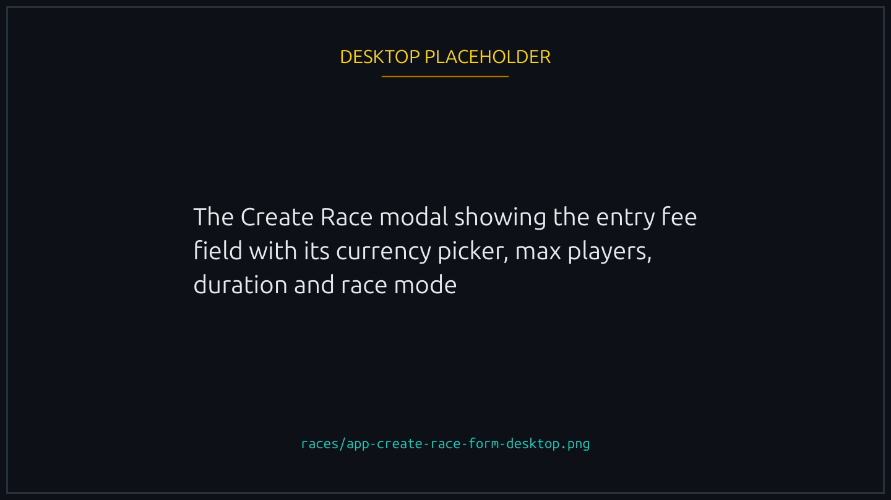
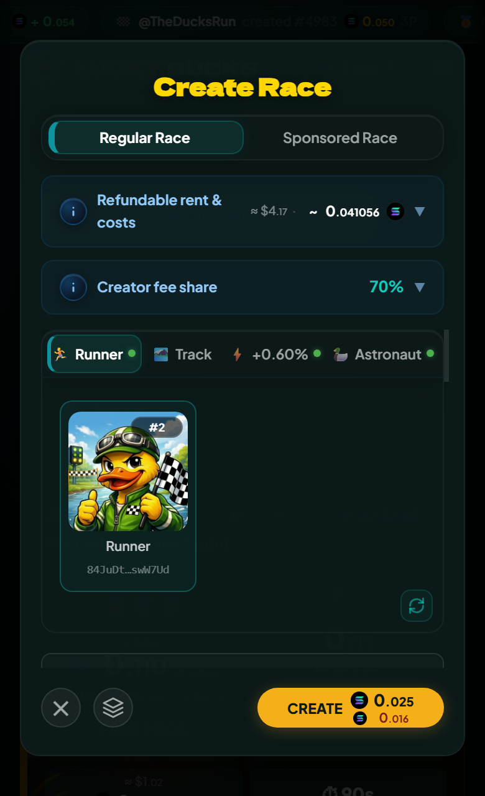
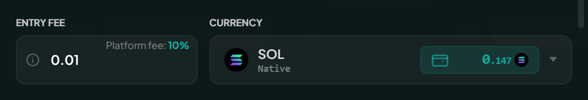
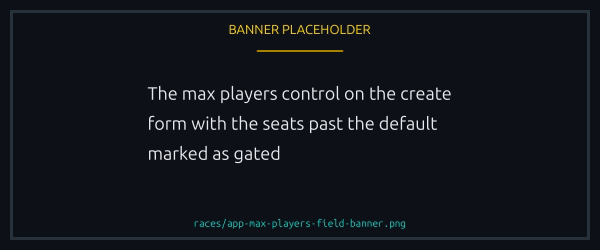
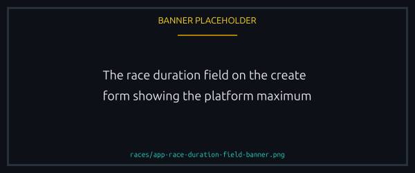
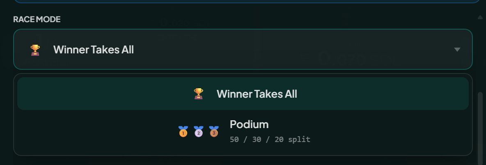
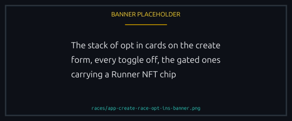
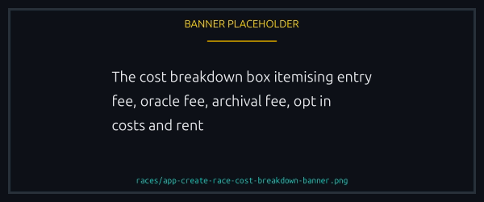

# Creating a race

Open Create Race from the main page. The form runs top to bottom in the order you fill it in.


**Creating is optional.** You can join a race someone else has already opened instead, straight from the race list, with nothing to fill in. Create your own when you want the terms to be yours: the entry fee, the seats, the duration and the mode. See [Joining and playing](joining-and-playing.md).



{% column width="70%" %}

<figure><figcaption>
Required choices at the top, opt ins below.
</figcaption></figure>



{% column width="30%" %}

<figure><figcaption>
On a phone
</figcaption></figure>




## Required choices

### Entry fee

What each player pays to join, in SOL or any supported SPL token, legacy or Token-2022, such as USDC and USDT. More tokens arrive over time. The minimum is 0.01 SOL or the token equivalent, the maximum 10 SOL.

The platform fee scales with it: 10% on tiny pots, down to 2% on large ones. [Fees and prizes](../economy/fees-and-prizes.md) has the tier table.

<figure><figcaption>
The minimum is 0.01 SOL, and the picker sets what everyone pays in.
</figcaption></figure>

### Max players

How many seats the lobby has. The default cap is 5 and the absolute maximum is 20; anything past the default needs a Runner NFT in the connected wallet. See [Runner NFTs](../nfts/runners.md).

<figure><figcaption>
Past the default of 5, the control tells you a Runner is needed.
</figcaption></figure>

### Race duration

How long the visual race runs. The floor is 30 seconds, and the ceiling is a platform setting that the form shows you, 3 minutes as the platform has it set. Short is punchier; long gives the audio commentary room to build a story.


30 seconds is open to everyone. **Any other value needs a Runner NFT**, like the join timeout slider, and without one the field stays locked at 30s. See [Runner NFTs](../nfts/runners.md).


<figure><figcaption>
30 seconds needs nothing. Any other value needs a Runner.
</figcaption></figure>

### Race mode



First place takes the whole pool, minus the platform fee. The cleanest format for a small race.



The pot splits 50/30/20 across first, second and third. Needs at least 3 players, and suits a big lobby.



<figure><figcaption>
Podium Split needs 3 players, so a 1v1 only offers the first.
</figcaption></figure>

## Optional opt ins

All off by default, and most need a Runner NFT.

- **AI commentary**. A per second narration track, generated as the race starts. Costs a little per race second.
- **X announcement**. Posts the race to Lucky Ducks' X account, so it reaches people outside the app. Small flat cost, non-refundable. See [Advanced options](advanced-options.md#x-announcement).
- **Custom join timeout**. Default 1 hour, shorter or longer as you like.
- **Custom name**. A title on the race card, up to 32 characters.
- **Custom track**. A Track NFT you own as the background.
- **Start when underfilled**. Lets the race launch short of max players once the join timeout passes. See [Advanced options](advanced-options.md).
- **Host without playing**. Create without taking a seat. Not available for 1v1, and the host gives up the Creator Fee Share. See [Hosting, cancelling, and refunds](hosting-and-cancelling.md).
- **Sponsored race**. You fund the pool, players join free. Good for giveaways.
- **No-boost race**. Boost NFTs off for everyone, yourself included. See [No-boost races](../nfts/boosts.md#no-boost-races).
- **Join setting**. Open by default. Verified Only and Token Holders gate a race without a Runner; NFT Holders and Allowed Players, an invite list of up to 20 wallets, both need one. See [Race access and gating](access-and-gating.md).
- **Minimum account age**. Keeps fresh wallets out by requiring a player account of a certain age, 24 hours when enabled. See [Advanced options](advanced-options.md#minimum-account-age).

<figure><figcaption>
Every opt in starts off, and the ones that need a Runner carry the chip that says so.
</figcaption></figure>

## Sign and submit

The cost box totals everything you pay: entry fee, oracle fee (\~0.0035 SOL), archival fee (\~0.0001 SOL), any opt in costs, and the race account's rent. The rent comes back when the race ends. After signing, the race hits the lobby and the join timer starts.

<figure><figcaption>
Every line you are about to pay. The rent line returns when the race closes.
</figcaption></figure>


Race in your own race and part of the platform fee comes back to you. No NFT needed to earn it, and each one you bring adds more. See [Creator Fee Share](../economy/creator-fee-share.md).



[advanced-options.md](advanced-options.md)

