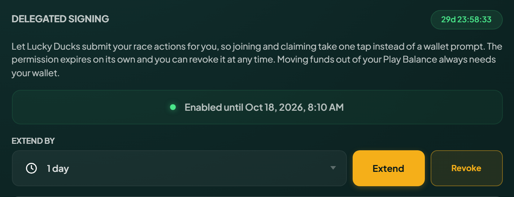
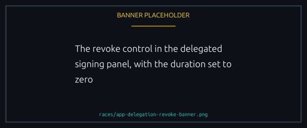
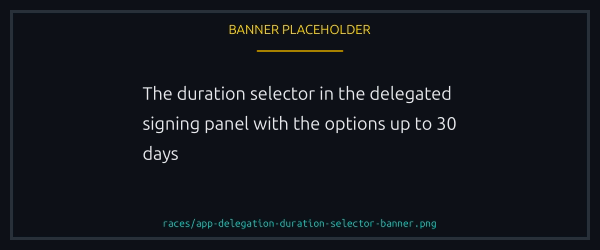

# Playing without signing every action

The Lucky Ducks can sign your in-game actions for you, for a period you choose. Joining then takes one tap: no wallet popup, no waiting on a confirmation. The app calls it delegated signing, and the panel on the Player page carries that name.

It exists for phones, where a wallet round trip per action is the slowest part of a race. This page is the detail; [Playing without your wallet app](without-the-wallet-app.md) is the whole path, sign-in half included.

## What you need

- A [verified wallet](../trust/verification.md). The program refuses to grant this to an unverified one, for the reason below.
- A [player vault](../economy/player-vault.md) with a balance, since the actions spend from it rather than your wallet.
- One signature to turn it on, choosing how long it lasts.

That is your last signature until it expires or you turn it off.

<figure><figcaption>
The panel that grants the permission is also where you revoke it.
</figcaption></figure>

## Why it needs a verified wallet

Not signing every action is half the problem. The other half is getting in: opening the app meant signing a message in your wallet, which is the same handoff delegation was meant to remove.

A linked account closes that gap, because you sign in with it and the wallet app stays shut all session. Granting this without one would be turning on a feature you have no comfortable way to reach.


Turning it **off** needs nothing at all. Revoking is always available, whatever state everything else is in.


## What it can do

Everything you do inside the game:

- Create a race, join one, leave one during the lobby.
- Claim a prize, cancel your own race, trigger a refund.
- Offer, accept and decline rematches.
- Claim a tournament prize.
- Every team action: create, update, join, leave, invite, remove, disband.

## What the permission can never do

It covers playing, not your money leaving the platform. Read the table as limits on the **permission**, not on you.

| Action                          | Why it is excluded                                                                                           |
| ------------------------------- | ------------------------------------------------------------------------------------------------------------ |
| Withdraw from your vault        | Moving value out is the line the whole design rests on. Only your wallet can authorise it                    |
| Close your player account       | Same reason. This is the other exit                                                                          |
| Deposit into your vault         | Not merely disallowed. Money leaving your wallet requires your wallet's signature, so nothing else can do it |
| Extend or change the permission | The permission is your consent. Anything that could extend itself would have no expiry                       |


Money moves around inside the platform on a signature you granted. It only leaves on yours.


**Your own access never changes.** Deposit and withdraw whenever you like, with a live grant or without one: those buttons always ask your wallet, and a grant neither locks your balance nor puts a queue in front of it. The same goes for closing your account.

## Turning it on and off

Choose 1, 7 or 30 days. It expires on its own, so a permission you forget cannot last forever.

Revoke whenever you like with the Revoke button, which the panel shows while a grant is live. It takes effect at once, and it keeps working even if the platform has switched the feature off for everyone, so you can always withdraw consent. Verification is not required to revoke either: nothing about your account can put the off switch out of reach.

Extending uses the same panel, with Extend in place of Enable, and needs the same verified wallet.

Where your winnings land sits on the same screen but is a separate choice. Change it whenever you like, granted or not, verified or not: it only says where money already owed to you should go.

<figure><figcaption>
The off switch needs no verification and takes effect at once.
</figcaption></figure>

## What it costs

Each action signed for you reimburses a flat per-action charge from your vault's SOL balance, set by the platform and 0.00005 SOL as it stands, which covers submitting the transaction on your behalf.


**An action that pays you still needs SOL in the vault.** Claiming costs a fee even though money is coming to you, so a vault holding tokens and no SOL cannot claim.

**There is no fallback to your wallet.** Signing for yourself, your wallet is right there and covers what your balance cannot. A delegated action has nowhere to fall back to, so it stops and asks you to top up.


## What happens after you tap

The action is queued, then submitted. Queued is not landed, so the app waits for the on-chain result before telling you it worked. If it fails you are told, and nothing is charged for an action that never happened.

## Choosing a duration

A shorter permission is a smaller window, and the honest risk is not theft: nothing here moves your money off the platform. What a misused permission could do is spend your vault on races you did not choose, or act on your teams, including disbanding one you created. A lost entry fee is recoverable. A disbanded team is not.

Play daily and a long duration is reasonable. Trying it once, pick a short one. The choice is per player for exactly that reason: your exposure should be yours to size.

<figure><figcaption>
The window is yours to size, and it expires on its own.
</figcaption></figure>


[player-vault.md](../economy/player-vault.md)

