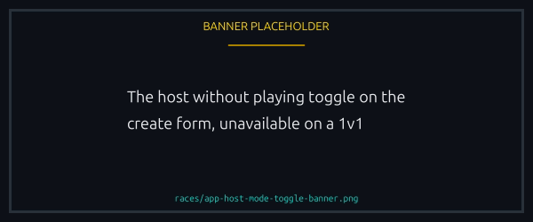
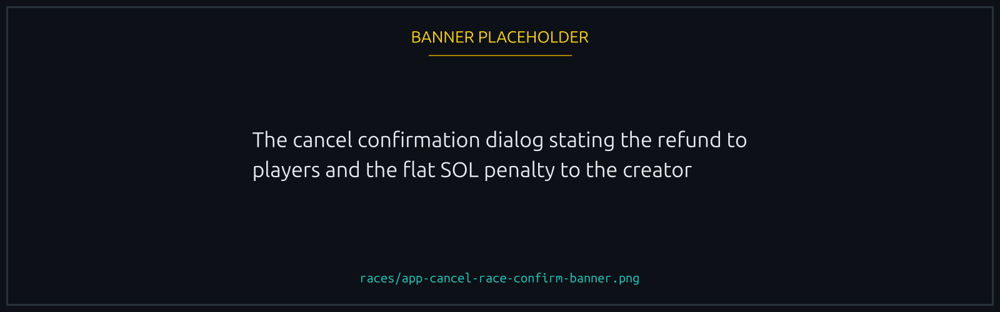

# Hosting, cancelling, and refunds

Three things a creator can do with their own race: host it without playing, cancel it while the window is open, or let it expire.

## Host a race without playing

Normally the creator is also the first player. Hosting instead opens the race empty, and it fills as others join.

- You need a Runner NFT. See [Runner NFTs](../nfts/runners.md).
- It is not available for 1v1.
- A host earns no [Creator Fee Share](../economy/creator-fee-share.md). Hosting and earning a cut of the fee are separate paths, and hosting gives the cut up.
- You can still join your own race while the window is open, and from then on you are an ordinary player: cancel or expiry returns your full entry like anyone else's.

It suits community events, tournaments where the organiser should not compete, and any race you want to put up without taking a seat.

<figure><figcaption>
It opens the race empty, and it gives the Creator Fee Share up.
</figcaption></figure>

## Cancelling a race

Only the creator can cancel, and only while the join window is open. Everyone who joined gets their full entry back, you included if you joined, and you pay a small fixed penalty in SOL to the platform.


The penalty is flat, around **0.05 SOL**, and the confirmation shows the exact figure. It does not scale with the pot, and a token race still pays it in SOL.


<figure><figcaption>
The exact penalty is on the confirmation, before you sign.
</figcaption></figure>

A race that is ready to start cannot be cancelled. If yours had [start when underfilled](advanced-options.md#start-when-underfilled) on and enough players joined to reach the threshold, it goes ahead instead.

The penalty is there to keep cancelling deliberate. Joiners committed real funds, and the charge stops creators pulling races on a whim.

## When a race expires

A race that never filled or started can be refunded once the window passes, and anyone at all can trigger that, not only the creator.

- Every player gets their full entry back.
- Hosted and never joined? There is no entry to refund you, but the leftovers from setting the race up, the rent and any unused opt in costs, still come back.
- No penalty applies after expiry. The penalty belongs to the window.

A race nobody joined just closes. No penalty, no fanfare.

## Quick comparison

| Situation                                  | Who triggers          | Player refund                     | Creator penalty                     |
| ------------------------------------------ | --------------------- | --------------------------------- | ----------------------------------- |
| Withdraw during lobby                      | The player themselves | Entry minus 0.01 SOL flat penalty | Not applicable (creator unaffected) |
| Creator cancels during lobby               | Creator only          | Full entry returned               | 0.05 SOL flat                       |
| Race expires (join window passes unfilled) | Anyone at all         | Full entry returned               | None                                |

For the rest of the money flow, rent, surcharges and where pending refunds appear, see [Refunds and rent](../economy/refunds-and-rent.md).


[refunds-and-rent.md](../economy/refunds-and-rent.md)

