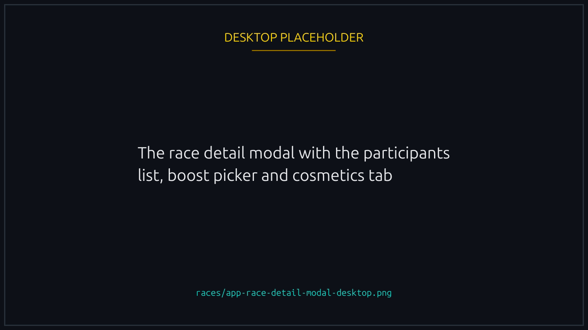
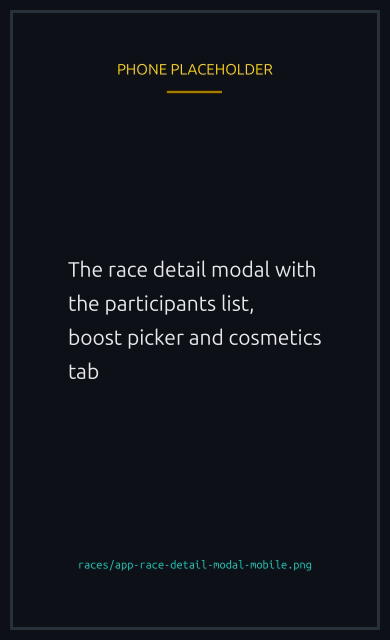
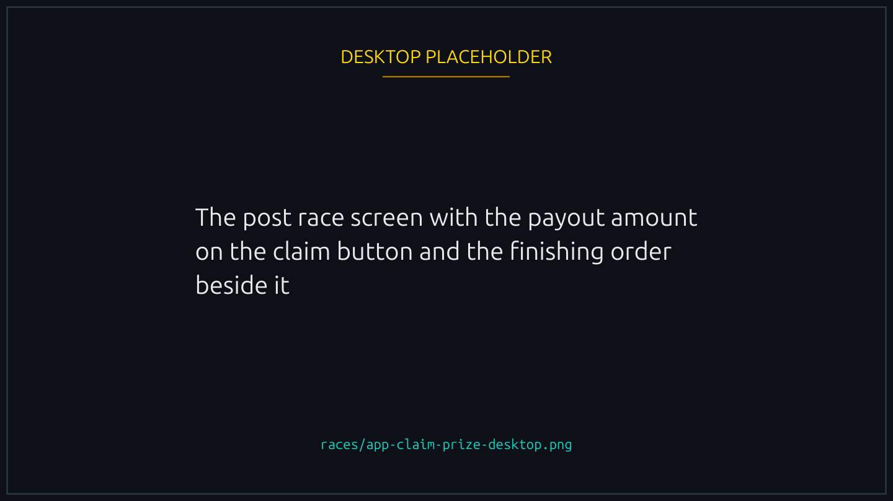
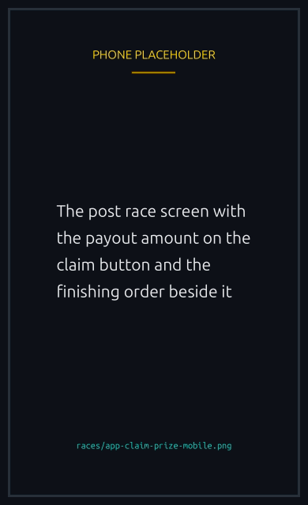

# Joining and playing

The race list updates live, newest at the top. Each card carries the entry fee, prize pool, slots taken, duration and any opt in badges: audio, custom track, runner only, sponsored.

## Joining

Tap a card to open the detail modal, then Join Race. It shows the participants, the Boost NFTs in your wallet and your cosmetics. Pick what you want to wear, sign, and your duck takes its slot. When you do not need to customize, the Join button on the card skips straight to it.


{% column width="70%" %}

<figure><figcaption>
Everything you bring to a race is picked here, before you sign.
</figcaption></figure>



{% column width="30%" %}

<figure><figcaption>
On a phone
</figcaption></figure>




The confirmation asks where the entry fee comes from: your wallet, or a balance you pre-funded. See [Your player vault](../economy/player-vault.md). With [playing without signing every action](delegated-play.md) on, joining is one tap and no wallet popup appears at all.

### Eligibility

Some races ask for more than the entry fee, and the modal spells out whatever applies:

- **Verified only.** Wallets that have completed Telegram, X or Facebook verification.
- **Allowlist (invite only).** Only the wallets the creator invited, up to 20. Off the list, Join stays disabled and the modal says the race is invite only.
- **NFT Holders.** A minimum number of NFTs from a chosen collection, both shown so you can check at a glance. If the collection lives on another chain, such as Ethereum, Base or Polygon, the check runs against the external wallet linked to your profile, and the join flow sends you to link one first if you have not.
- **Token Holders.** A minimum amount of a chosen token, which need not be the race's prize token.
- **Minimum account age.** A player account at least a certain age. A brand new account created during the join transaction is always too young, and the modal says so rather than failing silently.

[Race access and gating](access-and-gating.md) is the full reference.

### NFT boost selection

Hold any Boost NFTs and you can attach one, adding a small percentage to your duck's speed for that race. Boosts are never consumed, so the same one works in every race you join. See [Boost NFTs](../nfts/boosts.md).

### Cosmetic selection

Cosmetics change how your duck looks, picked from the cosmetic tab. Own none and your duck races in default plumage. They are visual only and change no outcome.

## During the lobby

The modal stays open while the lobby fills, and participants appear as they join with their avatar, nickname and any NFT badges.

### Withdrawing

Changed your mind? Click Withdraw. Two windows apply: **within 2 minutes of your own join**, and never in the **last 60 seconds** of the lobby, which is locked for everyone.


The vault then refunds your full entry fee and charges a fixed **0.01 SOL** penalty from your wallet, always in SOL even on token races. [Refunds and rent](../economy/refunds-and-rent.md#withdrawal-during-the-lobby) has the full rules.


## When the race starts

The modal gives way to the canvas, after a short loading screen if audio is still generating. The race runs for whatever duration the creator picked, every paddle and somersault driven by the on chain seed.

## After

Finish first in WTA, or on the podium in Podium Split, and the claim button appears with your payout on it. Click to sign and the money arrives at once, in your wallet by default or in your player vault if you pool your winnings there.


{% column width="70%" %}

<figure><figcaption>
The button carries the amount. Where it lands is your own payout setting.
</figcaption></figure>



{% column width="30%" %}

<figure><figcaption>
On a phone
</figcaption></figure>




Lost? Nothing to do. The race archives itself and the page returns to the lobby list.


[player-vault.md](../economy/player-vault.md)

