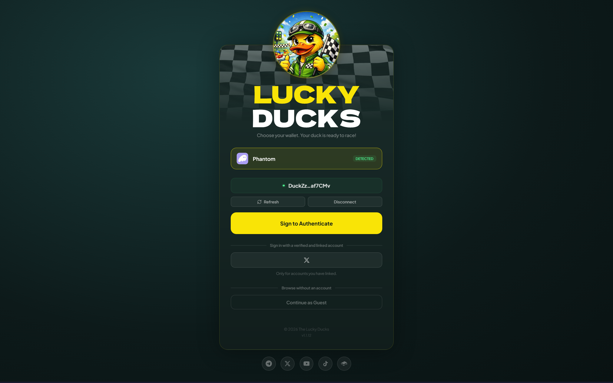
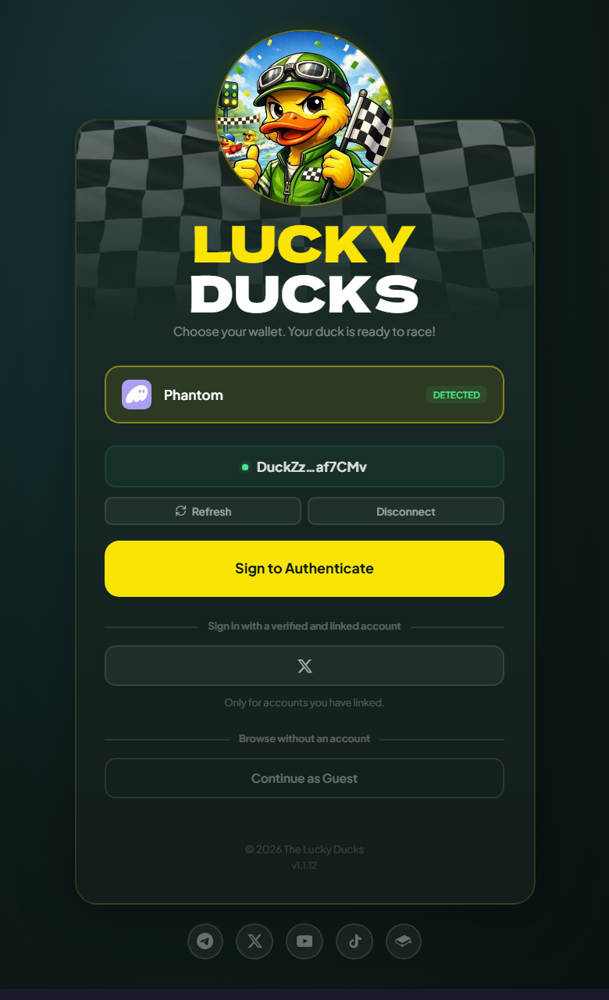

# Playing without your wallet app

On a phone the slowest part of a race is the handoff: tap, wait for the wallet app, approve, wait to come back. Once is fine. Every join, claim and rematch is what makes a quick game feel slow.

You can set things up so a whole session never opens your wallet app. Each step has its own page; this is the order and what each one buys you.

## The three steps, once each




### Connect your wallet and sign in

The first sign-in is always the wallet. Signing a message is the only thing that proves the wallet is yours, so nothing else is on offer until it has happened once.





### Link an account

Verification links an off-platform identity to your wallet, through whichever providers the platform has enabled. From then on that account is a second way in. See [Player verification](../trust/verification.md).





### Turn on delegated play

Lucky Ducks then signs your in-game actions for a period you choose, funded from your [player vault](../economy/player-vault.md). See [Playing without signing every action](delegated-play.md).




After that, opening the app means picking your linked account, and playing means one tap per action.


{% column width="70%" %}

<figure><figcaption>
A linked account shows up on the login screen as a second way in.
</figcaption></figure>



{% column width="30%" %}

<figure><figcaption>
On a phone
</figcaption></figure>




## The order is not a suggestion

Each step needs the one before it, and the app refuses out of order:

- No linking until you have joined a race. A brand new wallet cannot verify.
- No delegated play until your wallet is verified. The program refuses it, not just the app.

That second refusal exists because the halves only work together. Signing for you takes the wallet out of playing; the linked account takes it out of signing in. With only the first, every visit would still start in the wallet app, which was the thing you wanted to avoid.

## What still needs your wallet app

A short list always will:

| Action                               | Why                                                                                  |
| ------------------------------------ | ------------------------------------------------------------------------------------ |
| Topping up your vault                | Money leaving your wallet needs your wallet's signature. No arrangement changes that |
| Withdrawing from your vault          | Value leaving the platform is the line the whole design rests on                     |
| Closing your player account          | The other exit, for the same reason                                                  |
| Granting or extending delegated play | The permission is your consent, so it cannot renew itself                            |

None of them is blocked, they simply ask your wallet, so topping up and withdrawing stay available at any moment, grant or no grant. Everything you do inside a game is covered.

## If you lose access to the linked account

Link a second one. Any account linked to your wallet signs you in, and none of them is the primary: verify with X, link Google later, and either will do. Only the first link costs an on-chain transaction.


Your wallet always works as a way in. A linked account sits on top of it and never replaces it, so losing every linked account costs you the convenience, not the account.


## Turning it back off

Revoking delegated play is always available. It needs no verification, it works even if the platform has switched the feature off for everyone, and it takes effect at once.

Signing in with your wallet is always available too, whatever you have linked. Nothing here can lock you out of your own wallet.

<figure><figcaption>
Always available, whatever the rest of your account looks like.
</figcaption></figure>


[delegated-play.md](delegated-play.md)

