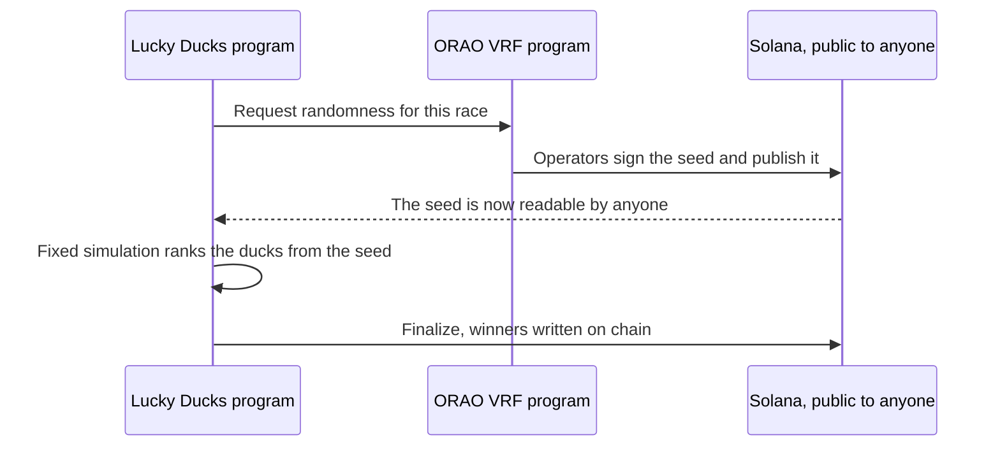

# Provable randomness

The most important property of Lucky Ducks is that the platform cannot pick a winner. Here is how.

## The actor: ORAO Verifiable Random Function (VRF)

ORAO is a Solana-native randomness oracle. When the contract needs a seed it sends a `request` to the ORAO program, and ORAO's operators, a distributed set of network participants, compute the response, sign it with their VRF keys and write it back to Solana.


That signed seed is publicly verifiable: anyone can check it came from the right key over the right inputs, and ORAO cannot change it afterwards.


## How the seed becomes a winner

Once the seed is on chain the outcome is fixed. The contract holds one simulation function, and from the seed, the participant list and the boosts it computes a strict ranking, first to last.

That same function runs in the canvas, so the animation matches the chain, and in finalization, so the payouts match the animation. The two are identical.

## Anyone can predict the outcome early

Deliberately so. Between ORAO publishing the seed and the race duration elapsing, anyone watching the chain can run the contract's math and know the result. The visual race is delivery; the maths is already done.

The backend holds finalization until the timer ends so the suspense survives, and from that instant anyone at all can submit it instead, because the instruction requires no signer (see [How a race works](../introduction/how-it-works.md#5-finalization)). If you genuinely want to know early, you can. Most players would rather watch.

## What if the seed never arrives?

The contract splits the wait at one instant: the VRF timeout, around 3 minutes from the moment the race is waiting on randomness. Before it, the race can only start. After it, the race can only be refunded. Exactly one is possible at any moment and the contract enforces the boundary, so the backend cannot hold a race pending past it.

Nothing fires on its own at the deadline. The race does not auto-cancel; the refund merely becomes possible, and anyone can submit it. The platform sweeps the races it created and leaves a player's race to that player or any participant, because closing a race somebody else paid for is not the platform's call. Either way it appears in your Unclaimed Items as soon as it is refundable.


**A refund returns every stake in one transaction and closes the race.** Nobody can refund only themselves.


That boundary is the part that matters for fairness. The seed is public the instant it lands, so if starting and refunding overlapped, a player could read the result, dislike it and exit instead of paying the winner. Because the windows meet exactly and a refund is all or nothing, the worst anyone can do is void a race that was already too late to run, which returns their own stake along with everyone else's.

## What if I do not trust ORAO?

Read their audits, watch their on-chain operator set, or simply note that the seed is signed and the maths is public. There is no path by which the platform substitutes a seed of its own: the contract accepts only seeds signed by the ORAO program's authorised keys.

## What if the seed is biased?

ORAO uses a VRF scheme, so the seed is the output of a one-way function over inputs the contract chooses, including the request transaction's slot. Nobody, ORAO included, can predict it before submitting, and the output is unique per request and uniform across the possibility space.


[verifying-a-race.md](verifying-a-race.md)

