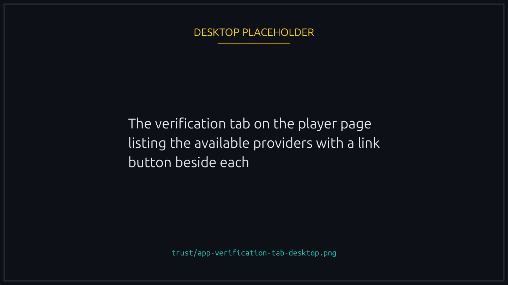
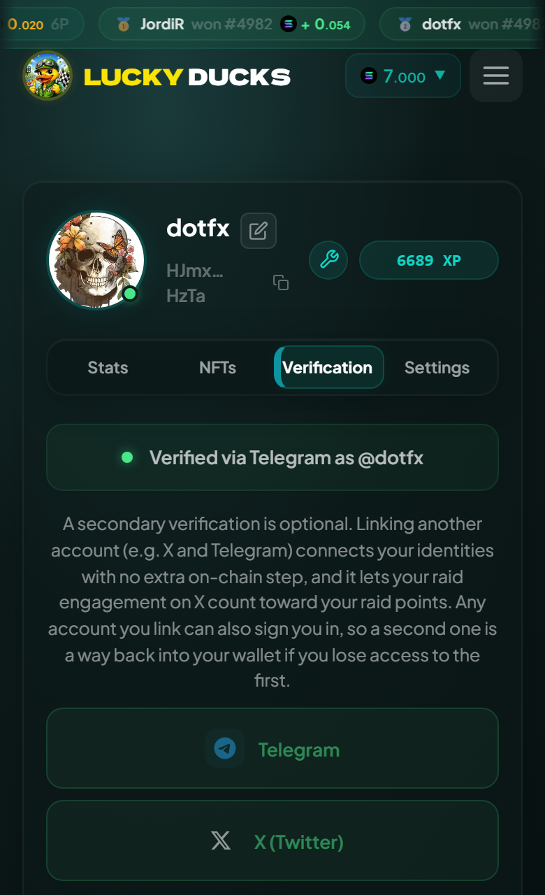
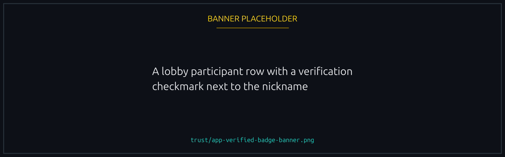

# Player verification

Every wallet has a player profile. Verification ties that wallet to an off-platform identity as well, which is optional but unlocks limits and tournament eligibility.

## Profile basics: nickname and avatar

Anyone can set a **nickname** and an **avatar** on the Player page, verified or not, and both appear beside your wallet in lobbies, participant lists, leaderboards and team rosters.

- **Nickname.** A short display name. Uniqueness is not enforced, so collisions are separated by the truncated wallet shown next to it.
- **Avatar.** An image you upload. Without one you get a deterministic identicon derived from your address.

Both live off chain on your profile and can change any time.

## What gets verified

OAuth2 verification with:

- **X**
- **Telegram**

Verifying sets a verified flag on the wallet and gives you access to that identity's display name and avatar, which you can adopt as your profile if you like.


{% column width="70%" %}

<figure><figcaption>
Whichever providers the platform has enabled.
</figcaption></figure>



{% column width="30%" %}

<figure><figcaption>
On a phone
</figcaption></figure>




## When verification is offered


After your first race. A brand new wallet cannot verify: the providers are listed from the start but refuse until there is a race in your history, which stops an empty wallet minting a badge and walking away.


There is no deadline. Once you qualify you can verify whenever, or never.

It is a one-time off-chain OAuth flow: you authorise the provider, the backend confirms the grant, and your wallet's `verified` flag flips. The flag lives on your profile and shows beside your nickname in lobbies, leaderboards and rosters.

## What verification unlocks

- **Signing in without your wallet app.** A linked account signs you in instead of a signed message, which on a phone is the difference between staying in your browser and being bounced to the wallet app and back. See [Signing in with a linked account](#signing-in-with-a-linked-account).
- **[Playing without signing every action](../races/delegated-play.md).** The program refuses to grant it to an unverified wallet, for one reason: the point is not reaching for your wallet, and a linked account is what gets you back in without one.
- **Races reserved for verified players.** A creator can admit verified wallets only, which keeps throwaway wallets out without an invite list. You need to be verified to enter one, and to host one. See [Race access and gating](../races/access-and-gating.md#verified-players-only).
- **An identity badge**, a checkmark beside your nickname that other players see on race cards and in lobbies.
- **Your Telegram handle in announcements**, for Telegram-verified players who opt in. See below.

<figure><figcaption>
The badge travels with you: race cards, lobbies, leaderboards, rosters.
</figcaption></figure>

## Signing in with a linked account

Your first sign-in is always the wallet, because signing a message is the only thing that proves the wallet is yours. After you have linked an account, the login screen offers it as a second way in.

It resolves, it does not create: signing in with a social account finds the wallet that account is linked to, and if it is linked to nothing the platform says so rather than making an account.

Two things it deliberately cannot do. It cannot link an account, since linking starts from a wallet you have already proved you own. And it never grants an operator session; an operator signs in with their wallet.

Which accounts appear depends on the providers the platform has enabled.

This is half of playing without ever opening your wallet app. [Playing without your wallet app](../races/without-the-wallet-app.md) is the other half, and the order to do them in.

## Telegram handle in group announcements

Verify with Telegram and you can opt into showing your **handle** in the platform's Telegram announcements: wins, podiums, tournament results and similar posts.

It is off by default, and you toggle it from the Player page once Telegram-verified. On, announcements tag your `@handle` so the broadcast reaches you and your contacts; off, they use your nickname only. Flip it whenever you like, though past announcements are not rewritten.

## Privacy

The platform stores only what it needs: a stable identifier from the provider, your display name and your avatar URL. It never receives your email, phone number, refresh tokens or any other personal data, and the grant covers only the scopes needed to confirm you control the account.


Verification is one-way. There is no unverify: nothing on the platform, and no instruction in the program, sets the flag back. Link an account deliberately rather than to try it out.


## Multiple providers per wallet

You can verify with several providers at once, X, Telegram and Facebook together, and the platform shows whichever identity you make primary. Future events may reward being verified across several, but the flag itself is binary.

**Any linked account signs you in, and none of them is the primary for that.** Verify with X, link Google later, and either will do. That is the practical reason to link a second: lose access to the first and the second is still a way back into your wallet without your wallet app. Only the first link costs an on-chain transaction.


**One social account belongs to one wallet.** A wallet can carry several providers, but a given X, Telegram or Facebook account links to exactly one wallet, and trying it on a second is refused. That is what stops one person fielding several verified players in a Verified Only race.


## What verification does not do

- It does not change your race history.
- It does not give you a boost.
- It does not discount entry fees.
- It does not let the platform refund you out of band. Refunds are always on chain.
