# How to verify a Lucky Ducks race on-chain

Verify a race without the Lucky Ducks website, using public Solana explorers. By the end you will have confirmed the three things that matter: the randomness came from a public source, anyone can recompute the winner, and the payout went where the program said it would.

## The app shows its working first

The app has a verification screen that recomputes a finished race in your own browser, from the seed, with the same formula the on-chain program runs. It needs no wallet, so you can read it as a guest.

Three ways in:

- The **🎲** button on the races page, beside Create Race, which opens the screen and asks for a race number.
- The **Verify** link inside a finished race, under **Verify fairness** on its Details tab, which opens that race straight away. It appears once the race is `Completed` and its seed is on chain.
- The address **`/app/verify/<race number>`** directly, or **`/app/verify`** on its own for the lookup.

<figure>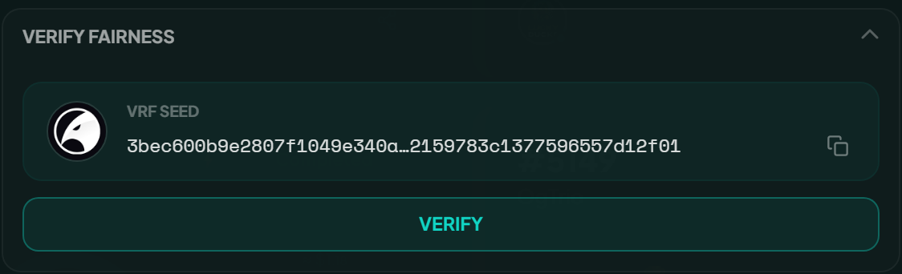<figcaption><p>Inside a finished race: the seed, and the link that opens the full working.</p></figcaption></figure>

Top to bottom, the screen shows the ORAO randomness account and the seed it published, the formula the program applies to every player, every racer in finishing order with the time recomputed for them, the speed curves of the whole field, and the segment by segment working behind any one racer. The randomness and the recorded result each link to the transaction they came from.

The race's own modal keeps three panels that save you the lookups: **Race info**, the figures the account holds; **Transactions**, every signature on the race in order, from creation to claim; and **Addresses**, the program, the race account and the rest, ready to paste into an explorer.


{% column width="70%" %}

<figure>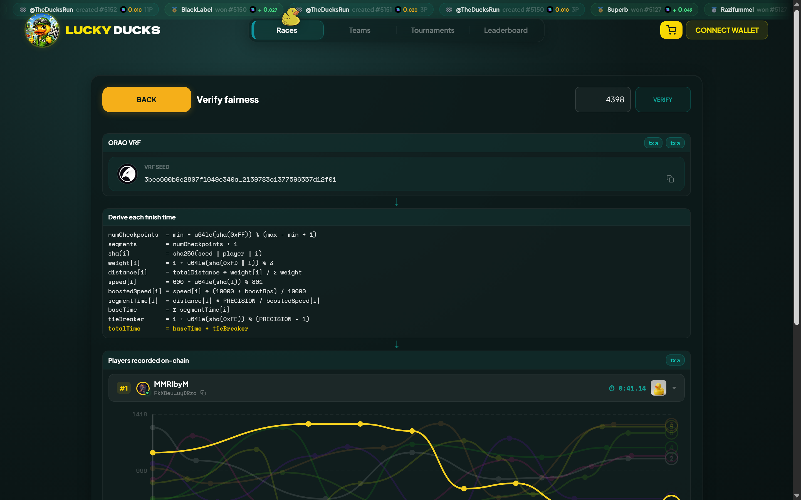<figcaption><p>The seed, the formula and every finish time, recomputed as you read it.</p></figcaption></figure>



{% column width="30%" %}

<figure>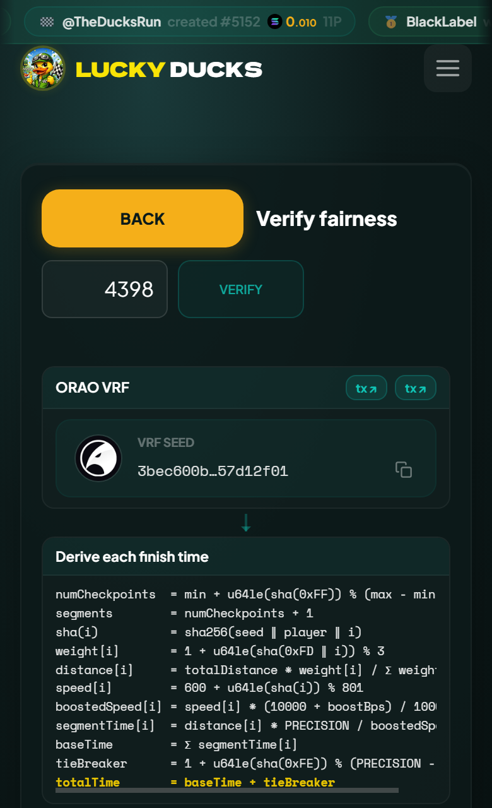<figcaption><p>On a phone</p></figcaption></figure>





That screen is still the platform telling you what happened, which is why the rest of this page exists. Everything it shows can be checked against the chain by somebody who does not trust it, and the two should agree exactly.


## Before you start; what you need

The program address, an explorer, and the race ID.



```
Lucky Ducks program   DuckBzSivbVv6b5zAw6EGP8YtLBbXwZmcoJPTQ5m1BkM
ORAO VRF program      VRFzZoJdhFWL8rkvu87LpKM3RbcVezpMEc6X5GVDr7y
```



- **The program**, above. Every race account is derived under it. ORAO's is the third-party randomness oracle, and the VRF step comes back to it.
- **An explorer.** Solana Explorer decodes a race account on its Anchor Data tab, and the steps below follow it. Solscan and SolanaFM show the same accounts:
  - Solana Explorer: `https://explorer.solana.com/address/<address>`
  - Solscan: `https://solscan.io/account/<address>`
  - SolanaFM: `https://solana.fm/address/<address>`
- **The race ID**, a sequential number visible in the app and in the race URL. It is what makes a race's accounts predictable: know the ID and you can derive every account the race uses.

## Step 0; Verify the program itself is legitimate

One-time, not per race: you are checking that the deployed program matches the open source and has not been quietly replaced. Open the program address on Solana Explorer and read three rows.

**Upgradeable** should read Yes, which means the program runs under `BPFLoaderUpgradeab1e11111111111111111111111`, the Solana upgradeable loader every standard upgradeable program uses. Anything else is wrong.

**Upgrade authority** is whoever can deploy a new version. Healthy is either an address the team has published or `None`, which locks the program at this version. An anonymous authority matching no disclosed wallet is a yellow flag, because that wallet could push a malicious update.

**Last deployed slot** says when the current version landed. Compare it with the team's announced history: a surprise deploy nobody mentioned is a yellow flag.


{% column width="70%" %}

<figure>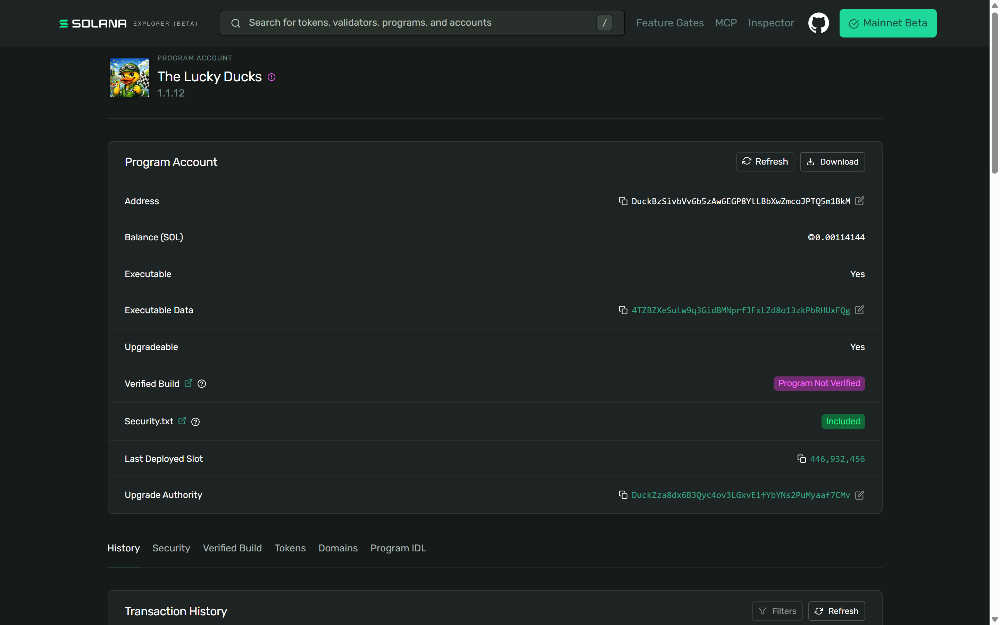<figcaption><p>Owner, upgrade authority and last deployed slot, on the program's own page.</p></figcaption></figure>



{% column width="30%" %}

<figure>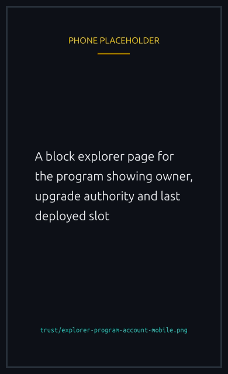<figcaption><p>On a phone</p></figcaption></figure>




For the strongest check, reproduce the published build hash locally with `solana-verify`, which confirms the on-chain bytes match the public source. The explorer's **Verified Build** row only says whether anyone has registered such a build with it: **Program Not Verified** means none is registered there, not that the bytes differ, so this check is the one that settles it.

## Verifying one race, step by step

The six steps below follow a race's own lifecycle, in the order the chain
recorded it. Each box is something you can open and read for yourself, and
the two edges leading to Cancelled are the paths where nobody wins and every
stake goes back.

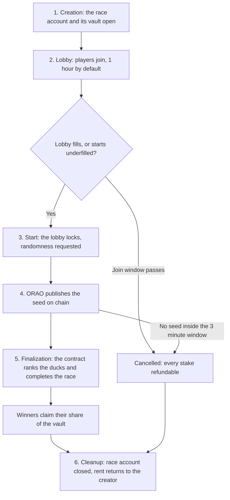

## Step 1; Find the race account

Every race lives at a Program Derived Address anyone can compute from the race ID, so the program cannot lie about where a race lives. The derivation is `[b"race", platform_config_pubkey, race_id_as_u64_le]`, and you need not compute it by hand: the **Addresses** panel on the race lists it, and an explorer search by ID surfaces it too.

Open the PDA and read the decoded fields on the **Anchor Data** tab, which writes each name in title case, **Race Id** for `race_id`:

- **creator**: the wallet that started the race
- **race_id**: matches the ID you searched
- **entry_fee**: what each player paid, in SOL or the token
- **max_players**: the seats
- **prize_pool**: what is actually at stake. After joining closes that is `entry_fee × players` on a regular race, or the sponsor's deposit on a sponsored one. Less than `entry_fee × max_players` means it started underfilled, which is expected
- **status**: `Open`, `VRFPending`, `Racing`, `Completed`, `Cancelled` or `Refunded`
- **players**: the wallets that joined
- **randomness_account**: the ORAO account that provides the seed, empty while the race is `Open`. Step 4 inspects it
- **vrf_seed**: the seed itself, empty until the randomness is fulfilled and consumed
- **winners**: empty until finalization


{% column width="70%" %}

<figure>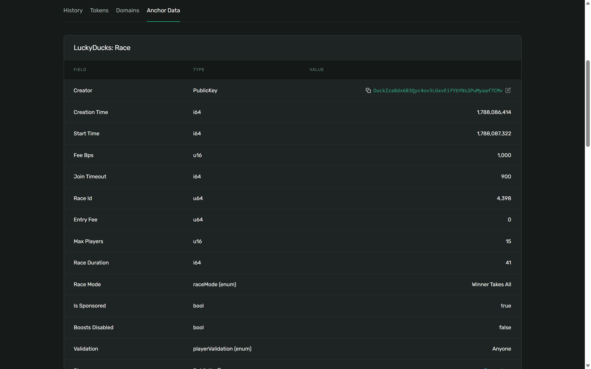<figcaption><p>The decoded race account. Everything the site shows you is in here.</p></figcaption></figure>



{% column width="30%" %}

<figure>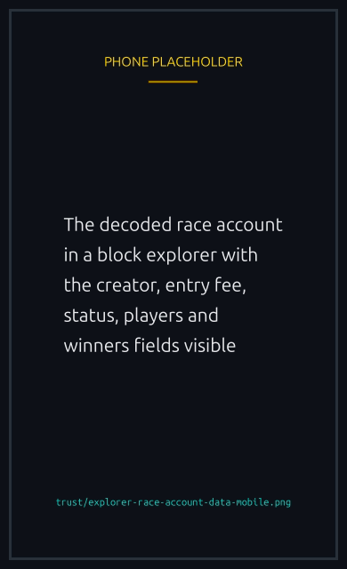<figcaption><p>On a phone</p></figcaption></figure>




Everything the app shows for this race should match. If the app claims a 10 SOL pool and the account says 1 SOL, the app is lying.

## Step 2; Verify race creation

The first transaction in the PDA's history is the `create_race`, or `create_race_token`, call. The race's **Transactions** panel lists the same signatures in order, if you would rather start from there. Open it and you should see:

- the creator's wallet signing and submitting,
- two new accounts, the race and its vault PDA,
- SOL moving from the creator to the vault: their entry fee if the race is not sponsored, the VRF cost up front so the race can pay the oracle, and an audio cost if commentary is on,
- a log line reading `Race #N: created by ABC... (entry: X, players: Y, mode: Z, sponsored: bool)`.

The vault is where all the race's money lives, a PDA derived from the race address, and the explorer links to it from the history. Watch its balance grow as players join and fall to zero when prizes are paid.

## Step 3; Verify each join

Each joiner has their own `join_race` transaction, so the history holds one per player. Each should show the joiner signing, `entry_fee` moving from their wallet to the vault, and a log line `Race #N: Player ABC... joined`.

Two things to cross-check: the wallet that signed is the wallet appended to `players`, and the amount transferred equals `entry_fee` exactly. Both are always true unless something is wrong.

On a sponsored race joiners pay nothing, since the sponsor funded the pool at creation, so the join transaction has a signature and no transfer.

## Step 4; Verify the randomness source

The most important step. Lucky Ducks generates no randomness of its own: the outcome comes from a seed ORAO produces and signs, and the on-chain accounts let you prove it.

Find the transaction carrying `request_randomness`, the moment Lucky Ducks asked ORAO for this race's number. In it you will see the call to the Lucky Ducks program, a nested invocation of the ORAO program (`VRFzZoJdhFWL8rkvu87LpKM3RbcVezpMEc6X5GVDr7y`), and a new account whose address is exactly the race's `randomness_account`. Click through.

That account starts empty. Within seconds the ORAO fulfilment authority, a wallet ORAO operates and Lucky Ducks does not, signs a transaction writing the seed into it. Find that transaction in the account's history: ORAO-signed, calling the ORAO program, writing the bytes. From then on anyone can read the seed, and Lucky Ducks cannot change it, because **the account is owned by ORAO's program rather than by Lucky Ducks**.


{% column width="70%" %}

<figure>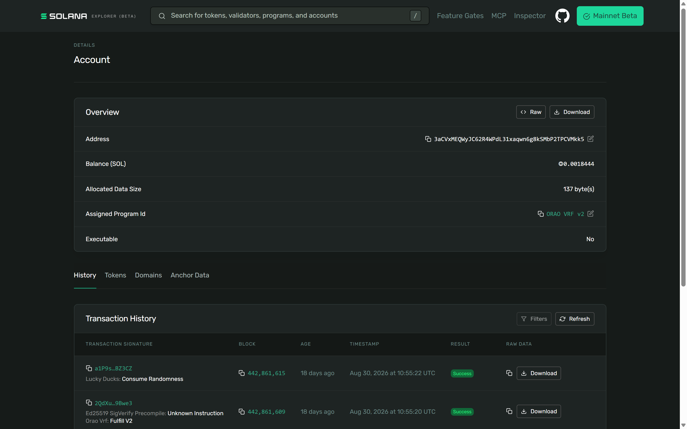<figcaption><p>The owner field is the proof: the account belongs to ORAO's program.</p></figcaption></figure>



{% column width="30%" %}

<figure>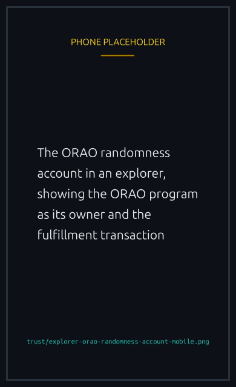<figcaption><p>On a phone</p></figcaption></figure>




That ownership is the fairness proof. ORAO controls the seed, does not know who is in the race, and cannot bias it toward anyone. Both parties would have to collude, and even then the seed is produced by ORAO's cryptographic procedure and checkable against ORAO's public key.

One subtlety: the seed is readable the moment ORAO fulfils, usually before `race_duration` has elapsed, so anyone watching can compute the winner before the race visibly ends. The backend delays finalization so the app stays suspenseful, but the outcome was locked the second the seed landed.

## Step 5; Verify winner determination

A `consume_randomness` instruction copies the seed from the ORAO account into the race's `vrf_seed`, and from there the winner is recomputable by anyone.

Find `finalize_race` in the history and check three things: the logs include `Race #N: Finalized - X winner(s) determined`, `status` has become `Completed`, and `winners` is populated.

Selection is deterministic. Given the seed and the player list, boosts included, exactly one winner or podium is correct, and the algorithm is published in the program's source, so you can recompute it yourself and compare against `winners`. Winner Takes All lists 1 wallet; podium lists 3, in order.

A mismatch between `winners[0]` and what the algorithm produces would mean a broken program, and recomputing it yourself from the published source is what would catch one.

## Step 6; Verify the payout

The last step is `claim_prize`, or `claim_prize_token`. Check that it calls the Lucky Ducks program, and that money leaves the vault in the right proportions: most to the winner or winners and the rest to the platform fee wallet, at whatever the [platform fee tier](../economy/fees-and-prizes.md#platform-fee-tiers) says for that pool. A podium race splits the winners' share 50% / 30% / 20%. Once everything settles, the race account closes and its rent returns to the creator.

The balance changes on that one transaction are the whole proof:

- Race vault: to zero, or near it
- Winner: `prize_pool × (1 - fee_pct) × winner_share`
- Platform fee wallet: `prize_pool × fee_pct`


{% column width="70%" %}

<figure>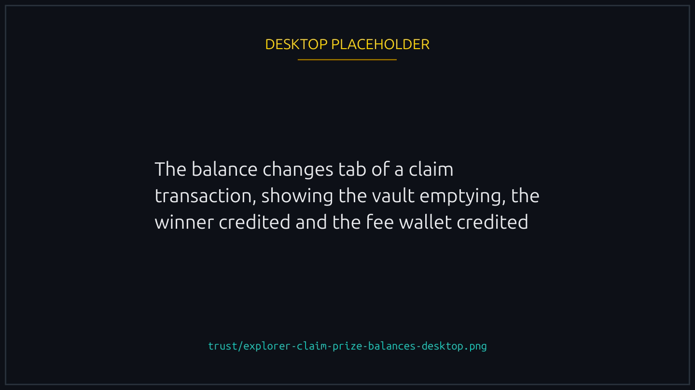<figcaption><p>One transaction: vault out, winner in, fee wallet in.</p></figcaption></figure>



{% column width="30%" %}

<figure>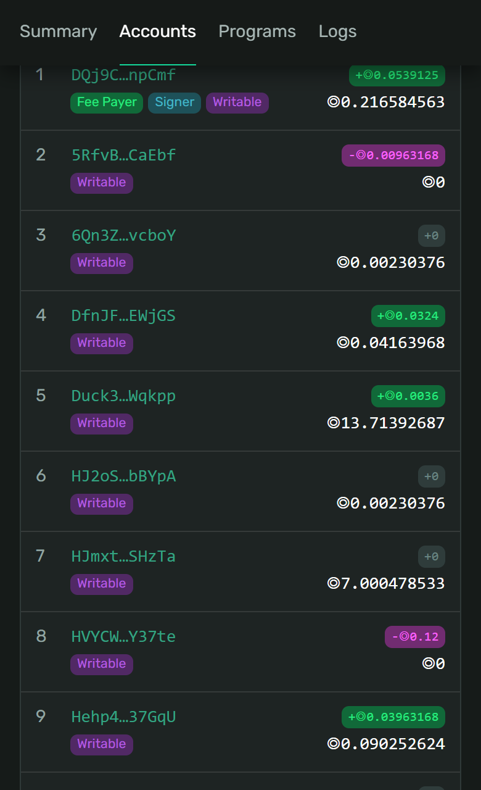<figcaption><p>On a phone</p></figcaption></figure>




The fee wallet address is declared in the platform config account, a PDA derived as `[b"platform_config"]` under the program, so open that and confirm the wallet receiving fees is the declared one.

A token race works the same way with SPL transfers instead of SOL. Legacy SPL Token and Token-2022 differ slightly in the destination accounts and instructions, and the verification logic does not change. Solscan shows token movements on the "Tokens" tab.

## What to look for as red and green flags


**Healthy signals.** The race PDA exists at the predicted address. The vault balance matches the announced pool. The randomness account is owned by ORAO's program. The seed was written by an ORAO-signed transaction. Finalization succeeded and the winners match the deterministic algorithm. The claim sent the prize to the winner and the right percentage to the fee wallet. Everything happened in order: create, joins, request, fulfil, consume, finalize, claim, with sensible timestamps.



**Yellow flags worth asking about.** An upgrade authority you cannot identify against any published wallet. Transfers to accounts the app never explains. Fees above the documented tier schedule. An unusually long gap between fulfilment and finalization: the suspense delay is normal, hours are not.



**Red flags that should stop you playing.** `randomness_account` pointing at an address ORAO's program does not own. A `vrf_seed` that does not match the ORAO account. Winners the algorithm does not produce. A payout to a wallet that is neither the winner nor the documented fee wallet. No race account at the predicted PDA at all, which would mean the app is showing a race with nothing behind it. Any one of those is a bug or a scam.


## A worked example

Say you played race #142 and won 9.5 SOL:

1. Look up race #142 in the app and copy the race address, or derive the PDA.
2. Open it on the Anchor Data tab and confirm `winners[0]` is your wallet.
3. Click through to `randomness_account` and confirm ORAO's program owns it.
4. Compare `vrf_seed` on the race with the bytes in the ORAO account. They match.
5. Find `claim_prize` and confirm 9.5 SOL went from the vault to you, 0.5 SOL to the fee wallet (5% of a 10 SOL pool at the 5% tier), the vault is near zero and the race account is closed.

All 5 check out and the race was fair and the payout correct. Once you know what to click, it takes about 3 minutes.

## Why this matters

The point of an on-chain game is that you need not trust the operator. Everything touching your money is enforced by code anyone can read, executed by validators no single party controls, on randomness from an oracle that signs its output. If a race ever produces a result you cannot reproduce by following these steps, the right move is to stop playing and ask the team to explain, not to assume good faith and carry on.

The other side of that: when the check passes you have cryptographic certainty rather than a company's word, which is a stronger guarantee than any traditional platform can offer.
