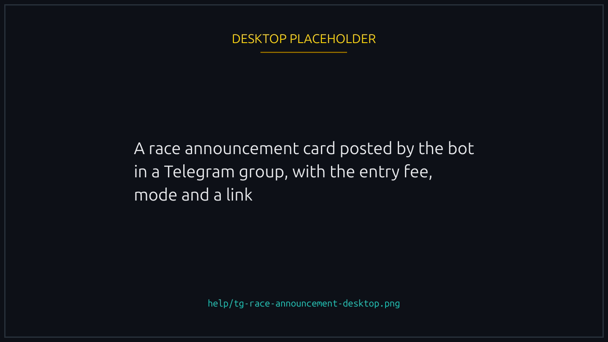
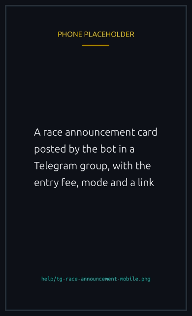

# The Lucky Ducks Telegram bot

The Lucky Ducks bot keeps your community in sync with on chain racing and rewards engagement on X. This page covers what everyone can use.

Join the main group at [t.me/TheLuckyDucks](https://t.me/TheLuckyDucks), or add the bot to your own group. See [Social networks](social-networks.md) for the full list of channels.

## Everyday commands

| Command        | What it does                                                         |
| -------------- | -------------------------------------------------------------------- |
| `/duck`        | Your player stats (races, wins, XP, badges).                         |
| `/races`       | Currently open races.                                                |
| `/race`        | Details for a specific race.                                         |
| `/team`        | Your team's stats.                                                   |
| `/teams`       | Browse teams.                                                        |
| `/leaderboard` | Top players. Add `day`, `week`, `month`, or `all` for a time window. |
| `/help`        | The full command list.                                               |

The bot also announces races, wins, and prize claims in your group automatically, with a link to view each race on the site (and on X for sponsored races).


{% column width="70%" %}

<figure><figcaption><p>Announcements carry the race link, so the group can join from the chat.</p></figcaption></figure>


{% column width="30%" %}

<figure><figcaption><p>On a phone</p></figcaption></figure>



### Why two groups show different races


Each group has its own announcement policy, set by whoever added the bot: a group can be scoped to particular join settings, particular tokens, particular NFT collections, or to sponsored races only. `/races` applies the same policy as the announcements, so the list you get in one group is not the list you get in another, and neither is the full list. The site always shows everything.


### How you appear on a card

Announcements name you by the first of these that exists: your linked and verified X or Telegram handle, then your nickname, then a shortened version of your wallet address. The first two are shown with your wallet alongside them, because nicknames are not unique and a card that names two different people identically is worse than a card with an address on it.

If you would rather not appear by handle, unlink it. See [Player verification](../trust/verification.md#telegram-handle-in-group-announcements).

## Raids: boost the tweet together

A **raid** rallies the group to engage with a Lucky Ducks tweet. When a raid is live, the bot posts a card that updates in real time:



```
💥 Raid the Tweet
🟨 Likes    5 | 6   [ 83% ]
🟨 Retweets 2 | 3   [ 66% ]
🟨 Replies  1 | 2   [ 50% ]
https://x.com/.../status/...
```



Each line shows the current count against the goal and the percent complete. Like, retweet, or reply to the tweet and watch the numbers climb. When every goal is hit, or the timer runs out, the card flips to an "Ended" summary and the next tweet in the queue goes live.


You don't need to link anything to help a raid: **everyone's** likes, retweets, and replies count toward the group goals.


### Earn points on the raid leaderboard

If you want your engagement credited to you personally, link your X account once. You can do this from the Verification tab on the site by choosing X, or by adding X as a secondary link if you already verified another way (see [Player verification](../trust/verification.md)).

After that, when a raid ends the bot tallies who engaged and awards points:

- Like = **2** points
- Retweet = **3** points
- Reply = **4** points

Check standings with `/raidboard` (add `week` or `month` for a shorter window). Points also feed your global XP and unlock raid badges (see [Badges](../competition/badges.md)).

Linking is optional. Without it you still push the group goals, you just will not appear on the personal leaderboard.

## FAQ

<details>

<summary>Do I need a wallet to raid?</summary>

No. Anyone can engage with the tweet. Points and XP require a linked, verified wallet.

</details>

<details>

<summary>How is engagement counted?</summary>

The live card reads the tweet's public counts. Personal points are tallied once at the end of the raid.

</details>

<details>

<summary>Why link both X and Telegram?</summary>

It ties your identities to one wallet so your raid points and future rewards land in the right place. Linking a second network never requires a second on chain step.

</details>
