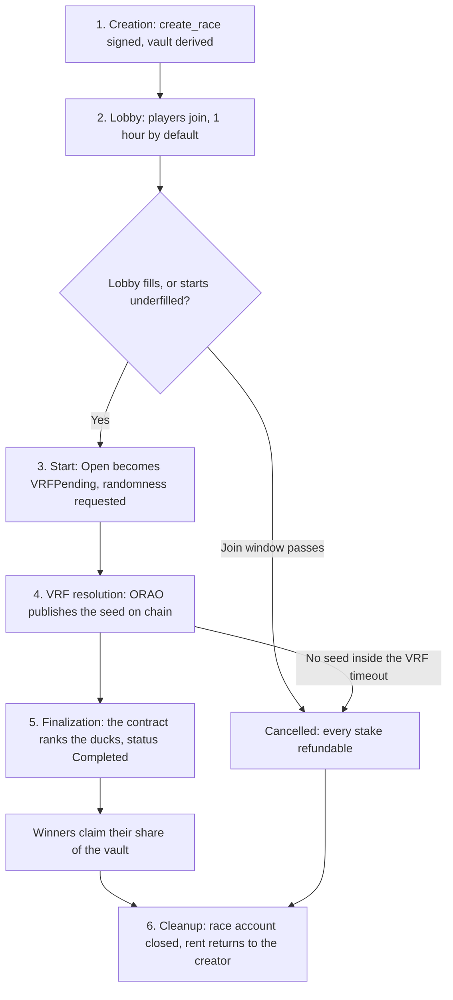
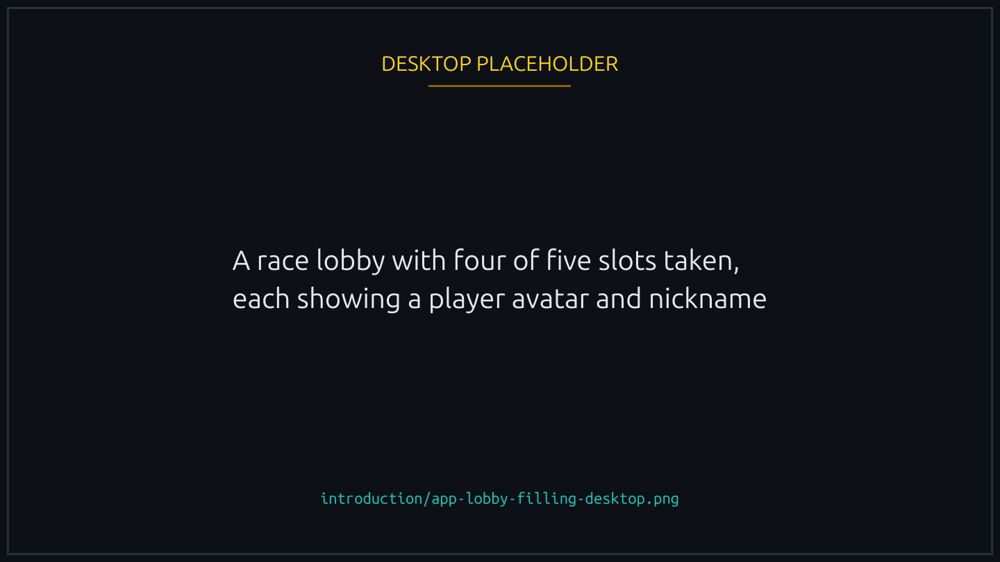
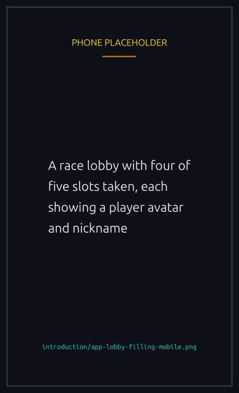

# How a race works

A race is a Solana account. Creating a race creates the account, joining a race deposits your entry fee into the account's vault, and the smart contract closes the account at the end and pays out the winners. Here is the full lifecycle.

## 1. Creation

Someone picks the race parameters and signs a `create_race` transaction:

- Entry fee (SOL or SPL token)
- Max players (between 2 and 5 by default, up to 20 with a Runner NFT)
- Race duration (default 30 seconds; up to 5 minutes with a Runner NFT)
- Payout mode (Winner Takes All, or Podium split with 1st, 2nd, 3rd)
- Optional opt ins: race name, AI commentary, custom track, custom join timeout, start when underfilled

The transaction allocates a fresh race account on Solana, derives a vault account to hold deposits, and emits a `race:created` event. The race appears in the lobby list seconds later.

## 2. Lobby

Players have 1 hour by default to join. Joining is a single transaction: your entry fee moves into the vault, your wallet is added to the participants list, and the lobby UI updates in real time over a websocket connection.


{% column width="70%" %}

<figure><figcaption>
The lobby updates as each join transaction confirms.
</figcaption></figure>


{% column width="30%" %}

<figure><figcaption>
On a phone
</figcaption></figure>



Players can withdraw during the lobby window. A withdrawal returns the entry fee minus a fixed 0.01 SOL penalty (always paid in SOL, even on token races). The penalty goes to the platform fee wallet as a deterrent against join-and-bail griefing. It does not increase the remaining prize pool.

## 3. Start

The race starts when the lobby fills, or earlier if the creator enabled the start when underfilled option and the join timeout has passed. Starting is itself an on chain transition: the race moves from `Open` to `VRFPending` and the smart contract submits a randomness request to an ORAO oracle.

## 4. VRF resolution

ORAO publishes the random seed back to the contract within seconds. The seed is public on chain. Anyone watching the chain can run the same deterministic math the contract will run and predict the winners ahead of the visual race. The backend intentionally delays the finalization transaction until the race duration has elapsed, so the suspense survives.

## 5. Finalization

Once the race duration has elapsed, the backend wallet submits the finalization transaction. The contract runs the simulation, ranks the ducks, and transitions the race to `Completed`. Winners can now claim their share of the vault.

Finalization is permissionless after a 10-second grace window. If the backend hasn't finalized within 10 seconds of the race duration ending, any participant can submit the finalize transaction themselves. This is the fallback path if the backend ever goes down so the race never gets stuck. In practice the backend finalizes within the grace window and participants rarely need to do this themselves.


Claims work the same way: anyone can submit a claim transaction on a winner's behalf, and the funds always go to the winner regardless of who pays for the tx, into their wallet or their player vault according to their own setting.


## 6. Cleanup

After the race finishes, the race account is closed and its rent is returned to the original creator. If anything went wrong along the way (oracle timed out, no quorum, etc.) the race transitions to `Cancelled` and every participant can claim a full refund.


[getting-started.md](getting-started.md)

