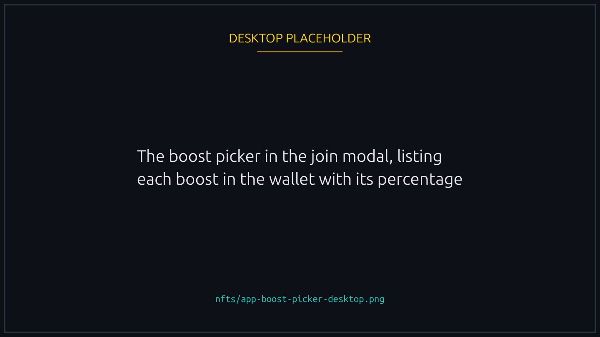
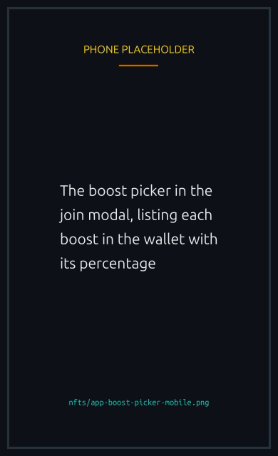
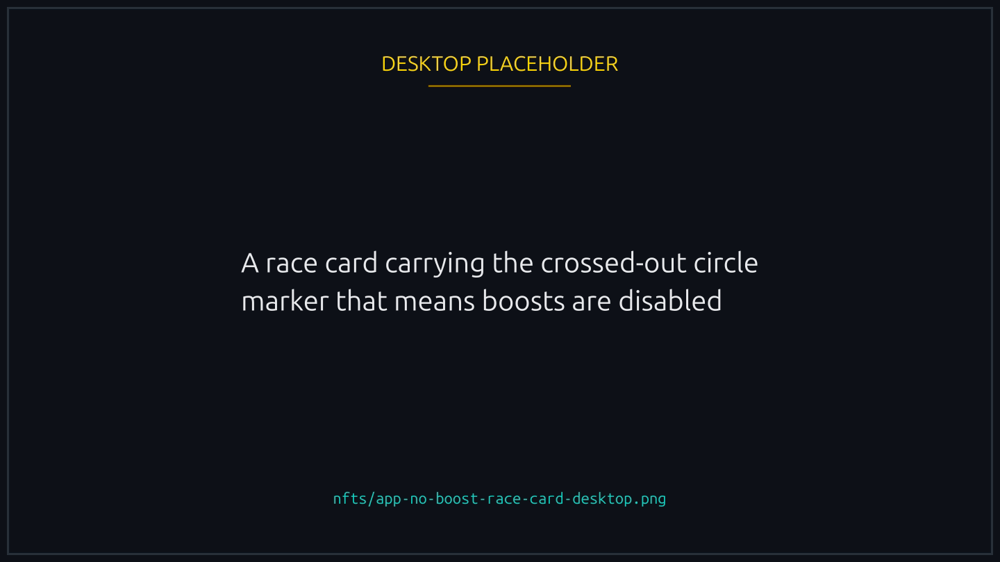
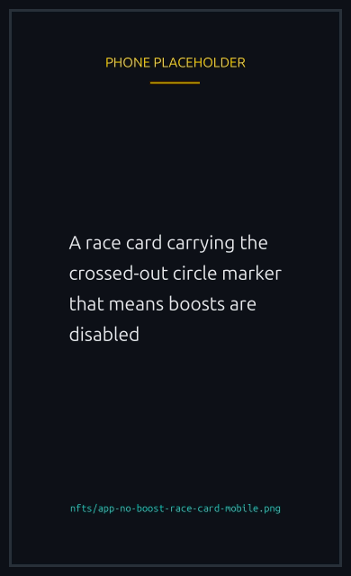
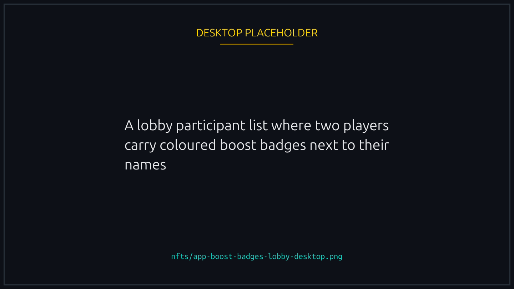
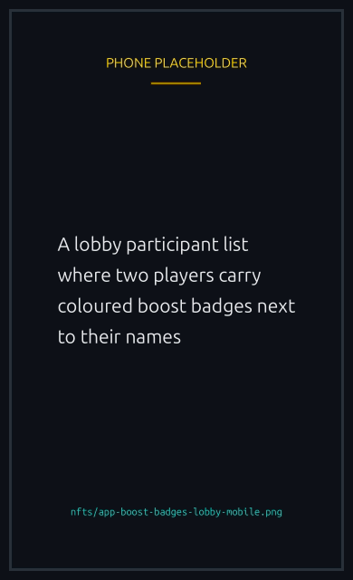

# Boost NFTs

The only NFT collection that affects race outcomes. Equipping a Boost NFT when joining a race gives your duck a small speed advantage for that race.

## How the boost works

Each Boost NFT has a fixed `boost_bps` value baked into its on chain metadata. `bps` stands for basis points, where 100 bps = 1%. A boost of 80 bps adds 0.8% to your duck's effective speed.


The boost percentage is capped on chain at **100 bps (1%) maximum**. Even if a boost claims a higher value off chain, the contract clamps it to 1%. This keeps the impact bounded: a boost is an edge, not a guarantee.


## Stacking and selection

You can only equip one boost per race. If your wallet holds multiple boosts, the join modal shows them all in a picker and you choose which one to use. If you do not pick, the race runs without a boost.


{% column width="70%" %}

<figure><figcaption>
One boost per race, chosen at join time.
</figcaption></figure>


{% column width="30%" %}

<figure><figcaption>
On a phone
</figcaption></figure>




Boost NFTs are **not consumed** on use. The same boost works in every race you join, forever. Wear and tear is not a concept here.


## Are boosters fair?

The concern comes up: a paid speed boost is just pay to win. It is not, and the numbers below are from a direct simulation of the on chain velocity model.

### Why the boost stays small

The engine picks a duck's speed independently on each of several segments. Two numbers set the scene:

1. **Speed range per segment.** Each segment's base speed is drawn uniformly between about 600 and 1400 units. A duck with an unlucky draw can end up more than **2.3 times slower** than a duck with a lucky draw. That gap is orders of magnitude larger than any boost.
2. **Boost size.** A boost multiplies the segment speed by at most 1.01 (the 1% cap). It cannot rescue a bad speed draw; it can only nudge a good one slightly further ahead.

Number of segments per race depends on duration:

| Race duration    | Segments per duck |
| ---------------- | ----------------- |
| Up to 40 seconds | 3 to 5            |
| 41 to 90 seconds | 5 to 9            |
| Over 90 seconds  | 7 to 13           |

Each duck has its own independent draw of segment count, per segment weights (1-3), and per segment speeds. So it is not "duck A cruises at one speed the whole time." It looks more like: duck A goes 900, 620, 1350, 780, 1100; duck B goes 700, 1250, 940, 1180, 830. A 1% boost multiplies each of B's segment speeds by 1.01. Compared with the spread between segments, that multiplier is tiny.

The simulated win rates in full (Monte Carlo, 200,000 simulations)

**Real win probabilities.** Base odds in a 5 player race are 20% per duck. Boost shifts them only slightly:

| Boost     | 5 player, 30s race | 5 player, 60s race | 5 player, 3 minute race |
| --------- | ------------------ | ------------------ | ----------------------- |
| None      | 19.9%              | 20.1%              | 20.0%                   |
| +0.1%     | 20.1%              | 20.3%              | 20.2%                   |
| +0.5%     | 20.8%              | 21.2%              | 21.4%                   |
| +1% (max) | 21.7%              | 22.4%              | 22.7%                   |

Longer races give the boost slightly more visibility (more segments average out the random draws, so a fixed multiplier stands out a bit more), but even at the max cap and longest duration, the shift is only about 2.7 percentage points from base.

**Bigger and smaller lobbies.** The effect scales down as the lobby grows:

| Lobby     | Base odds | +1% boost win rate |
| --------- | --------- | ------------------ |
| 1v1       | 50%       | 52.0%              |
| 5 player  | 20%       | 21.7%              |
| 10 player | 10%       | 11.1%              |
| 20 player | 5%        | 5.8%               |

In every case, the boost adds roughly one to two percentage points, never more.

**Where a boosted duck actually finishes.** In a 5 player, 30 second race, a duck running the max +1% boost finishes at each position:

| Finish position | Frequency |
| --------------- | --------- |
| 1st (win)       | 21.8%     |
| 2nd             | 20.7%     |
| 3rd             | 20.0%     |
| 4th             | 19.3%     |
| 5th (last)      | 18.2%     |


**A +1% duck finishes last almost as often as a duck with no boost.** The random speed draw dominates. Every finished race is public on chain, so if you want to check for yourself, the historical races are open to inspection. See [How to verify a race on-chain](../trust/verifying-a-race.md).


### If you'd rather race without boosters

- **Sponsored races.** Boosters are disabled in sponsored races entirely. If the creator is putting up the prize, no boost NFTs are allowed. Fully symmetric field.
- **No-boost races.** A creator can flip a switch when creating any race to disable boosts entirely, sponsored or not. See [No-boost races](#no-boost-races) below.
- **Allowlist races.** Allowlist lets you invite specific wallets, so you can run a boost free race by inviting only players who agree not to equip one. There is one caveat: allowlisted players **can** still equip a boost if they own one. The allowlist controls who joins, not what they bring. See [Allowed players (private invites)](../races/access-and-gating.md#allowed-players-private-invites).

There is no counter NFT. Boosts cannot be neutralized or stolen. The only way another player counters your boost in a regular race is by holding their own.

### Why the 1% cap

The 1% cap is on chain and intentional. If boosts scaled unboundedly, a wealthy player could dominate. Capping at 1% keeps the maximum edge in the range shown above: an extra one to two percentage points of win probability. That is a small nudge, and it is the ceiling.

## No-boost races

A race can be created with boosts switched off. Nobody can bring a speed boost NFT into it, including the person who made it. The result comes down to the draw alone.

These races are marked with a crossed-out circle icon on the race card, in the race view, and on the share image, so you can tell before you join. The Telegram and X announcements say so too.


{% column width="70%" %}

<figure><figcaption>
The marker is on the card, the race view and the share image.
</figcaption></figure>


{% column width="30%" %}

<figure><figcaption>
On a phone
</figcaption></figure>



### Why you might create one

Boosts are small but real. A boosted duck wins slightly more often than an unboosted one, and in a race where everyone else has one, not having one is a small disadvantage. No-boost mode removes that entirely, which is useful for community events where not everyone owns boost NFTs, or any time you want a level field.

### Creating one

You need a Runner NFT to create a no-boost race. The option appears when you create a race, and in recipe settings if you run automated races.

### If you already own boost NFTs

Nothing is lost. Your boost NFTs are untouched and work normally in every race that has not disabled them. In a no-boost race, you can still pass the boost NFT accounts to the join instruction if the UI does it automatically: they are simply ignored, and you are not charged for a boost that was not applied.


Rematches inherit the setting. A rematch of a no-boost race is also a no-boost race, all the way down the chain, so a rematch cannot be used to sneak boosts back into a level match.


## Verifying the badge

Joined participants in the lobby show a small boost badge next to their name if they equipped one. The badge color indicates the boost size (cooler colors for smaller boosts, hotter colors for bigger ones). You can see at a glance who is running with what.


{% column width="70%" %}

<figure><figcaption>
Badge colour tracks boost size, so the lobby shows who is running with what.
</figcaption></figure>


{% column width="30%" %}

<figure><figcaption>
On a phone
</figcaption></figure>



## Acquiring

Same channels as the other collections: scheduled mints, marketplace listings, third party secondary. Boost floor prices track the overall game's activity.
