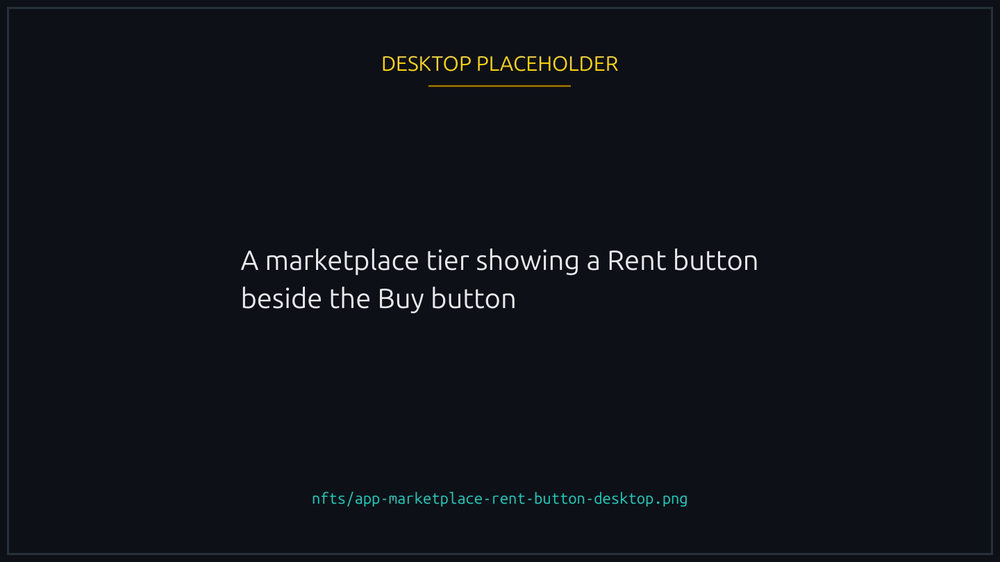
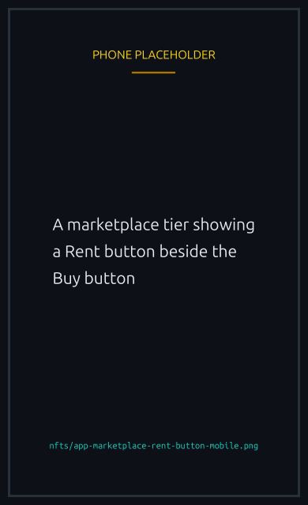
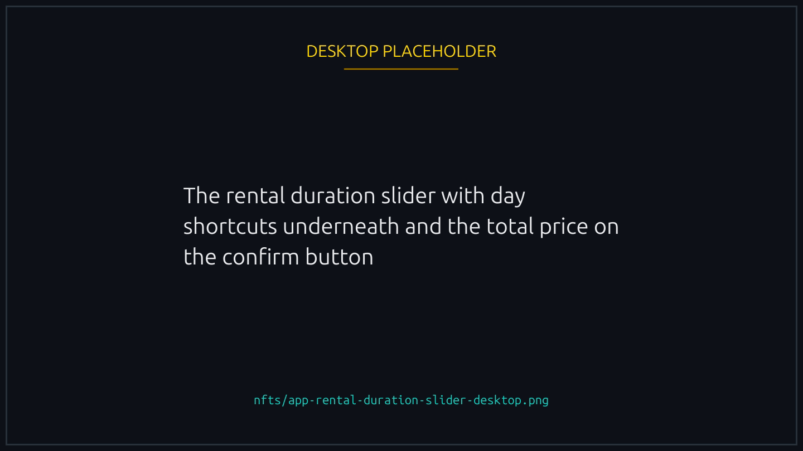
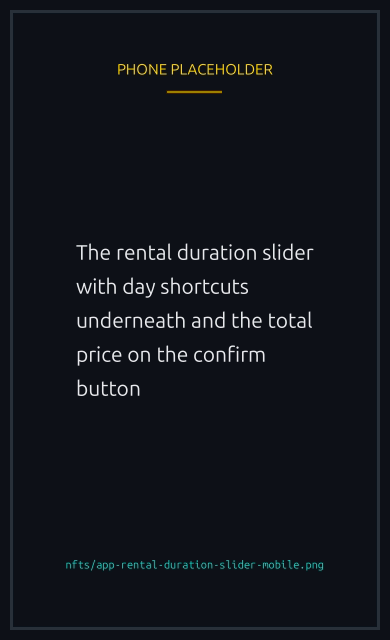
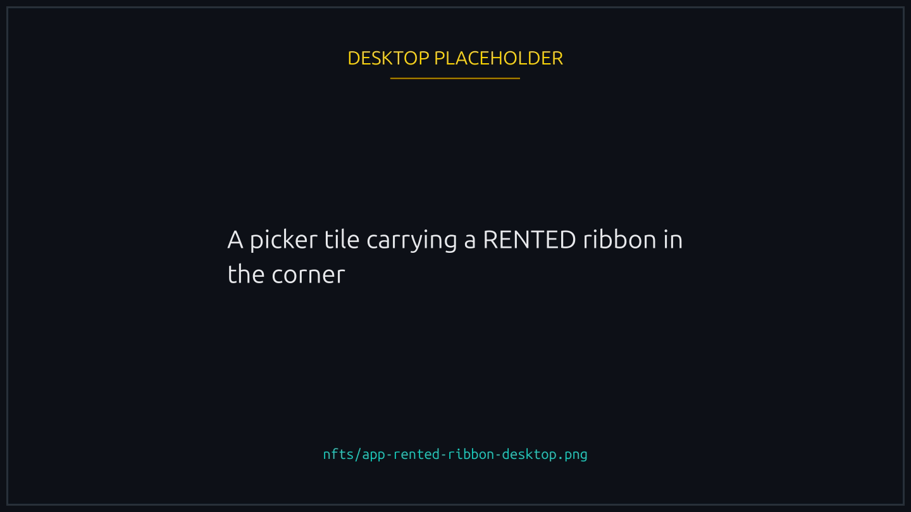
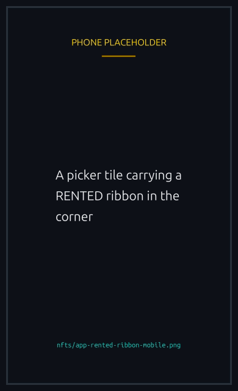

# Renting an NFT

Some NFTs can be rented instead of bought. You pay for a number of days, the NFT lands in your wallet, and it works exactly like one you own for as long as you hold it. When the time is up it returns to the platform on its own.

Renting is useful when you want a Boost for a weekend tournament, or want to try a Track before deciding whether to buy one.

## What can be rented

Only tiers the platform has chosen to offer. Open the marketplace: a tier you can rent has a **Rent** button next to **Buy**, and one you cannot has only Buy. There is no disabled Rent button to hunt for.


{% column width="70%" %}

<figure><figcaption>
A tier without a Rent button is not rentable at all.
</figcaption></figure>


{% column width="30%" %}

<figure><figcaption>
On a phone
</figcaption></figure>



Mystery Boxes are never rentable. A box only exists until you open it, so there would be nothing to give back.

The number of rentable items is deliberately small. They are minted specially for renting and carry a **Rental** label in place of an edition number, and there are only ever a handful of each. If everything of a tier is already out, the Rent button tells you so and you can try again when one comes back.

## Choosing how long

Rentals run from **one day to thirty days**, in whole days. The slider moves one day at a time, and the marks under it (1, 3, 7, 14, 21, 30) are shortcuts to the common lengths, not the only lengths: you can rent for five days or seventeen.

Each tier has its own price per day, set by the platform and unrelated to what the same item costs to buy. The total is simply the daily price times the number of days, and the figure on the button is what you pay. There is no proration and no partial day.


{% column width="70%" %}

<figure><figcaption>
The total on the button is the whole cost. Nothing is charged later.
</figcaption></figure>


{% column width="30%" %}

<figure><figcaption>
On a phone
</figcaption></figure>



## Paying

**One transaction moves the money and the NFT together.** Your wallet asks you to approve a single transaction: it sends the SOL and delivers the NFT in the same step, so there is no moment where you have paid and not received it.

Rentals are paid in SOL only, once, up front. Nothing is charged later and nothing renews.


If your wallet reports a failure after you approved, do not pay again. Check your rentals first: the platform records the transaction before it sends it, so a rental that actually landed will appear.


## While you hold it

The NFT is genuinely in your wallet, and every part of the platform treats it that way. A rented Boost gives the same speed edge as a bought one, a rented Runner unlocks the same features, a rented Track and a rented Duck look the same in a race. Nobody you race against can tell.

Two things are different, and both come from the same restriction:

- **You cannot sell, transfer or give it away.** It is frozen for the whole term, on Lucky Ducks and on Tensor, MagicEden or anywhere else. A listing could never settle, so the transfer is blocked rather than allowed to fail after somebody has paid you.
- **You cannot burn it.** The same freeze prevents it, and on purpose: there are only a few of each rentable item, and a collection cannot survive its renters destroying them.

Everything else works normally. You do not need to keep the page open, and the rental is not tied to a browser or a device.

**Your own screens mark it, and only yours.** In the create and join pickers a rented item carries a **RENTED** ribbon, on every tab: Runners, Boosts, Tracks and Ducks alike. That is there so you can tell at a glance which of your picks has a clock on it. It is not visible to anyone else, in the race or anywhere on the platform.


{% column width="70%" %}

<figure><figcaption>
The ribbon is on your own screens only. Other players never see it.
</figcaption></figure>


{% column width="30%" %}

<figure><figcaption>
On a phone
</figcaption></figure>



## The one rule: do not alter it


**Do not attach anything of your own to a rented NFT.** Using it cannot trigger this. Racing with it, equipping it, and everything else the platform does leave the item untouched. It means going to the NFT itself in a wallet or an explorer and adding something to it, such as your own delegate or your own freeze.

If you do, the rental ends immediately. The item is taken back, the rest of the term goes with it, and there is no refund. You are told when it happens, and the ended rental says what was found on it.


The reason is that the item goes back into the pool for the next person, and it has to go back the way it left.

## When the term ends

The NFT leaves your wallet automatically on the expiry, with no signature and no action from you. That is the deal you agreed to when you rented it, and it is what makes the item available to the next person.

Your rentals are listed on the marketplace with the days remaining on each, and the last day is marked. Nothing is deducted from your wallet at the end; the rental was paid in full at the start.

If a race you have already joined is still running when the term ends, that race is unaffected: the NFT's effect was recorded when you joined.


**A default you saved is skipped, not broken.** If the item was your saved Boost, Track or Duck, the next race you set up simply leaves that slot empty rather than refusing to start. Pick something you still hold, or rent again. The same applies to a saved race template built around a rented item.


## If you want to keep it

You cannot extend a rental in place. Rent it again when the term is over, or buy one outright from [the marketplace](README.md#where-to-acquire). A bought NFT has none of the restrictions above: it is yours, transferable, sellable, and it never expires.
