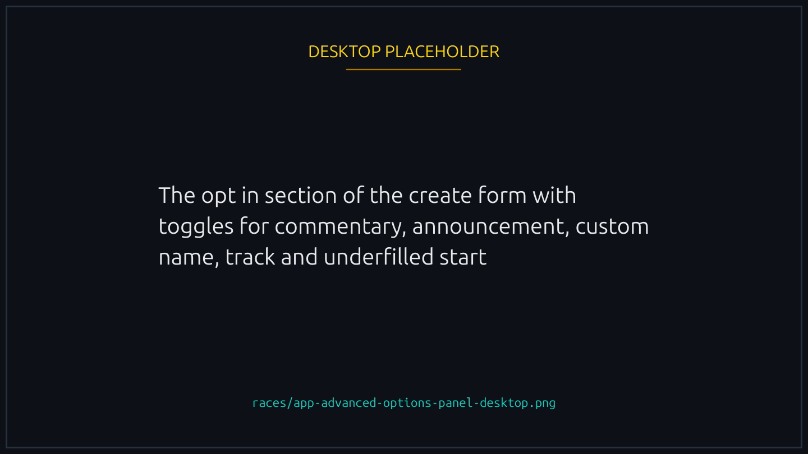
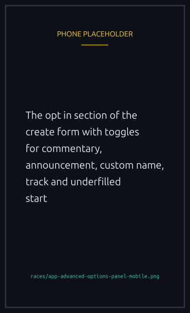
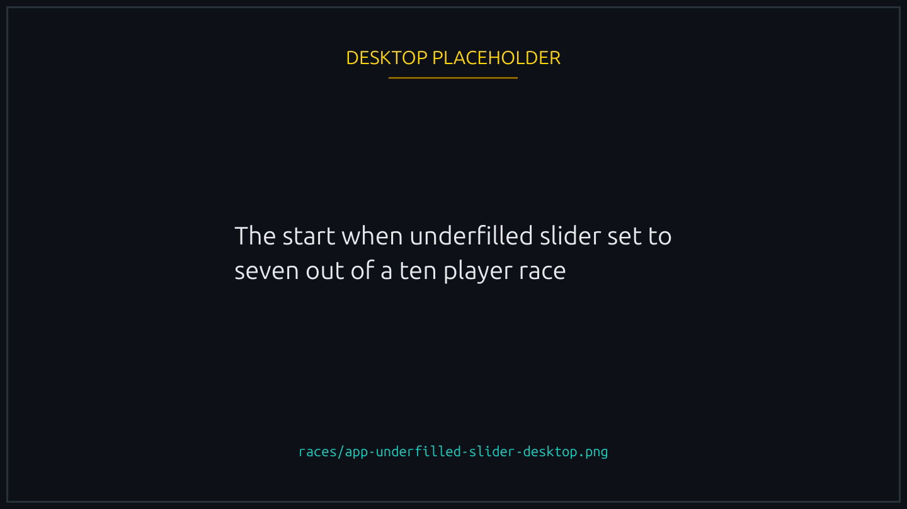
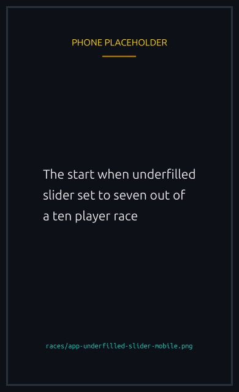

# Advanced options

The optional opt ins in the Create Race modal. All of them require a Runner NFT in your wallet except where noted.


{% column width="70%" %}

<figure><figcaption>
The opt ins are off by default, and each one shows its cost before you sign.
</figcaption></figure>


{% column width="30%" %}

<figure><figcaption>
On a phone
</figcaption></figure>



## AI commentary

A funny per second play by play track narrated by an AI voice, generated on the fly the moment the race starts. Adds a small cost per race second (the platform's audio cost setting times the race duration).

The narration references the duck names, the boosts in play, and the current standings. It does not predict the winner. Generation can add up to 60 seconds of waiting time after the lobby closes before the visual race begins.


**The race never waits indefinitely for it.** If the commentary is not ready by then, the race starts silently rather than holding everyone in the lobby, and the track is attached as soon as it finishes, so it can arrive part way through or after the finish. The commentary is archived with the race either way, so a race that ran silent is not a race whose audio is gone.


Available for any race size, including 1v1 races and rematches. Adding audio to a rematch is decided by the proposer at propose time, independent of what the finished race had.

## X announcement

Post the race publicly to the Lucky Ducks X (Twitter) account when it goes live. Useful for community events or when you want to bring in players who are not already watching the app.


Flat cost at creation, around **0.005 SOL**, shown exactly in the cost breakdown before you sign. Transferred immediately to the backend wallet, like the archival fee: **non-refundable** once the race is created, even if the race never fills.


The backend uses the on-chain flag to know when to post; you do not sign anything on X yourself. The announcement includes the race link and basic details (entry fee, mode, when it starts). No-boost races carry a marker in the tweet copy.

For rematches, the proposer picks X announcement independently at propose time, whether or not the finished race had it.

## Custom name

Sets a title on the race card so other players can identify it in the lobby list. Useful when running a themed event or a community match.

## Custom race duration

The default visual race duration is 30 seconds and is available to everyone. Changing it up to 5 minutes requires a Runner NFT. Shorter races stay punchy; longer races give the AI commentary more room to develop a story.

## Custom join timeout

The default lobby window is 1 hour. Setting a shorter or longer custom timeout overrides it. Minimum 1 minute, maximum 1 week. Custom timeouts are useful for scheduled events (long window for announcements) or rapid-fire match queues (short window for quick turnover).

## Custom track

Use a Track NFT you own as the race background. The track changes the visual environment (different pond, lighting, props) without affecting outcomes. See [Track NFTs](../nfts/tracks.md).

The four built in tracks (day, night, sunset, sunrise) are always available and free. Custom tracks need a held Track NFT.

## Start when underfilled

Permit the race to launch with fewer than max players once the join timeout passes. Without this option, an unfilled race expires and can only be refunded. With it, the race starts as long as the lobby reached the platform's default race size, which the create form shows you.

When you enable it, a slider appears for setting the minimum players to auto start. The slider runs from the platform's default race size up to one below your chosen maximum, so it is never possible to set a threshold the race could not start from. A 10 player race with the slider at 7 will auto start with 7, 8, or 9 players once the join window closes.


{% column width="70%" %}

<figure><figcaption>
The slider cannot be dragged below the platform's default race size.
</figcaption></figure>


{% column width="30%" %}

<figure><figcaption>
On a phone
</figcaption></figure>



This option adds a small surcharge to cover the backend's auto start operation. The surcharge is paid out of the race vault to the operator on auto start; it stays in the vault and refunds with everything else if the race never starts.

## Sponsored race

Pay the prize pool yourself instead of asking joiners to. Useful for community giveaways or marketing events. Set the prize amount when creating; players join for free and the pot is funded by your wallet upfront. The platform fee still applies, taken from the prize amount you sponsored.

## Join settings (who can join)

The Create Race modal also lets you control who can join: Open, Verified Only, Allowed Players (private invite list), NFT Holders, or Token Holders. Three of these (Verified Only, NFT Holders, Token Holders) can be hosted without a Runner NFT; Allowed Players requires one. See [Race access and gating](access-and-gating.md).

## Minimum account age

Require that anyone joining the race has a player account at least a certain number of seconds old. The toggle is off by default. When on, a duration input appears (defaulting to **24 hours**).

What it does:

- A joining wallet must have an existing player account, and that account must have been around for at least the configured duration. Otherwise the join is rejected.
- A brand new player (one whose player account is created during the join transaction) is always treated as zero seconds old, so they cannot join a gated race. The gate is a simple, effective barrier against fresh sybil accounts spun up for a single race.
- It works on top of whatever validation the race uses. You can combine it with Verified Only, with a private allowlist, or with no restriction at all (Anyone).

Things worth knowing:

- The gate is fixed at race creation and does not change for the lifetime of the race. Rematches inherit it.
- Your own auto join as creator is subject to the same check. If your player account is too new, you either have to wait, lower the threshold, or use host mode to create the race without joining it. See [Hosting, cancelling, and refunds](hosting-and-cancelling.md).
- If you are not sure whether your wallet qualifies for a gated race, the join screen tells you so before you sign.

## Combining options

Most options stack. The only hard exclusion is that AI commentary cannot be added to a race that has already started. Everything else can be mixed freely.
