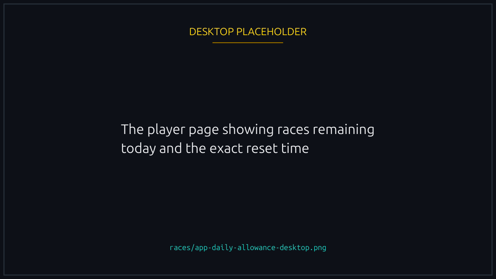
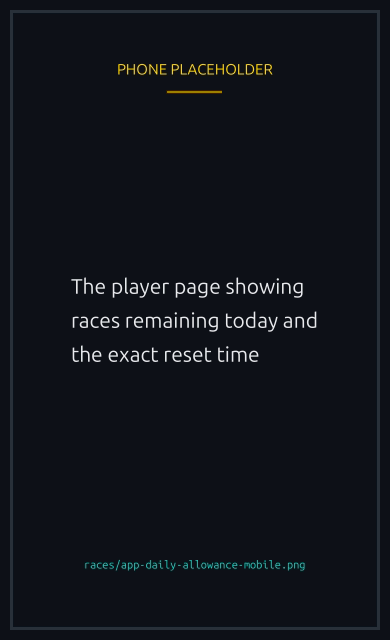

# Daily races

Every wallet has a daily race allowance: a cap on how many races it can **play** in a rolling window. The cap is about seating a duck in a race, not about creating one.

## What counts against your allowance

| What you do                        | Uses one of your daily races |
| ---------------------------------- | ---------------------------- |
| Create a race and join it yourself | Yes                          |
| Create a sponsored race            | No                           |
| Host a race without joining it     | No                           |
| Join anyone's race                 | Yes                          |
| Offer a rematch                    | Yes                          |
| Accept a rematch                   | Yes                          |

The practical effect: hosts and sponsors are not limited. If you run races for your community without playing in them, you can keep creating all day. The only pacing constraint is the short **30 second cooldown between race creations** from the same wallet.

## Your limit depends on your Runner NFT

Holding a Runner NFT raises your daily race limit. Ownership is checked at the moment you play, so:

- Buy a Runner today and the higher limit applies immediately.
- Sell it and you go back to the standard limit on your next race.
- A different Runner works just as well as the one you used yesterday.

The current limits: **50 races per day** without a Runner, **500 per day** for a Runner holder. Verification does not change this number; the Runner is the only thing that lifts it.


Make sure your Runner is attached when you join or rematch. If it is not, the race still goes through, but it counts against the standard limit instead of your Runner limit.


## When your day resets

The window is not midnight. It starts from your first race after your previous window ended, and runs for a fixed length from there. That length is a platform setting, and it is a rolling day.

So if your first race is at 3pm, your window ends the following 3pm, not at midnight tonight. Your remaining races and the exact reset time are both shown in the app, which is the figure to trust.


{% column width="70%" %}

<figure><figcaption>
Races remaining and the reset time, which is the figure to trust.
</figcaption></figure>


{% column width="30%" %}

<figure><figcaption>
On a phone
</figcaption></figure>



## FAQ

Why did my remaining races drop by two after one rematch?

It did not. Offering the rematch used one race, and accepting used another for your opponent. If you also played a fresh race in between, that used a second one from your side. Offering and accepting each cost one, per player.

I bought a Runner. Why does my limit still look the same?

Your limit updates when you next play. If it still looks wrong after that, check that the Runner was attached to the race.

