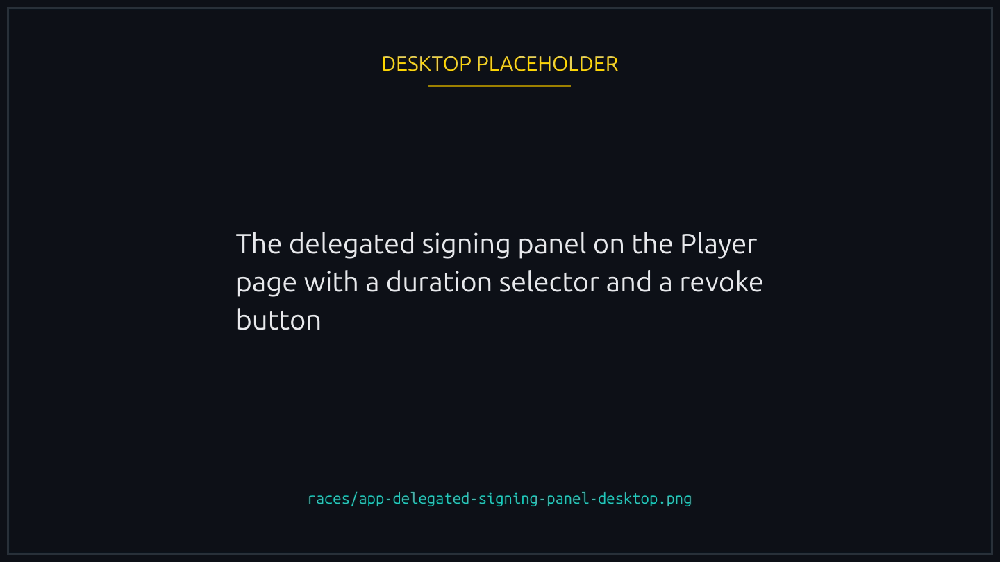
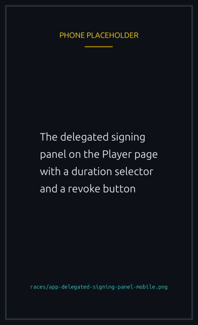

# Playing without signing every action

You can let Lucky Ducks sign your in-game actions for you, for a period you choose. Joining a race then takes one tap, with no wallet popup and no waiting for a confirmation. The app calls this delegated signing, and the panel that turns it on carries that name on the Player page.

It is built for playing on a phone, where a wallet round trip per action is the slowest part of a race.

This page is the detail. For the whole path, including the sign-in half, see [Playing without your wallet app](without-the-wallet-app.md).

## What you need

- A [verified wallet](../trust/verification.md). The program refuses to turn this on for an unverified one. See below for why the two are tied together.
- A [player vault](../economy/player-vault.md) with a balance, because the actions spend from it rather than from your wallet.
- One signature to turn it on, choosing how long it lasts.

That is the last signature until it expires or you turn it off.


{% column width="70%" %}

<figure><figcaption>
The panel that grants the permission is also where you revoke it.
</figcaption></figure>


{% column width="30%" %}

<figure><figcaption>
On a phone
</figcaption></figure>



## Why it needs a verified wallet

Not signing every action is only half of it. The other half is the sign-in: opening the app still meant proving the wallet was yours by signing a message in it, and on a phone that is the same handoff to the wallet app that delegation was meant to remove.

Linking a social account is what closes that gap. Once you have one, you sign in with it, and the wallet app stays shut for the whole session. So enabling this without a verified wallet would be turning on a feature you have no comfortable way to reach: every visit would still start in the wallet app.


Turning it **off** needs nothing. Revoking is always available, whatever state anything else is in.


## What it can do

Everything you do inside the game:

- Create a race, join a race, leave a race during the lobby.
- Claim a prize, cancel your own race, trigger a refund.
- Offer, accept and decline rematches.
- Claim a tournament prize.
- Every team action: create, update, join, leave, invite, remove, disband.

## What it can never do

The permission covers playing. It does not cover your money leaving the platform.

| Action                          | Why it is excluded                                                                                           |
| ------------------------------- | ------------------------------------------------------------------------------------------------------------ |
| Withdraw from your vault        | Moving value out is the line the whole design rests on. Only your wallet can authorise it                    |
| Close your player account       | Same reason. This is the other exit                                                                          |
| Deposit into your vault         | Not merely disallowed. Money leaving your wallet requires your wallet's signature, so nothing else can do it |
| Extend or change the permission | The permission is your consent. Anything that could extend itself would have no expiry                       |


Money can move around inside the platform on a signature you granted. It only leaves on yours.


## Turning it on and off

You pick the duration, up to a maximum of 30 days. It expires on its own, so a permission you forget about does not last forever.

Revoke at any time by setting the duration to zero. Revoking takes effect immediately, and it keeps working even if the platform has switched the feature off for everyone, so you can always withdraw your consent. The verification requirement does not apply to revoking either: nothing about your account can put the off switch out of reach.

Renewing is just turning it on again, and needs the same verified wallet the first grant did.

Where your winnings land is set by the same screen and is a separate choice. You can change it whether or not you have granted anything, and it does not require verification: it only says where money already owed to you should go.

## What it costs

Each action signed on your behalf reimburses the network fee for that transaction, taken from your vault's SOL balance. It is a few thousandths of a cent per action, and it is the same fee you would have paid yourself.

Two consequences worth knowing:



- **An action that pays you still needs SOL in the vault.** Claiming a prize costs a network fee even though money is coming to you, so a vault holding tokens and no SOL cannot claim.
- **There is no fallback to your wallet.** When you sign for yourself your wallet is right there, so it pays by default and it covers anything your balance cannot. A delegated action has nowhere to fall back to, because your wallet is not signing. It stops and asks you to top up.
  

## What happens after you tap

A delegated action is queued, then submitted. Queued is not landed, so the app waits for the result on chain before telling you it worked. If it fails, you are told, and nothing has been charged for an action that never happened.

## Choosing a duration

A shorter permission is a smaller window, and the honest risk is not theft. Nothing here can take your money out of the platform. What a misused permission could do is spend your vault on races you did not choose, or act on your teams: leaving one, removing a member, disbanding a team you created. Losing an entry fee is recoverable. A disbanded team is not.

If you play daily, a long duration is reasonable. If you are trying it once, pick a short one. The choice is per player for exactly this reason: your exposure should be yours to size.


[player-vault.md](../economy/player-vault.md)

