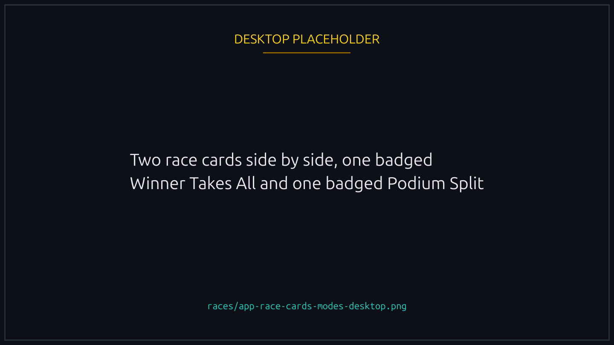
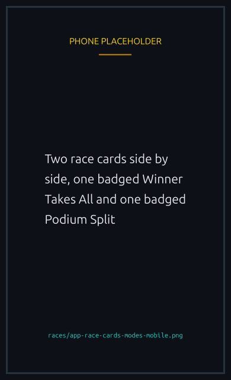

# Race modes

There are two payout modes. Pick when creating a race.



The first place finisher gets the entire prize pool, minus the platform fee. Everyone else gets nothing.

WTA is the canonical mode. Use it when:

- You want the simplest possible payout (one winner, everyone else competes for that single slot).
- The entry fee is large and splitting it three ways wouldn't leave enough on the table for podium finishes to feel meaningful.

A 5 player race with a 0.1 SOL entry fee has a 0.5 SOL pool. After the platform fee, the winner pockets roughly 0.45 SOL.



The pool is divided between the top three finishers:

- **1st place**: 50%
- **2nd place**: 30%
- **3rd place**: 20%

Requires at least 3 players. The split percentages are fixed on chain and cannot be changed per race.

Use Podium Split when:

- You want more players to feel like they got something for showing up.
- The entry fee is moderate, where three smaller payouts are still meaningful.

A 10 player race with a 0.05 SOL entry fee has a 0.5 SOL pool. After the platform fee, the splits are roughly 0.225 / 0.135 / 0.09 SOL.




{% column width="70%" %}

<figure><figcaption>
The mode is on the card, before you open the race.
</figcaption></figure>


{% column width="30%" %}

<figure><figcaption>
On a phone
</figcaption></figure>



## Choosing between them

WTA gives a sharper rush: one winner, total commitment. Podium Split gives more frequent positive outcomes per race played, at the cost of smaller individual payouts. There is no objectively better mode. Some communities run WTA exclusively, others alternate by lobby size.

## What if there are ties?


There are no ties. The on chain seed produces a strict ordering. Two ducks may finish very close visually, but the contract always has a deterministic winner.


## Refunds

If the race never finalizes (oracle stuck, lobby never fills past 2 players in WTA, or never past 3 players in Podium Split), every participant can claim a full refund. The platform never holds your fee hostage on a stuck race. See [Refunds and rent](../economy/refunds-and-rent.md).
