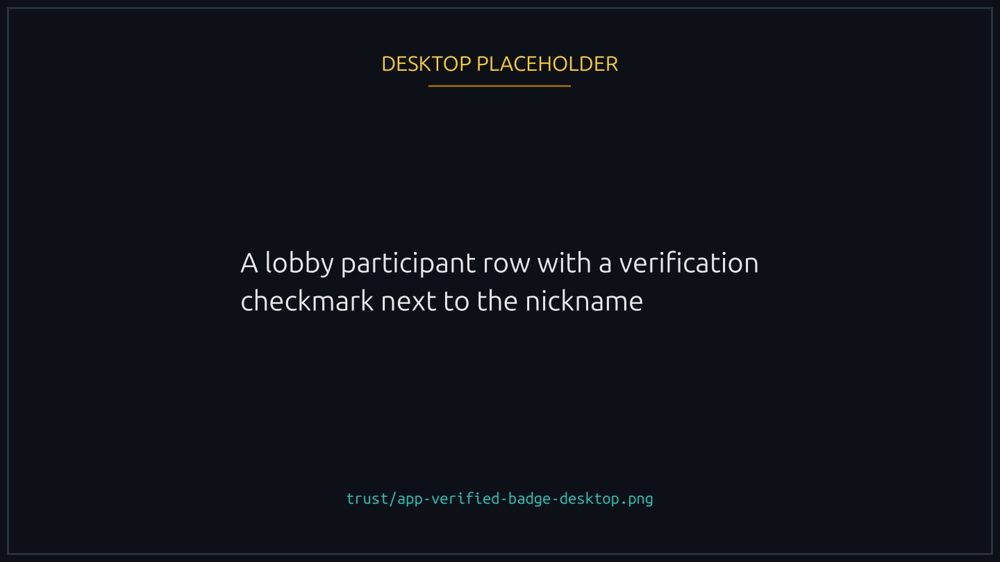
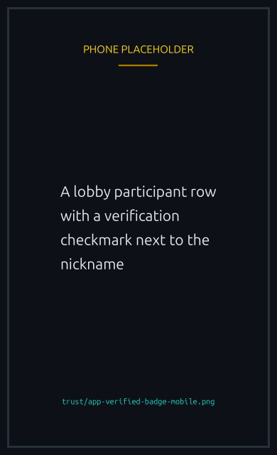

# Player verification

Every wallet has a player profile. Verification additionally ties your wallet to an off-platform identity, which is optional but unlocks limits and tournament eligibility.

## Profile basics: nickname and avatar

Every player can set a **nickname** and an **avatar** on the Player page, independent of verification. These show up next to your wallet in race lobbies, participant lists, leaderboards, and team rosters.

- **Nickname**. Short display name. Unique-per-platform isn't enforced; collisions are disambiguated by the truncated wallet shown next to the name.
- **Avatar**. An image you upload. If you don't set one, the platform uses a deterministic identicon derived from your wallet address.

Both fields are stored off chain on your player profile. You can change them any time.

## What gets verified

The platform supports OAuth2 verification with:

- **X (Twitter)**
- **Telegram**

After verifying, the wallet has a verified flag and gains access to the chosen identity's display name and avatar (which you can optionally adopt as your profile nickname/avatar).


{% column width="70%" %}

<figure><figcaption>
The providers on offer are whichever ones the platform has enabled.
</figcaption></figure>


{% column width="30%" %}

<figure><figcaption>
On a phone
</figcaption></figure>



## When verification is offered


You need to have joined at least one race. A brand-new wallet cannot verify: the providers are listed on the player page from the start, but they refuse until there is a race on your history, which is what stops an empty wallet minting a badge and walking away.


There is no upper limit and no window. Once you qualify you can verify at any time, or never.

Verification is a one-time off-chain OAuth flow. You authorize the chosen provider, the platform's backend confirms the OAuth grant, and your wallet's `verified` flag flips to true. The flag is stored on the player profile and shown next to your nickname in race lobbies, leaderboards, and team rosters.

## What verification unlocks

- **Signing in without your wallet app**. Once an account is linked, you can sign in with it instead of signing a message in your wallet. On a phone that is the difference between staying in your browser and being handed off to the wallet app and back. See [Signing in with a linked account](#signing-in-with-a-linked-account).
- **[Playing without signing every action](../races/delegated-play.md)**. Turning that on requires a verified wallet, and the program refuses it otherwise. The two go together for one reason: the whole point is not reaching for your wallet, and a linked account is what lets you get back in without one.
- **Races reserved for verified players**. A creator can lock a race so that only verified wallets may join, which is the usual way of keeping throwaway wallets out without managing an invite list. You need to be verified to enter one, and to host one. See [Race access and gating](../races/access-and-gating.md#verified-players-only).
- **Identity badge**. A small checkmark next to your nickname signals you are verified. Other players see this on race cards and lobbies.
- **Telegram handle in announcements** (Telegram-verified players only; see below).


{% column width="70%" %}

<figure><figcaption>
The badge travels with you: race cards, lobbies, leaderboards and team rosters.
</figcaption></figure>


{% column width="30%" %}

<figure><figcaption>
On a phone
</figcaption></figure>



## Signing in with a linked account

Your first sign-in is always your wallet: connecting it and signing a message is what proves the wallet is yours, and nothing else can establish that. After you have linked an account, the login screen offers it as a second way in.

It resolves, it does not create. Signing in with a social account finds the wallet that account is already linked to. If it is linked to nothing, there is no account to sign in to, and the platform says so rather than making one.

Two things it deliberately cannot do. It cannot link an account, because linking starts from a wallet you have already proved you own. And it never grants an operator session; an operator signs in with their wallet.

Which accounts appear on the login screen depends on which providers the platform has enabled.

Signing in this way is half of playing without ever opening your wallet app; [Playing without your wallet app](../races/without-the-wallet-app.md) is the other half and the order to do them in.

## Telegram handle in group announcements

If you verify with Telegram, you can opt in to display your **Telegram handle** in the platform's Telegram group announcements (race wins, podium finishes, tournament results, and similar event posts).

The opt-in is off by default. Toggle it from the Player page once you are Telegram-verified. With it on, announcement messages tag your `@handle` so the broadcast reaches you and your contacts. With it off, announcements use your platform nickname only.

You can flip the opt-in on or off at any time. Past announcements aren't rewritten.

## Privacy

The platform stores only what is needed: a stable identifier from the OAuth provider, your display name, and your avatar URL. The platform does not receive your email, phone number, OAuth refresh tokens, or any other PII from the provider. The OAuth grant covers only the scopes needed to confirm you control the linked account.


Verification is one-way. There is no unverify: nothing on the platform, and no instruction in the program, sets the flag back to false once it is set. Linking an account is a decision to make deliberately rather than one to try out.


## Multiple providers per wallet

You can verify with multiple providers (X, Telegram, and Facebook all at once). The platform shows whichever identity you set as primary. Future events may give bonuses for being verified across multiple providers, but the verified flag itself is binary.

**Any account you have linked signs you in, and none of them is the primary one for that.** Verify with X and link Google later, and either will do. That is the practical reason to link a second: if you lose access to the first account, the second is still a way back into your wallet without your wallet app. Only the first link runs an on-chain transaction; the rest are recorded off chain.


**One social account belongs to one wallet.** The reverse of the rule above: a single wallet can carry several providers, but a given X, Telegram or Facebook account can only ever be linked to one wallet. Trying to verify the same account on a second wallet is refused. This is what stops one person presenting as several verified players in a race gated on Verified Only.


## What verification does not do

- It does not change your wallet's race history.
- It does not give you a boost.
- It does not give you a discount on entry fees.
- It does not let the platform refund you out of band; refunds are always on chain.
